# 地形图册 R3

[离线图册](index.html) · [范围与文档依据](README.md) · [完整提示词](PROMPTS.json) · [审核记录](REVIEW.md)

## 01 · 整体星球与大陆

不规则大陆、向东入海的水系和东南半岛。用于统一地理身份，盆地面积不可按图量测。

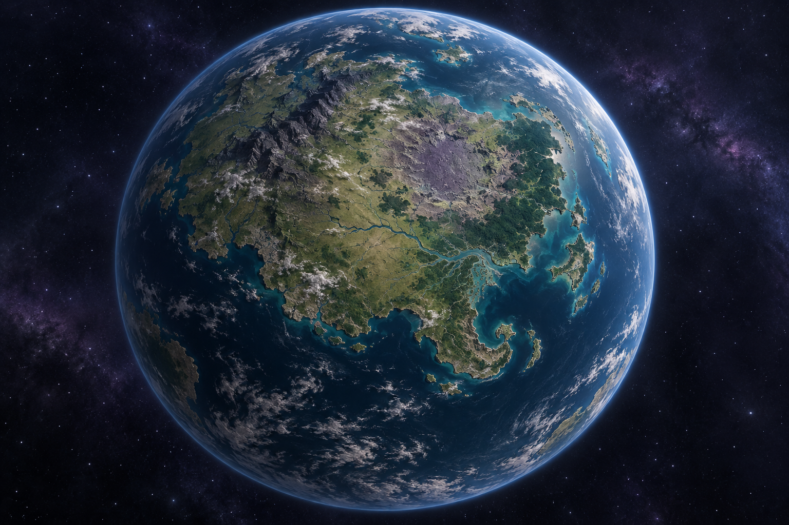

## 02 · 原始玄武岩盆地

保留干燥月面、宽阔盆底、阶岩、台地和陨坑；没有在旧盆地内添加河流或湖泊。

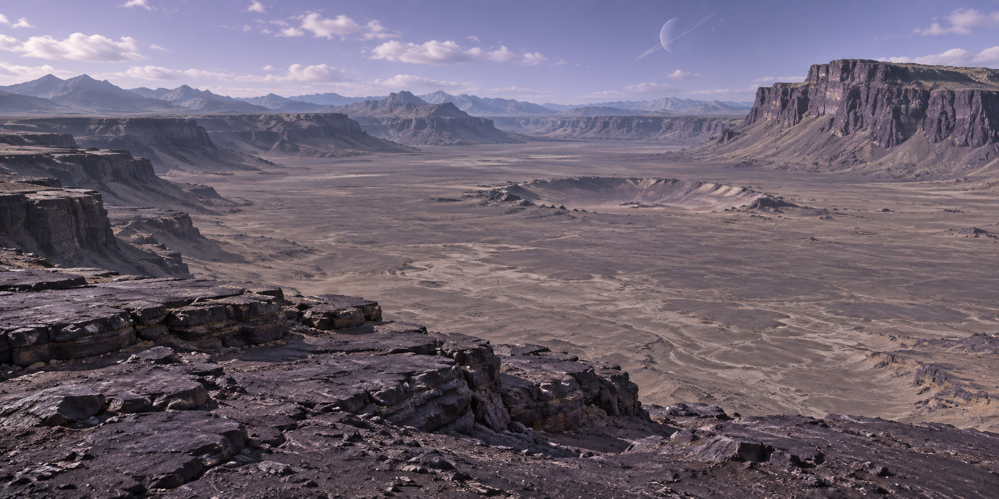

## 03 · 盆地 → 平原

露岩 → 碎砾 → 细土 → 稀草 → 平原。过渡沿侵蚀沟和坡脚交错，不沿方形内容边界。

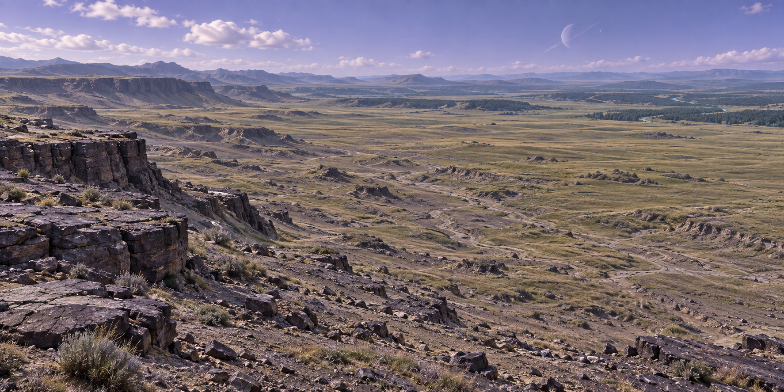

## 04 · 山脉、峡谷与悬崖

连续岩层连接山脊、断崖和坡积地；河流沿谷底向更平缓地带延伸。浅色山体是裸岩。

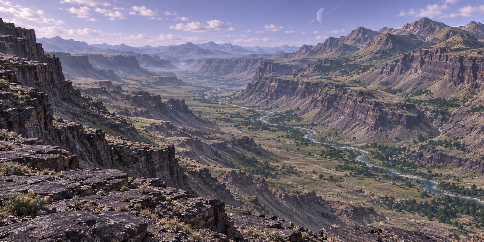

## 05 · 森林与河谷巨木

河谷巨木、林下空隙与可读的河岸地面。古林形态同时参考母星后续地区设计。

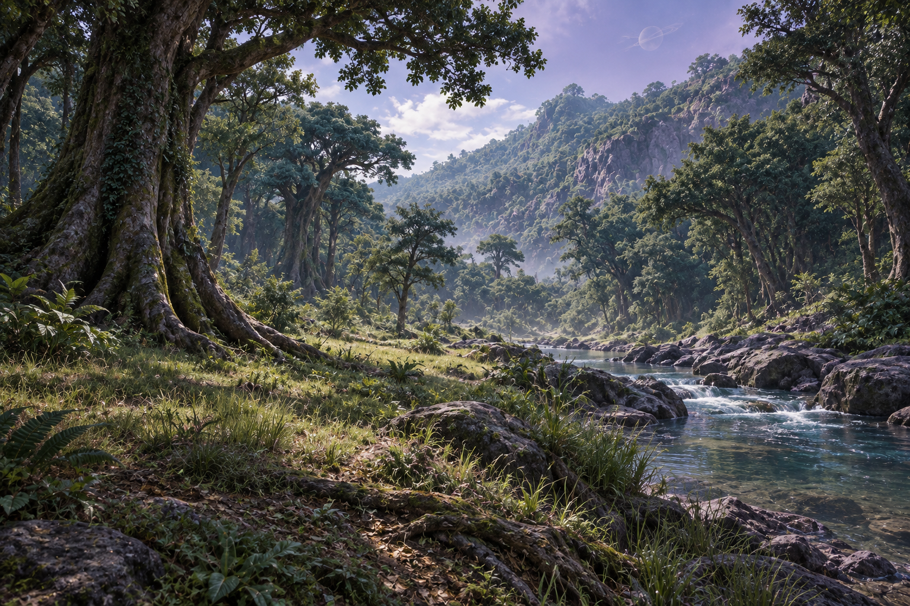

## 06 · 河流与湿地

主河道、浅水滩、芦苇群与较高的树木岸地；局部滞水属于湿地，并非新增大型湖泊。

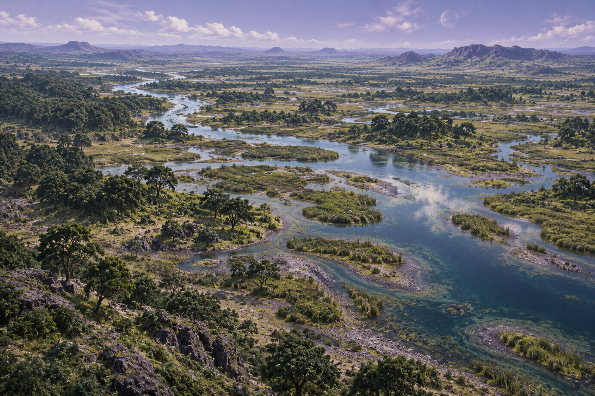

## 07 · 河口与曲折海岸

河道、潮滩、岩岬、近海和外海连通；悬沙与水深引导水色变化。

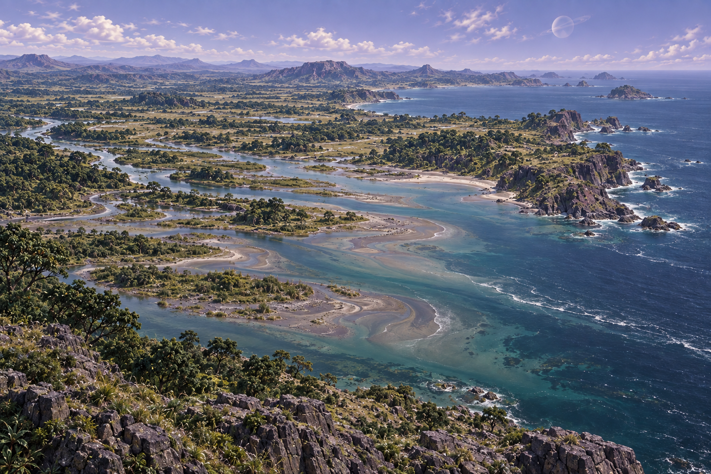

## 08 · 海洋与盐海裂岛

海洋基线与后续盐海裂岛的形态提案。岛屿延续沿岸岩性，尚无获批的实际岛屿坐标。

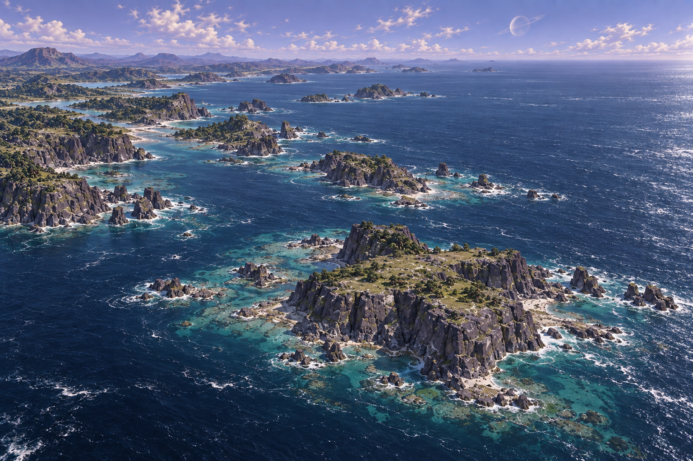

## 09 · 自然生态交界

草地空隙伸入森林，树群沿湿润低沟逐渐增密；重点观察林缘、河岸和岩性分布。

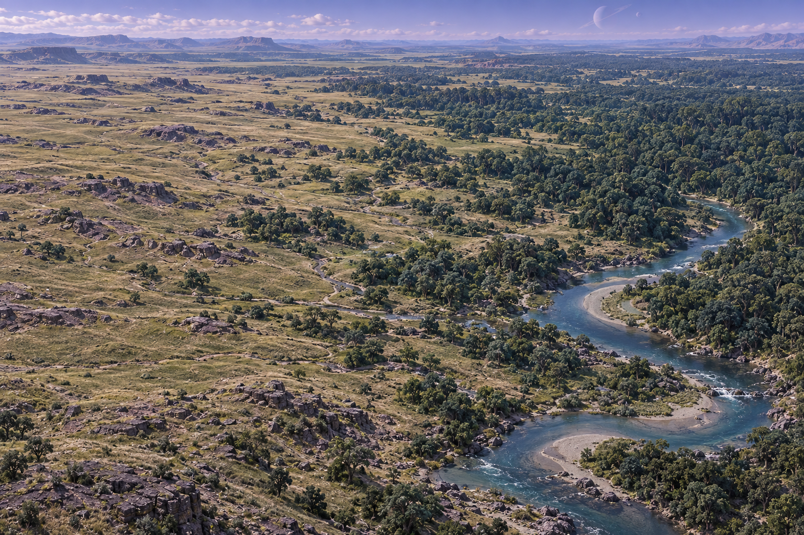

## 10 · 盆地高空鸟瞰

以约 1.6 km 高空阅读为目标，实际画面更接近高处俯瞰示意；不证明精确相机高度或运行时表现。

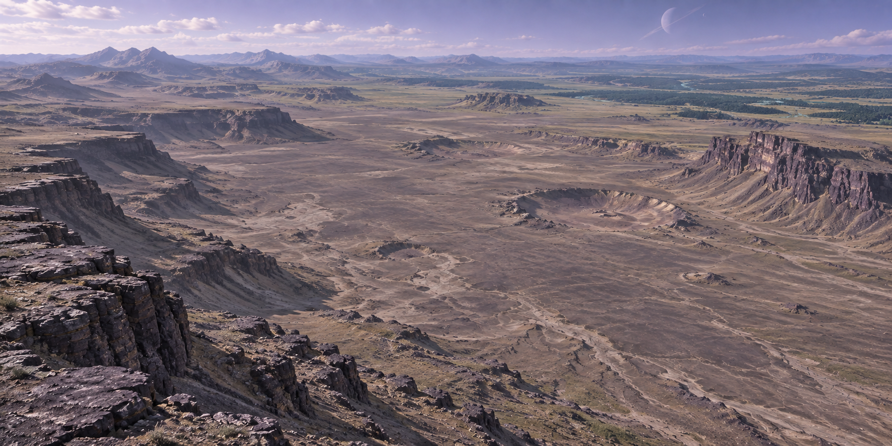

## 11 · 完整球面轨道图

保留 01 的大陆轮廓、河口和东南半岛。远距盆地融入大陆，细纹理不形成独立方片。

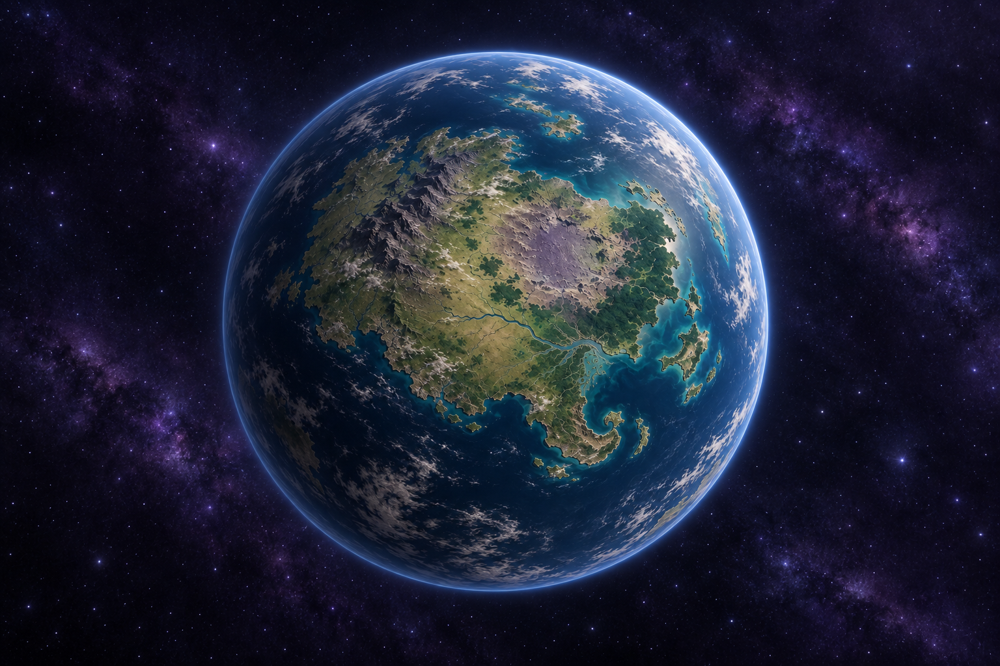

## 12 · 特殊地区候选

左上：归档旧稿低温裂谷；右上：火山地热矿带；左下：D3 镜晶峡谷；右下：D3 风暴高原浮岩与旧重力异常矿带。四地不是相邻拼色区域，也不是已实现现状。

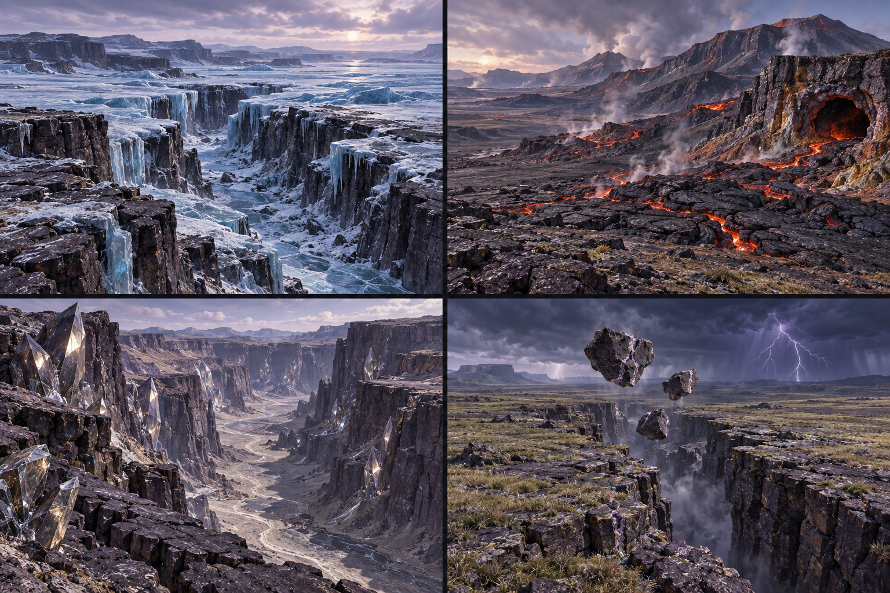

