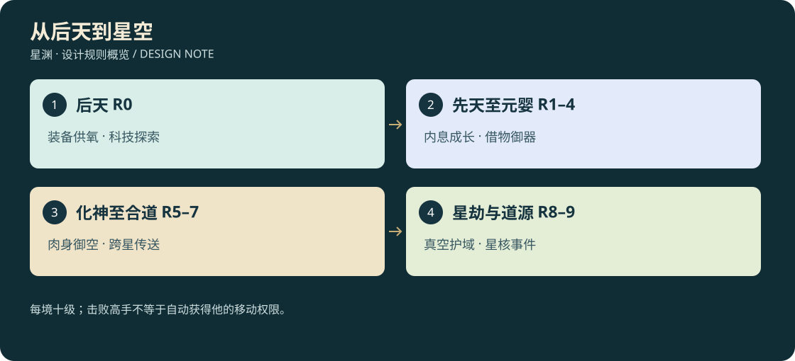

# D3-01 · 十境界、属性与修炼

<!-- illustrated-overview:start -->

*图解：每境十级；击败高手不等于自动获得他的移动权限。*
<!-- illustrated-overview:end -->

依赖：[总览](README.md)。本文是角色成长的唯一数值基准；战斗与配方只能引用，不另造第二套境界。

## 1. 十境界与能力里程碑

最高组织与领袖见[29](29_SUPREME_FACTIONS_AND_STORY.md)。总等级=10r+l；道源91—93初阶、94—96中阶（96顶峰）、97—99大成、100圆满。神皇99级是当前已知最高NPC参考战力；这些角色段位不替代技能五阶掌握。

|编号|境界（每境 1—10 级）|生命与探索能力|力量演示目标|移动权限|
|---|---|---|---|---|
|R0|后天|科技强化肉体，仍需宇航服供氧和环境防护|从对抗野兽到破坏轻型机械；有效攻击 1—5 米|徒步/车辆/飞行器|
|R1|先天|形成内息，可在出生星常规地表脱下呼吸面罩|击穿 10 厘米标定石墙；气刃约 10 米|仍依靠飞行器|
|R2|灵海|真气形成稳定气海，解锁元素护体|可击毁标记为可破坏的普通建筑构件，范围约 5 米|仍依靠飞行器|
|R3|金丹|真气凝核，可短时抵挡酸雾和局部能量侵蚀|裂开 20 米巨岩/破开重装堡门，范围约 15 米|仍依靠飞行器|
|R4|元婴|意识外探，发现隐藏阵纹、远控法器|切断 100 米岩脊的脆弱结构，范围约 40 米|借物御器，地表上限 200 米|
|R5|化神|肉身御空，独立神识探查|击毁 300 米级山峰的标定核心，范围约 100 米|无需飞行器，持续耗真气|
|R6|炼虚|承受跨星传送，短距离空间步法|干预公里级空间裂隙/摧毁大型虚空巢穴|跨星传送；仍非真空长航|
|R7|合道|建立局部领域，环境规则成为战术资源|覆盖 5 公里战略区域的领域事件|星球内高空航行，真空仍需载具|
|R8|星劫|形成真空护域，可肉身在星空活动|摧毁标定 10 公里小天体核心，击败星空巨兽|星空飞行，真气维持护域与推进|
|R9|道源|操控星核级能量结构，探索文明级后果|具备毁星能力，须完整星核事件而非随手普攻|星域航行与高级传送|

这些是游戏的结构破坏等级和剧情挑战尺度，不是假称物理模拟能量值。普通战斗有效距离、范围和伤害仍受技能配置限制；不因达到 R5 让每次挥剑都削平整个场景。R9 的可毁星目标与救援保护见世界文档。

R1 的“正常呼吸”只针对标记为常规可适应的出生星大气；真空、深水、极毒区不能混同为能呼吸。R0 密封服在安全区自动补给，出发前预警；供氧耗尽会昏迷救援，不永久删档。

宠物补充：表中0—3境“依靠飞行器”现扩为飞行器或合格飞行坐骑，详见 [骑宠规则](17_PET_3D_FLIGHT_AND_ASSETS.md)。宠物自己能飞/更高境界不等于骑手能肉身御空、耐真空或越过本人传送资格。

## 2. 可量化基础属性

设境界 r∈[0,9]，小等级 l∈[1,10]，`B = 6^r × (1 + 0.18 × (l−1))`。未配装、标准成长路线的参考值：

- 生命 `H = round(120 × B)`；攻击 `A = round(12 × B)`；防御 `D = round(10 × B)`。
- R1 起真气上限 `Q = round(100 × 2^r × (1 + 0.08 × (l−1)))`；R0 没有可自行运转的真气，科技设备使用独立电容 100。
- 体力池基础 100，动作按实际池结算。后天一级常速 4.7 m/s、疾跑 8.6 m/s；后续每境独立速度与每小级加成见 [移动追逐](13_MOVEMENT_AND_PURSUIT.md)，不再所有境界共用新手地速。
- 每境从 1 到 10 级基础生命/攻防增长 2.62 倍；从上一境 10 级到下一境 1 级约 2.29 倍。大境界带来新能力，但不是碰一下必死的隐藏等级压制。

|境界|1 级参考攻击|10 级参考攻击|1 级参考生命|
|---|---:|---:|---:|
|后天|12|31|120|
|先天|72|189|720|
|灵海|432|1,132|4,320|
|金丹|2,592|6,791|25,920|
|元婴|15,552|40,746|155,520|
|化神|93,312|244,477|933,120|
|炼虚|559,872|1,466,865|5,598,720|
|合道|3,359,232|8,801,188|33,592,320|
|星劫|20,155,392|52,807,127|201,553,920|
|道源|120,932,352|316,842,762|1,209,323,520|

显示使用万/亿并可展开精确值。存储以整数属性计算，伤害每次结算后取整，不用浮点余额存材料或货币。

## 3. 同境界差异从哪里来

角色境界决定可承载上限；丹方路线、材料品质、功法、武器、机缘共同决定同境界差异。

`最终攻击 = 基础攻击 × (1 + 体质攻击加成) × 功法倍率 × 装备倍率`，防御/生命同结构。体质加成由历次突破、淬体和机缘累计，单项正加成合计上限 +80%；功法常驻单属性倍率上限 1.8；装备合计同属性倍率上限 1.8。极端配置上限约 5.83 倍，初期实际目标是同级不同构筑主属性相差 2—4 倍。

速度单独计算：先取每境基础值，再乘小级/构筑与负重；常驻构筑倍率上限 2.0，奔袭与药物上限见 [移动追逐](13_MOVEMENT_AND_PURSUIT.md)。一般减速 slowFactor 最低保留 35%，但超载、束缚等显式禁移动另算；攻速上限 1.6，不随赶路速度无限加快挥刀动画。

破甲、真气效率、招式形态和控制能力可以不同，不能把所有差异都压成攻击。三种突破路线主强化攻击、生命/防御、真气/速度；每境三条路线均可继续下一境，无永久选错门派。

## 4. 修为、小升级与大突破

极稀有例外见[26逆天传承](26_HEAVEN_DEFYING_LEGACIES.md)：普通5.83倍常驻构筑上限仍有效，天命核心在其后有显式单核心倍率。允许低境高小级角色凭成熟传承挑战高一境普通对手，但不因此直接解锁对方境界的飞行/真空权限。

当前境界每级所需修为：`X(r,l)=round(100 × 4^r × l^1.35)`。l=1—9 用于升到下一小级；l=10 用于填满突破槽。修为不可跨境囤积；满槽提示“待突破”，不继续扣灵石。道源十级满槽后完成当前成长上限，停止经验消费。

来源为有风险的战斗、首次探索、任务验证、在线打坐与离线打坐。普通同阶同级怪参考奖励当前级 X 的 3%，精英 10%，首领 30%；低于玩家两个大境界的敌人不再给修为，但仍按原表掉材料。刷新同一唯一探索点不重复领奖。

普通突破：本境十级且突破槽满 → NPC 讲解下一境 → 选择完整配方或替代突破法 → 展示材料、属性、能力变化 → 主动确认 → 一次性扣料并升到下一境一级。无随机爆丹、掉级或强制清空装备。R0 一级起可用后天淬体液增加成长资质，但进入 R1 使用的是 R1 突破液。

每种境界配方有“入境突破”和“同境淬体”两种用途：R1—R9 首次突破到该境可用；当前已在该境可炼一次淬体剂。R0 只有淬体用途。首次突破的体质收益与同境淬体共用该境一个槽位，不可喝两遍叠加。换更高品质或不同路线只重算该槽，不累加，并明确预览被替换属性。

## 5. 三种突破途径

|途径|可用范围|条件/代价|永久收益|
|---|---|---|---|
|进化液/丹药|R0→R1 至 R8→R9 全部|修为满＋任一对应配方＋NPC 校准|按配方路线与品质记录一个体质槽|
|遗址传承|R0→R1 至 R8→R9|修为满＋对应层级传承试炼；可用探索材料替代血/核，耗时更长|相当于同阶 Q3 均衡突破，另解锁功法知识|
|极稀有机缘灌顶|R0→R1 至 R8→R9|匹配本境、满足生命承载试验；可以免修为不足及常规配方，一次最多跨一个大境界|记录不可重复的 +2%—5% 永久体质或特殊感知能力|

机缘不是保证刷出的第四个日常任务。若已达目标境界，机缘改为对应传承或同等限额体质收益，不浪费、不跨两境。无需为了随机事件才能走通主线。所有跨境方式都触发同一 NPC 世界知识记录和区域解锁，不绕过必要的飞行/传送安全规则。R9 到顶后机缘只增强构筑，不生成第十一境。

每境的确定性传承路线如下。试炼材料为同阶药草/环境结晶/阵纹记录，可取代猎杀血核；试炼失败不永久销毁传承资格，不能要求玩家提前会下一境能力。

|目标境界|非丹药突破试炼|不用下一境能力也能完成的办法|
|---|---|---|
|先天|引息归环：稳定三处导引节点，抵御短时灵压|后天设备读数＋手动调节，用宇航服保护完成|
|灵海|百川归流：恢复药谷水脉并承受回流|使用先天内息或水道机关分段泄压|
|金丹|赤炉凝核：在冷/热周期内凝聚稳定能核|用灵海气量与矿站冷却装置控制，不先要求金丹护体|
|元婴|镜心照影：识别并打断自己的三种错误回路|扫描、脚步/倒影观察及金丹技能，避免只猜真假|
|化神|天穹问神：取得风暴三点测量并稳定神识|用元婴御器或 F3 飞行器到达落脚点，不先要御空|
|炼虚|界隙锚定：修复母星界门三个本地锚点|化神御空＋地面阵器，全部位于母星|
|合道|重力合律：在不同重力区维持同一规则|炼虚空间步法或固定平台/索桥两种路径|
|星劫|真空护域：在带救援罩的试验舱内稳定护域|合道领域配合星港试验设备，无需裸身进入真空|
|道源|星核共鸣：理解并稳定一处衰败小天体核心|星劫护域＋阵锚辅助；完成后才拥有毁星层级能力|

普通丹药路线也需 NPC 的一次短安全校准，但不再完整重复上述长试炼。机缘灌顶把当前不足修为补至突破条件，奖励采用唯一事务记录；例如元婴满级以下遇到匹配“化神星辉”，可直接升化神一级，不能连升炼虚。

## 6. 打坐与离线 72 小时

安全区练功 NPC 解锁打坐。退出前在安全区开始修炼才结算离线收益；野外断线先保留位置，重进执行当地安全恢复，不伪装野外无敌挂机。在线打坐基础速度 `v(r)=20 × 4^r 修为/小时`；离线效率在线的 50%。这是慢速保底，探索战斗应明显更快。

`有效离线秒数 = max(0,min(当前可信时间−最后有效在线时间,72×3600))`。一次离线超过三天，只结算最初三天，之后停止。离线修为可以自动升小级，但不能跨大境界；当前境界突破槽填满后立即停止，剩余时间不存进下一境。

在线修炼倍率：练功室 1.0/1.2/1.5；匹配功法 1.0—1.3；灵石辅助最高 2.0；总倍率封顶 3.0。离线先乘相同加成再乘 0.5。升级到下一小级时依新阈值逐段结算。

灵石只在用户勾选“允许离线消耗”并预存数量后自动使用。有效修炼每小时消耗本境标准碎灵石额度 `C(r)=10×5^r`；不足时回退无灵石基础速度，不能负余额或自动兑换背包全部资产。达到上限只扣实际有效时长，内部以微小时累计到最小货币单位。

重登界面显示离线时长、计入时长、获得修为、小级变化、消耗、停训原因。重复打开/读档不重复领取；先持久化结算事务再显示。系统时钟回拨给 0 并保留最大已结算时间。纯离线版本无法可靠防止改系统时间，应诚实标记；若以后接联网交易，收益时间及结算改服务器权威，不能继承未经验证的离线资产。

## 7. 真气与恢复

停止消耗真气且脱战 8 秒后，自然恢复每秒上限的 2%；战斗中每秒 0.2%；打坐恢复每秒 5%。暂停/菜单不补资源。飞行、护域或持续技能开启时不触发自然回气。

回气丹的同阶 Q3 基准为 3 秒服用、恢复 35%；与疗伤/续力共享 45 秒恢复族冷却，层级和品质系数见 [丹药规格](12_MEDICINES_AND_AFTEREFFECTS.md)。灵石吸收 5 秒站定引导，恢复 20%，冷却 15 秒，只消耗身上可访问灵石；二者都不触发突破、不清冷却。

R5 御空基础耗气上限的 2%/秒，急加速再加 1%/秒；基础满气悬空约 50 秒。20% 预警、10% 提示落点、5% 强制转降落，把最后 5% 用作专门的降落缓冲，禁止继续加速。断气/被打断时服装应急缓降接管；不凭空回满气，地面才可安全恢复。R8 真空护域额外 0.5%/秒，飞行不取代跨星传送与长途载具。

## 8. 成长验收关键点

验证 100 个等级位置、三条突破路线、上限属性、跨境幂次、70/72/96 小时离线、时钟回拨、满突破槽、不足灵石、重复读档、突破与机缘竞争提交、R9 封顶，以及脱战/飞行/打坐资源状态互斥。
