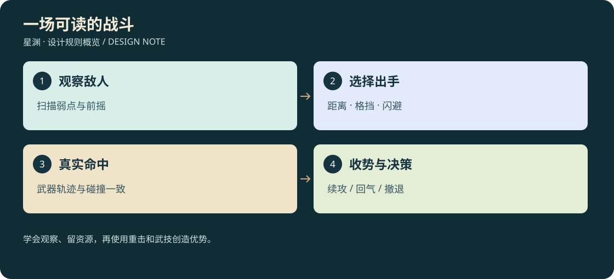

# D3-02 · 战斗、十大武器与功法

<!-- illustrated-overview:start -->

*图解：学会观察、留资源，再使用重击和武技创造优势。*
<!-- illustrated-overview:end -->

<!-- wandering-npc-update -->
抢夺例外：第28的动态劫修可在玩家倒地后完成可打断搜夺，转移真实可触及财物；普通怪昏迷仍保留背包。斩杀动态敌对NPC可取得其当前库存，固定NPC保护规则不变。 详见[28地图与游历NPC](28_MAPS_AND_WANDERING_NPCS.md)。

依赖：[境界数值](01_REALMS_AND_CULTIVATION.md)、[材料经济](03_ALCHEMY_MATERIALS_ECONOMY.md)。所有数值为白盒起点，先做 R0 一场有趣的战斗。

## 1. 一场战斗怎样发生

扫描可识别足迹、警戒范围、护甲和一次明显弱点；接近后怪物会警告或追踪。玩家选择绕开、伏击、远程引诱或正面交战。普通攻击制造机会，重击破势，闪避避开冲撞，屏障拦截正面攻击，技能用来打断/连携。怪物不会只站在原地扣血。

普通同级单怪目标耗时 8—15 秒，精英 25—45 秒，首领 2—4 分钟；同级普通怪命中玩家约 5—8 次致昏迷。按实际攻击频率调血量，不直接把角色 H/A 拷贝给怪物。高质量同级构筑可显著缩短战斗，但首领读招仍有价值。

R0 一级白盒起点：M00 生命 48、攻击 24、防御 2、攻击间隔约 2.5 秒；M01 生命 160、攻击 36、防御 8；M02 生命 900、攻击 42、防御 12。精英/首领预期玩家已有小级、武器或淬体进展，不按裸装一级强制通关。后续怪物以该生态模板乘境界与小级 B，另调攻击频率/部位，禁止把首领系数重复乘两遍。

普通敌人 AI：巡游 → 发现/警告 → 接近 → 预备攻击 → 生效 → 收招 → 再判断；另有受击、破势、退却、倒地、脱离重置状态。脱离恢复时显示返巢，不让玩家隔着无敌边界无限攻击；已归属的掉落只结算一次。

每境地速与敌人追踪采用 [移动追逐](13_MOVEMENT_AND_PURSUIT.md)：有感知/搜索/失去目标过程，怪物速度按自身境界而非玩家即时速度设置。重量与空间容器按 [储物负重](10_STORAGE_AND_ENCUMBRANCE.md)，短时爆发与后遗症按 [丹药规格](12_MEDICINES_AND_AFTEREFFECTS.md)。

## 2. 操作与动作

|输入|步行战斗|限制|
|---|---|---|
|左键|当前武器普通攻击/短连段|持扫描器时先收起再出招，不瞬间多持一物|
|右键|近战格挡；远程武器瞄准|重武器只有短架势防守，无永久举盾|
|R / 鼠标中键|蓄力重击 / 已装备武器战技|两个独立动作；可重绑，现有闪避保持 E|
|E|矢量闪避，后续可切换修真身法|已实现版本的 4 米闪避作为 R0 起点|
|Q|扫描|高阶可选择解析类功法替换外观，保留信息用途|
|1 / 2|两个已装备主动功法|冷却跟技能保存，切槽不刷新|
|滚轮 / 3|切两套武器|战斗换武器有收拔动作，不能同时结算两把攻击|
|4|快捷恢复物|只用预先选择的物品；不足时明确提示|
|F / V / Z|交互 / 视角 / 趴下|沿用现版，交互界面屏蔽攻击|

驾驶禁用角色武器攻击；载具武器另开功能。无鼠标捕获时第一次点击只恢复控制，拖拽视角不误开火。第一人称必须有对应握持与挥击，第三人称使用同一武器和命中时间，禁止两个视角不同攻击距离。趴姿允许短刀刺击、弩/发射器射击；长柄/重武器先起蹲并提示，不能贴地穿模大回旋。

## 3. 十大武器

枪指长枪/矛；初期电磁发射器属于科技工具，作为远程教学武器保留，不占修真十类之一。

|ID|类别|战斗定位|基础动作与破绽|材料倾向|
|---|---|---|---|---|
|W01|刀|连续近战、压制|两斩一劈，收刀较快，正面破甲一般|铁陨＋兽皮握带|
|W02|剑|精准、反击、气刃|刺/横斩/格挡反击，需命中弱点|晶陨＋导气纹|
|W03|长枪|距离、穿刺、守口|直刺/挑击，近身和侧后较弱|钨陨＋韧骨杆|
|W04|棍|范围、架势控制|横扫/点打/撑跃，无刃伤但破势稳定|空髓木＋陨铁箍|
|W05|锤|重破甲、击退|慢蓄力，命中回报高，落空硬直长|重陨＋甲片芯|
|W06|斧|劈甲、持续伤口|短突进重劈，耗体力高|赤陨＋兽筋|
|W07|戟|中距离群战|刺挑扫，转向受限，狭窄舱室吃亏|合金陨材＋长杆|
|W08|弓弩|远程、诱敌、部位命中|拉弓/装填占时，有弹药，贴身弱|星砂弓身＋兽筋|
|W09|拳套/爪|贴身、闪避连携|短距离快击，必须进入敌人危险区|骨爪＋轻陨护节|
|W10|环/飞刃|御器、回收轨迹、控场|往返路线可挡，飞出期间不能近战格挡|晶陨＋引灵核心|

初片只完成刀、电磁发射器和闪避；后续按枪→剑→锤→弓弩→其余类别扩展。十类有数据与动作合同不等于十类已做好 3D。

## 4. 伤害、破势与防御

伤害管线以[19属性与掌握](19_DAMAGE_ATTRIBUTES_AND_MASTERY.md)为唯一数值基准：技能原始总量=`(C×6^t+a×攻击+b×术强)×掌握倍率`；普通攻击视为0/1/0、重击0/1.8/0，不吃主动武技掌握倍率。扫描弱点+25%进入同类增伤桶，不再独立乘35%。具体武技与反制见[20的60式](20_PLAYER_MARTIAL_ARTS_60.md)。

`护甲减伤=min(0.8,有效防御/(有效防御+40×6^目标境界))`；固定减防→百分比减防→百分比穿透→固定穿透，最低0。几何屏障→抗性/易伤/通用减伤→个人盾→生命。通用减伤封顶60%，与抗性合计封顶85%。这替代旧常数20，必须重新验证怪物战斗时长，历史测试不代表新数值已平衡。

破势独立于血量：普通攻击破势 10，重击 30，精准打断 40；普通怪阈值 60、精英 120、首领分部位 180 起。脱离受击 3 秒后每秒恢复阈值的 10%。破势给约 1.2 秒机会，首领仅局部暴露而非无限眩晕。连续控制抗性递增，5 秒内最多一次完整倒地。

闪避不默认无敌。前摇通过身体姿态、地面扬尘、声响表达；危险体积按武器/肢体真实扫掠检测，每次攻击命中同一对象一次。低帧率也不得漏穿墙。战斗镜头震动可关闭，受击反馈不强行拉玩家朝向。

## 5. 功法与技能成长

角色十境界和技能五熟练阶完全分开。功法品质使用 Q1—Q6，境界门槛由 `requiredRealm` 决定，不能拿 Q6 后天功法当道源能力。基本功法可学习且永久保留，安全点配置 **1 主修、1 辅修、2 主动、2 被动**；武器战技来自装备，主修功法不再另占主动槽。

初始功法族：

|功法|初获|打法|高阶成长方向|
|---|---|---|---|
|玄壳导引诀|后天教学|电容与体力效率、引导内息|先天后转真气导引，成长不再依赖服装供电|
|踏星步|后天闪避模块/先天传承|避险与连携|小转向、双储备、精准避险回气；次数来源唯一|
|裂锋诀|先天武学教习|单体破甲、刀枪剑战技|弱点贯击与部位击破|
|镇岳篇|先天护体教习|定向屏障、反击|护盾角度控制，挡住真实伤害才涨熟练|
|归息经|灵海遗迹|气量、恢复与持久战|脱战恢复/辅助炼丹；不边无成本飞行边无限回气|
|御物章|元婴传承|飞刃、御器、操纵机关|远控多个目标，数量受锁定与气量限制|
|化神游空诀|化神突破|肉身御空|气耗效率、空中闪避与安全降落|
|虚步经 / 星域经|炼虚 / 星劫|空间移动 / 真空护域|明确范围和媒介，不穿越未加载/未解锁星球|

熟练阶沿用入门、小成、精通、大成、圆满；有效实战、训练挑战提升，空放不刷。打坐只提供角色修为，不能离线把所有战技练到圆满。功法书未学习前可交易，学习后书消耗；已掌握内容不可凭空复印出售。

## 6. 陨石锻造

流程：发现陨落/矿脉 → 采集原矿 → NPC 鉴定组成与 Q 品质 → 精炼成对应陨材 → 选武器类别、配方、辅料 → 预览攻防/速度及适用境界 → 扣料锻造 → 检视并装备。未知陨石由场景轨迹/热痕可发现；新陨落避开安全区，不砸毁唯一任务物品。

任意同阶基础武器配方：同阶陨材 6、同阶韧材 2、导气纹 1；弓弩另需兽筋 2，重武器另需陨材 2。韧材允许同阶合成纤维替代，性能预览有差别。标准锻造成本为装备估值的 10%，品质由材料与工匠能力决定，无暗骰碎装。

一把武器最多 1 主词条＋2 副词条；从成分得到可预览效果，不无限洗随机词条。修复消耗同阶陨材；精炼改良不改变武器类型；旧武器分解返还精炼原料的 30%，不能通过打造/分解获利。Q 品质与装备倍率上限引用成长文档。高级工匠接单有真实地区/知识前置，不要求所有 NPC 同时能造全部境界武器。

同层级武器的 Q1—Q6 主属性倍率起点为 1.0/1.10/1.20/1.35/1.55/1.80；词条与其他装备合并后仍受单属性装备倍率1.8上限限制，同词条不能重复乘品质。功法五阶常驻倍率及品质增量统一按19，技能五阶动画按[22](22_COMBAT_3D_AND_ANIMATION.md)；不要同时读取旧倍率表。

## 7. 战斗失败与奖励

野外生命归零为昏迷；播放怪物失去兴趣或救援烟幕撤离，淡出后在已建立救援联系的安全站苏醒。保留境界、功法、唯一物品和背包，不随机掉级。代价为本次未领取掉落遗失、装备 5% 耐久损耗、短暂疗养提示；无钱也能救援，无耐久时仍保留基础训练武器可用。

救援携带范围是人物身上及已绑定储物袋/戒；野外载具和货舱不免费瞬移回营，保留地图位置供取回/拖运。服战力丹形成的后遗症不会因昏迷清零，避免用救援洗掉药物代价。

战斗奖励由怪物实例 ID 一次性生成；尸体交互领取血液/材料，未领取时给范围提示；不存在“再读档一次就再掉一份”。药草、陨石和战斗共享探索经济，但安全练功木桩无可带出掉落。
