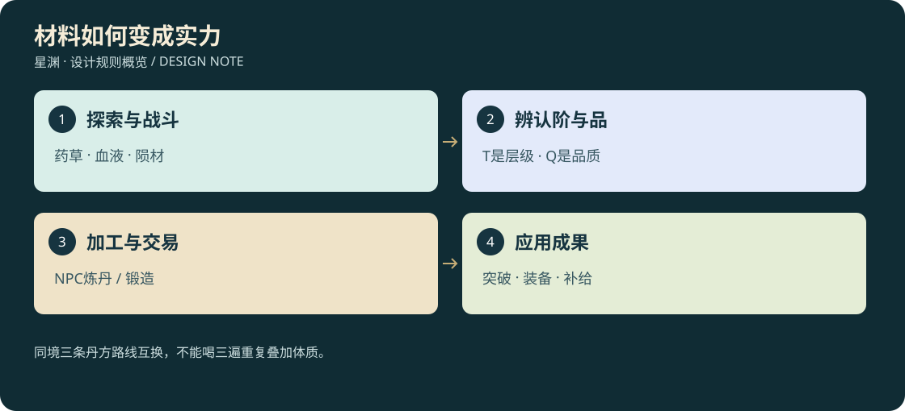

# D3-03 · 丹方、材料、掉落与灵石经济

<!-- illustrated-overview:start -->

*图解：同境三条丹方路线互换，不能喝三遍重复叠加体质。*
<!-- illustrated-overview:end -->

依赖：[境界](01_REALMS_AND_CULTIVATION.md)。配方、材料和经济均是拟实现数据，不消耗玩家当前资源。

## 1. 两个互不替代的维度

材料层级 T0—T9 对应可承载境界；品质 Q1—Q6 为粗品、凡品、良品、上品、极品、天成。同名材料可有不同 Q，低层级 Q6 不能替代高层级 T8。物品显示“层级·品质·来源”，不只靠颜色。

材料类别：药草、血液、内丹、骨/甲/筋、陨石、环境结晶、灵石、传承书、制成丹药与武器。草药从真实采集点获得，血液/内丹按怪物层级，陨石来自矿点和落星事件；不让所有东西都从同一种宝箱掉。

制剂品质由主料加权质量向下取整，且不得超过最低主料品质 +1，也不得超过 NPC 当前能力；辅料不能把低质主料洗成极品。Q1—Q6 品质系数为 0.65/0.85/1.0/1.25/1.6/2.0。炼丹前固定显示成品品质，无随机失败吞掉稀有材料。

## 2. 三十种境界制剂配方

下表每格是一份制剂的完整主材数量，默认再加纯化溶媒 1（营地有售），整数单位为一份采集物或一管血液；产出恰好 1 份，不能当血液毫升计量。ID 采用 `R{r}-{A/B/C}`。A 炼体偏攻防，B 通脉偏身法，C 凝元偏真气。R0 制剂用于后天淬体；R1—R9 用于突破到该境或替换同境体质槽。

|境界|A 炼体配方（无内丹）|B 通脉配方（无内丹）|C 凝元配方（稀有内丹路线）|
|---|---|---|---|
|R0 后天|赤芽淬体液：赤芽草×3、掠兽血×2、铁陨粉×1|清露导引液：月露苔×4、石露×2、铁陨粉×1|微核启灵液：月露苔×2、后天内丹×1、石露×2|
|R1 先天|开脉进化液：开脉藤×4、棘背兽血×3、铜陨粉×2|先天通息液：息风叶×4、净息晶×2、铜陨粉×2|聚息丹：开脉藤×3、后天内丹×2、净息晶×2|
|R2 灵海|沧血扩海液：潮髓莲×4、泽鳄血×3、玄陨粉×2|百川通海丹：雾心草×5、潮汐砂×3、玄陨粉×2|凝海丹：潮髓莲×3、先天内丹×2、潮汐砂×3|
|R3 金丹|赤炉结丹液：焰心芝×5、熔甲兽血×4、赤陨粉×3|九转凝丹液：凝露花×5、地火晶×3、赤陨粉×3|金髓丹：焰心芝×4、灵海内丹×2、地火晶×3|
|R4 元婴|返胎塑婴液：还魂花×5、镜翼兽血×4、晶陨粉×3|明神育婴丹：空髓木芽×6、镜心晶×3、晶陨粉×3|归一育婴丹：还魂花×4、金丹内丹×2、镜心晶×3|
|R5 化神|龙髓化神液：神照果×6、雷脊兽血×5、雷陨粉×4|天息化神丹：天息兰×6、风雷髓×4、雷陨粉×4|照神丹：神照果×4、元婴内丹×2、风雷髓×4|
|R6 炼虚|裂空炼虚液：虚叶草×6、虚渊兽血×5、空陨粉×4|太虚通脉丹：界根藤×6、界隙砂×4、空陨粉×4|虚府丹：虚叶草×4、化神内丹×2、界隙砂×4|
|R7 合道|万象合道液：道纹芝×7、重环兽血×6、界陨粉×5|同尘合道丹：尘光穗×7、法纹石×5、界陨粉×5|合源丹：道纹芝×5、炼虚内丹×2、法纹石×5|
|R8 星劫|星髓渡劫液：星露葵×7、噬星鳐血×6、星陨粉×5|曜息渡劫丹：曜心莲×7、劫光晶×5、星陨粉×5|劫元丹：星露葵×5、合道内丹×2、劫光晶×5|
|R9 道源|源血归道液：源初花×8、界鲸血×6、源陨粉×6|太初归源丹：寂照草×8、原初尘×6、源陨粉×6|道源丹：源初花×6、星劫内丹×3、原初尘×6|

目标境界 R 的材料默认在 **R−1 地区的核心、秘境或精英栖地**可以收齐，不能要求先升级到 R 才能取得所有 R 突破材料。名称不等于必须打 R 的怪；例如 R5 配方的雷脊兽血取自 R4 幼成体。R6 虚叶草、界隙砂和空陨粉在母星 R5 界隙谷有有限、可再生来源，高阶星球更丰富。详细区域见世界表。

R0—R2 普通突破不需要低概率内丹；C 路线可用较多同层破损内丹片替代（10 片=1 枚完整核，片来自精英委托与稀有矿巢，不能把普通石头换核）。NPC 也提供有限委托报酬渠道。内丹路线有构筑价值，不是唯一正确路线。

## 3. 丹方带来的差别

每个境界体质槽的 Q3 基础加成：A 攻击 +4%、防御 +4%、生命 +3%；B 攻击 +2%、普通移速 +3%、真气上限 +3%；C 真气上限 +6%、技能真气耗费 −2%、防御 +2%。乘 Q 系数后存入该槽，最后统一受成长文档上限约束。R0 C 的气量加成先作用于科技电容，R1 后同槽改计真气，不两边叠加。

消耗减免按 `基础消耗×max(0.65,1−减免合计)`，不能零消耗。速度上限与飞行分别结算。某境已用 A-Q2，再用 B-Q5 时移除旧槽、替换为新槽；界面显示净变化，可取消。永久机缘另有唯一记录并计入体质总上限。

淬体可改良，但每次替换均消耗完整配方；突破不强制高品质，不把玩家卡在稀有采集点。Q5/Q6 可以获得显著更好的成长资质，长期通过探索改良旧境槽位，而非因为早期服用普通药永久废号。

## 4. 常用功能丹与炼丹过程

同阶回气丹：本阶通脉药草×2、环境结晶×1、纯化溶媒×1，产 1，Q3 恢复 35% 真气。疗伤丹：本阶炼体草×2、净化血浆×1、溶媒×1，Q3 即时恢复 20% 生命并在 5 秒恢复 15%；与回气/续力共享 45 秒恢复冷却。完整层级适配、八种功能药、爆发后遗症见 [丹药规格](12_MEDICINES_AND_AFTEREFFECTS.md)。R0 对应科技医剂，不声称普通人已有真气。

固定炼丹 NPC 工作流：选已知丹方 → 放主辅材/允许替代品 → 预览层级、品质、效果、服务费、时间 → 确认并原子锁料 → 30—120 秒制作 → 成品进待领取栏 → 领取。离线制作仅按一次时间戳完成，不受打坐 72 小时上限影响，也不自动循环批量生产。取消未开炉订单全退；开炉后不可取消，关闭窗口不丢单。背包满时保留在 NPC 订单栏。

首次教学订单免服务费，普通订单服务费为主材基准估值的 10%，只收钱不吞掉失败材料。丹方知识来自 NPC、遗迹、任务或交易书；同一境三条路线至少一条有确定获取路径。

## 5. 内丹概率与可持续材料

|怪物境界|普通怪完整内丹率|精英率|首领率|
|---|---:|---:|---:|
|R0|0.2%|1%|5%|
|R1|0.5%|2%|12%|
|R2|1.5%|5%|25%|
|R3|4%|12%|45%|
|R4|8%|22%|65%|
|R5|15%|35%|85%|
|R6|25%|50%|100%|
|R7|40%|65%|100%|
|R8|60%|80%|100%|
|R9|80%|95%|100%|

一次成功最多 1 枚完整核；首领额外核只作独立一次性任务奖励，不偷偷再乘。普通生物保证血液 1 管，35% 额外 1 管，25% 骨/甲/筋 1 件；精英血液 2—3、身体材料 1—2；首领血液 5、特色材料 2、唯一首杀知识 1。机械敌人掉能芯/合金，绝不掉“机械血液”。血液用自动无菌采集演出，避免每次重复长动画。

普通 Q1/Q2/Q3/Q4 分布为 45/35/18/2%；精英 Q2/Q3/Q4/Q5 为 25/50/23/2%；首领 Q3/Q4/Q5/Q6 为 40/45/14/1%。按每件主材独立质量骰，掉核率和核品质是不同骰。高阶怪更容易有核，但不是天然全部极品。

收获随机种子与实例 ID 在首次生成时保存；读档、击晕后刷新或反复进入区域不改既有掉落。再生群体可产新掉落，但唯一首杀不重复。后天首条主线完整不依赖 0.2% 掉核。

## 6. 灵石面额、用途与交换

|名称|相邻兑换|碎灵石计价|
|---|---|---:|
|碎灵石|基础单位|1|
|初级灵石|1 初级 = 100 碎|100|
|中级灵石|1 中级 = 100 初级|10,000|
|高级灵石|1 高级 = 100 中级|1,000,000|
|极品灵石|1 极品 = 100 高级|100,000,000|

银行/兑换 NPC 按 1:100 双向兑换，无隐藏损耗。价值单位与 Q 品质不同，“极品灵石”是固定面额名称，不是所有物品的 Q5。

灵石用于交易、炼丹/锻造服务、传送、练功加速与回气。回气吸收每次消耗 `ceil(C(r)/5)` 碎灵石价值，需放入吸收槽授权；仅扣实际消耗价值，不吞整颗极品。对大面额晶石的部分吸收，原实例记 `remainingValue` 成为残石，不在野外凭空生成数万颗找零碎石；残石在 NPC 处按剩余价值兑换完整面额。已消耗价值不可出售。钱包是可访问实体价值的派生汇总，负重与银行边界见 [储物规格](10_STORAGE_AND_ENCUMBRANCE.md)。

矿脉能产对应面额：新手碎/少量初级；R2—R3 初级/中级；R4—R5 中级/高级；高级星球高级/极品。采集有脉量和可见工具/环境要求，不无限原地点击；首次确保玩家能赚足基本炼丹服务费。

## 7. 交易基准与闭环

所有材料、药草、功法书、丹药、武器、陨石可与支持该品类的 NPC 买卖或议价交换；唯一主线证据与已学习知识本体不能卖。玩家报价以选择物品和数量进行，不用自由文本承诺直接改库存。

基准单位价：T0 草药 2、血液 3、身体材料 4、陨材 8、完整内丹 120 碎灵石；T 层乘 `5^T`，再乘 Q 系数向上取整。合成药品/武器估值=主辅材价值＋基准服务费。NPC 收购价为估值 60%，卖价 125%；安全区基础溶媒 1 碎灵石。功法书为本层基准内丹价 5 倍起，稀有唯一传承只以探索/指定交换获得。

缺货溢价 0—20%，收购需求加价 0—20%，总卖价始终低于可立即买入再卖出的价格，避免循环套利。基础草、血和矿至少各有一个稳定买家。每个地区 NPC 货币额度/库存分开；游戏内 24 小时补货，离线最多补一次，普通进出菜单不刷货。

补货资格由[世界刷新系统](08_WORLD_DIRECTOR.md)发布，首轮24游戏小时对应120分钟有效游玩，离线至少24小时才最多一次；按[27](27_CONSUMPTION_AND_UNIQUE_WORLD.md)只补已售/授权调拨产生的缺额，旧货和回购物保留，新货有到货来源。唯一原器的买卖仅转移原实例，不能按商品销量制造第二件。草、矿、野怪不共用商店时钟，也不按修炼72小时循环产出。

以物易物按 NPC 收购价值抵买价，差额用灵石结清；预览双边数量、估值、找零，再一次提交。数量、钱包采用 BigInt 或安全整数串序列化，禁止高阶大额丢精度。NPC 无钱显示剩余额度，不吃掉超额货物。

## 8. 机缘与概率的边界

稀有永久机缘只在首次完成一段合格未知区域调查时尝试，初始权重 0.3%，不是每秒/每次杀怪尝试；约每 333 次独立合格发现一次仅为统计期望，不是保底承诺。每种永久机缘只能领取一次，普通刷新不重掷。作者提供模板和候选区域，位置/内容/奖励按角色种子生成保存，不提供所有角色同坐标同奖励的固定机缘。普通洞府另有常规发现频率，详见 [随机洞府](11_CAVES_AND_FORTUNES.md)。

永久体质上限、替代突破和重复已学奖励遵循成长文档。没有机缘也能达到最高境界；机缘使角色特殊，不成为必须先刷三百次的门票。
