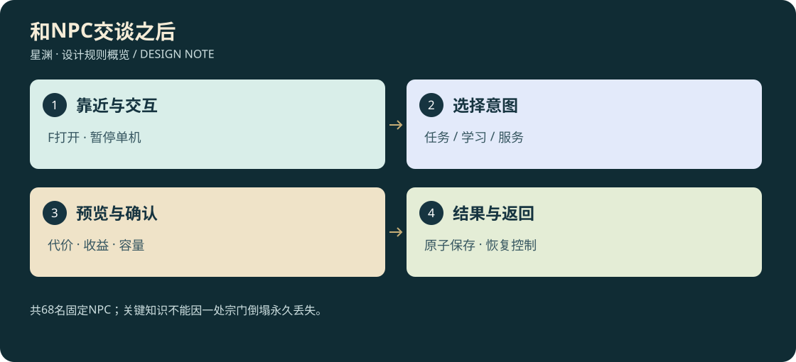

# D3-05 · 68 名固定 NPC、对话与功能

<!-- illustrated-overview:start -->

*图解：共68名固定NPC；关键知识不能因一处宗门倒塌永久丢失。*
<!-- illustrated-overview:end -->

<!-- wandering-npc-update -->
固定NPC现为68名（含29新增30名）。新增RN01—RN12动态游历模板不计入固定人数，实际人物有姓名、目标、背包、隐藏倾向与永久死亡记录；采集、竞争、伏击、搜夺、销赃与换人补位使用独立体系。 详见[28地图与游历NPC](28_MAPS_AND_WANDERING_NPCS.md)。

依赖：[世界](04_WORLD_REGIONS_EXPLORATION.md)、[炼丹交易](03_ALCHEMY_MATERIALS_ECONOMY.md)、[宗门](23_SECTS_NPCS_MISSIONS_AND_DUELS.md)。宠物及宗门补充后固定名单共 **68 名**：原母星28名、原高阶星域10名，新增十大顶层领袖和20名跨区域支门派人物。重复路人、敌对人形、随机旅商不计入固定名额；初片只制作必要的前4名和教习，其余随对应切片接入。

## 1. 母星 28 名

|ID / 姓名|常驻地 / 身份|具体功能|解锁与边界|
|---|---|---|---|
|N01 林澈|曙光营地 / 远征领队|主线、首次探索目标、营地服务介绍|开局可见，不把所有支线自动灌进日志|
|N02 苏禾|曙光营地 / 生物医师|后天淬体与先天制剂、疗伤、血样知识|基础采集后教学；炼制 R0—R1、最高 Q3|
|N03 韩铸|曙光营地 / 机械锻造师|铁陨精炼、刀与发射器、修理、F1 飞行器|回收铁陨解锁；服务 R0—R1、最高 Q3|
|N04 许衡|曙光营地 / 商站管事|材料收购、基础补给、1:100 灵石兑换、仓库|不卖唯一证据；库存与收购额度可见|
|N05 闻止|曙光营地 / 导引教习|打坐、练功室、72 小时设置、突破讲解|完成一次血样调查即可，首次训练免费|
|N06 祁岳|曙光营地 / 战技教官|刀法、闪避、格挡、训练挑战|训练不产可带出材料，不空放刷境界|
|N07 唐岚|曙光营地 / 救援队长|昏迷救援、危险区说明、建立野外救援联系|开局签约，破产也能回安全区|
|N08 阿洛|曙光营地 / 勘测机器人|扫描图鉴、陨落线索、地图与异常声纹研究|图鉴只公开已见对象；不先剧透全星球|
|N09 沈青萝|栖息药谷 / 遗民药师|药草采法、炼丹、先天到灵海的知识|服务 R1—R2、最高 Q4；首次解释修行体系|
|N10 陆行舟|栖息药谷 / 远游修士|传授功法、十境界传闻、非丹药传承路线|玩家可早遇见；高境细节随证据展开|
|N11 岳九锻|赤炉工坊 / 炼器师|R2—R3 武器、甲具、F2/F3 飞行器|最高 Q4；高空模块须热区矿材|
|N12 玄仪|镜渊驿站 / 丹阵师|R3—R4 丹方、传承试炼、镜阵破解|最高 Q5；副本入口与炼丹分别操作|
|N13 白砚|镜渊驿站 / 典籍商|功法书、遗物鉴定、材料交换委托|未知书可鉴定再学，不静默消耗|
|N14 云栖|天穹学宫 / 御器导师|御器、御空预修、R4—R5 制剂与药圃|最高 Q5；R5 才真正授予肉身飞行|
|N15 墨临|界门港 / 星门阵师|跨星认证、阵网校准、首次双向券|达到 R6 后可跨星；R5 可先修阵和找材料|
|N16 宁照|界门港 / 化神炼丹师|R5—R6 制剂、Q6 精炼、突破炼虚|R6 入境材料母星可获得，避免传送死锁|
|N25 林蘅|曙光营地 / 灵兽医师|宠物蛋鉴定/孵化、收服教学、契约、兽用制剂、基础兽诀和治疗|后天完成血样/生态调查可见；高阶契约委托与各星NPC协作|
|N26 织翎|栖息药谷 / 兽装师|宠物服装、骑具适配、个人纹章、低境载飞教学|首次流动服务可在营地预约教学，主工坊在药谷；不要求先天才能学后天骑宠|
|N27 顾行简|玄衡武院 / 院正|宗籍、立宗登记、识阵教学|R0传闻、R1学阵、R2五级立宗|
|N28 叶知锋|玄衡武院 / 演武执事|武技、贡献兑换、比武|外门R0六级|
|N29 沈清岳|青岚剑宗 / 传剑长老|剑风传承、验证|R1五级及试剑|
|N30 乔听澜|青岚剑宗 / 巡山执事|巡逻护送、风眼材料|危险地区真实可达|
|N31 炎百炼|赤炉门 / 炉主|锻造研究、阵器|R2与锻造教学|
|N32 罗星砂|赤炉门 / 矿务执事|采矿治理、锻材兑换|任务信誉与成本预览|
|N33 温素问|回春谷 / 谷主|功能丹谱、药圃、疗养|R1三级救人试炼|
|N34 何采苓|回春谷 / 药圃执事|采集、补种、药材兑换|真实物品上交|
|N35 牧云生|御灵山 / 长老|兽诀、契约、载宠训练|R1安抚任务，不要求稀有宠|
|N36 鹿小满|御灵山 / 灵兽执事|饲料、失宠救援、鞍具|保留个体身份|

## 2. 高阶 10 名

|ID / 姓名|地点|功能|服务范围|
|---|---|---|---|
|N17 裴虚|空衡星 / 虚衡丹院|炼虚/合道丹方、空间试炼、稀有草交换|R6—R7 制剂，最高 Q6|
|N18 石问天|空衡星 / 浮陆炉坊|高阶十大类武器、空间法器、当地修理|R6—R7 装備，最高 Q6|
|N19 洛尘|万象星 / 合道观|领域功法、R8 突破制剂、传承突破|R7—R8 制剂，最高 Q6|
|N20 商无界|万象星 / 万象商会|高级物品买卖、灵石兑换、跨星委托、仓库|非联网拍卖行；稀品有限库存|
|N21 星岚|寂曜星 / 星港|星空飞行教学、真空救援、星兽图鉴、R9 丹方|R8—R9 制剂，最高 Q6；先给安全训练场|
|N22 赤衡|寂曜星 / 星炉|星陨精炼、R8—R9 武器、星空装备|最高 Q6；最顶级配方需星兽与遗迹材料|
|N23 守源者·衡|源寂星域 / 源庭|道源突破复核、星核事件、毁星/封印选择|复核与试炼，不重复卖一套必要突破药|
|N24 时缄|源寂星域 / 归航档案馆|终局探索、旧星回程、机缘档案、传承置换|保证主线与回程可追溯，不无限出售永久机缘|
|N37 裴观辰|空衡星 / 太虚星宫长老|空间术、星门阵图|R6安全传送测绘|
|N38 闻星渡|空衡星 / 太虚星宫远征执事|跨星护航、星材兑换、比武联络|真实远征事件去重|

## 2.1 十大势力新增30名

以下为[29顶层势力](29_SUPREME_FACTIONS_AND_STORY.md)的名册同步，原38名不重编号；新支线人物的死亡与继任规则按29。

|ID / 姓名|所属|功能/合作线|等级或冲突边界|
|---|---|---|---|
|N39 姬天衡·神皇|神国·昊宸神国 / 最高领袖|组织决策、终局事件、道源强度|99级 / 大成（九级）；不作为低阶免费队友|
|N40 玄微子·太初老祖|洞天·太初玄都洞天 / 最高领袖|组织决策、终局事件、道源强度|98级 / 大成（八级）；不作为低阶免费队友|
|N41 顾长渊·归墟老祖|洞天·归墟洞天 / 最高领袖|组织决策、终局事件、道源强度|97级 / 大成（七级）；不作为低阶免费队友|
|N42 闻道衡·院长|学府·太一学府 / 最高领袖|组织决策、终局事件、道源强度|97级 / 大成（七级）；不作为低阶免费队友|
|N43 叶知微·院长|学府·万象学府 / 最高领袖|组织决策、终局事件、道源强度|96级 / 中阶顶峰（六级）；不作为低阶免费队友|
|N44 墨天机·院长|学府·天工学府 / 最高领袖|组织决策、终局事件、道源强度|96级 / 中阶顶峰（六级）；不作为低阶免费队友|
|N45 陆焚霄·圣主|圣地·赤霄圣地 / 最高领袖|组织决策、终局事件、道源强度|95级 / 中阶（五级）；不作为低阶免费队友|
|N46 苏映寒·圣主|圣地·瑶光圣地 / 最高领袖|组织决策、终局事件、道源强度|95级 / 中阶（五级）；不作为低阶免费队友|
|N47 闻无相·圣主|圣地·无相圣地 / 最高领袖|组织决策、终局事件、道源强度|95级 / 中阶（五级）；不作为低阶免费队友|
|N48 牧天青·圣主|圣地·御灵圣地 / 最高领袖|组织决策、终局事件、道源强度|95级 / 中阶（五级）；不作为低阶免费队友|
|N49 裴照野·巡边使，R2三级|SS01 镇辰府 / 昊宸|护送灾民，和主角并肩守撤离口|主角确实劫掠平民或伪造军令后追捕；不会仅因拒绝入伍攻击|
|N50 姬玄策·监察使，R4二级|SS02 天衡司 / 昊宸|合作查星门走私，交换通行证据|受密令没收未认主禁器，遭拒后可进入有预告争夺；可用证据说服其违令|
|N51 宁守真·守印弟子，R1七级|SS03 守一门 / 太初|修复裂缝，教正确封印顺序|主角破坏有证实危险的封印会阻止，不因学其他宗功法敌视|
|N52 沈藏岳·藏卷执事，R3三级|SS04 藏虚观 / 太初|查找失窃残卷、共同过镜阵|本人私吞传承，发现主角持关键残图时可能伏击夺图|
|N53 顾听潮·渡舟队长，R2一级|SS05 归潮盟 / 归墟|救助被重税拖垮的商队，提供绕行图|玩家出卖安全路线致难民受害后绝交/交战|
|N54 陆沉锋·先锋，R3一级|SS06 沉星剑门 / 归墟|袭击掠夺灵脉的非法采场|将无辜补给船也列目标，主角阻止其爆破后可能决斗|
|N55 温知行·游学弟子，R1四级|SS07 明心书院 / 太一|一起做遗迹辨伪、保全证据|主角杀伤其同伴且拒绝解释，关系下降并依法追责|
|N56 卫争鸣·试剑弟子，R2五级|SS08 问道剑院 / 太一|先比武再共闯剑阵，互相救援可成挚友|争排名先走规则内比武；只有私人仇怨升级才野外攻击|
|N57 叶听澜·勘图师，R2二级|SS09 星图院 / 万象|共同测绘地宫、出售经核实地图|主角泄露避难点给劫修后拒绝合作，不无证据全图通缉|
|N58 许照尘·鉴图执事，R3四级|SS10 千鉴阁 / 万象|鉴定残图，追索赃物流转|为偿债伪造一条安全路线，暴露后可能逃走或雇劫修灭证|
|N59 墨承砚·炉师，R2三级|SS11 星炉宗 / 天工|修炉、击退矿区怪群，共建节能阵器|主角掠走救援用核心导致停炉后讨还，可赔偿和解|
|N60 韩断机·试验执事，R3五级|SS12 百机门 / 天工|合作测试无伤害兽用鞍具|偷偷使用强制抽灵装置，被揭发后带机关武器攻击|
|N61 岳扶危·护航统领，R3三级|SS13 烽岳宗 / 赤霄|保卫航路，救两方伤员，重视守约|会因上级征用令与主角对峙，可通过替代物资避免冲突|
|N62 炎夺岳·夺矿执事，R4一级|SS14 血铸门 / 赤霄|迫于兽潮可暂时与主角合作|觊觎主角陨核/原器，主动布设夺宝伏击，是可斩杀的长期对手|
|N63 苏晚照·行医弟子，R1五级|SS15 济世山 / 瑶光|采药、救援、护送伤员，可同行治疗|目击主角滥杀后离队，必要时保护受害者对抗主角|
|N64 柳寒灯·药库执事，R3二级|SS16 寒灯谷 / 瑶光|采购短缺药材，提供可靠疗伤线索|倒卖赈灾丹药，主角掌握货单后可能找人抢夺证据|
|N65 阮渡影·潜行弟子，R2四级|SS17 渡影楼 / 无相|救回被盗兽卵、揭穿假旗袭击，可能背叛本门保护主角|主角出卖其真实身份后失去信任，生死追捕由实际证据触发|
|N66 莫无声·猎宝人，R4三级|SS18 无面阁 / 无相|可买情报或达成一次停战交易|按已观察的宝物设局，使用伪名；身份揭露后仍是同一实例|
|N67 牧青禾·护兽弟子，R1六级|SS19 青梧苑 / 御灵|共同孵蛋、安抚暴走灵兽、救援契约宠|若主角抢卵贩卖或伤害受保护兽群，会护兽反击|
|N68 赫连驭·镇兽执事，R3六级|SS20 镇兽谷 / 御灵|兽潮时帮助筑防线，早期看似可靠|推行强制契约，企图夺主角封存异格蛋；活契约宠不变成可抢背包物|

所有已解锁安全站都有基础休息/仓储/回程接口，少量通用服务由上述 NPC 的终端提供，不为每个按钮再复制一个新 NPC。高阶地区救援由唐岚网络接入当地星港；剧情先说明定位与支援来源。

高阶丹师/工匠可回制已掌握的低阶配方，因此后期能用高品质材料改良后天/先天体质槽；服务范围表标的是新配方上限与主要业务，不禁止炼低阶药。低阶 NPC 的能力不会因带来 Q6 材料自动突破上限，预览须明确提示品质损失。

储物/洞府服务继续复用原NPC：N05 闻止在后天六级教《纳物铭纹》Ⅰ，N03 韩铸提供稳纹台/货舱/基础袋制作；N12 玄仪在灵海教Ⅱ，N16 宁照在化神教Ⅲ，N21 星岚在星劫教Ⅳ。N10 陆行舟在先天介绍洞府登记与普通租洞保底。N02 教恢复药及兴奋剂风险，N09/N12 接高级药物和后遗症疗养。宠物专门新增N25/N26，旧24人不重编号。详细成本、前置和上限查 [储物](10_STORAGE_AND_ENCUMBRANCE.md)、[洞府](11_CAVES_AND_FORTUNES.md)、[丹药](12_MEDICINES_AND_AFTEREFFECTS.md)、[宠物](15_PET_PROGRESSION_AND_BOND.md)。

## 3. NPC 首次接触怎样揭开修真

开局人类词汇是“强化等级、神经导引、能量电容”；玩家第一次带未知血样回营时，苏禾发现其自组织能量结构，闻止授予基础导引。先天突破后，沈青萝确认这就是内息；陆行舟讲清后天之上九个大境，并指出人类已掌握的进化液是丹道的一种提纯形式。

第一次见陆行舟就能问“后面还有哪些境界”，不会故意隐藏用户希望了解的体系。界面显示十境名字与简要能力，高阶配方、地名和具体数值随探索逐步发现。科技设备仍能测量真气，旧调查剧情作为世界谜团继续推进。

## 4. 对话框合同

靠近可交互范围、落地并面向 NPC，F 开启。中央偏下为文本框，左侧姓名/身份/头像，正文右侧或下方为可选回复；上方保留场景与人物，不用全屏遮罩盖住全部演出。对话暂停单人世界战斗，退出恢复输入状态，不能带着菜单误攻击。

固定回复包括“询问近况”“查看服务”“询问线索”“离开”，未解锁服务解释原因。任务回复单独标记“接受/暂不”，不能点下一句就默认出售物品。正文可滚动，长文本分段；选择项最少 44 px 高、中文自动换行，640/768/1440 宽度均可点到，Esc 可返回上一层，最外层才关闭。

对话数据结构：`DialogueNode{id,speaker,text,conditions,choices:[{id,label,next,effects}]}`。剧情脚本决定条件和结果；不能用模型随口编出的 NPC 答案直接扣钱或升级。分支已读记录可重看，不重复发放首次奖励。

示例：

> 苏禾：这管血样里的结构会主动聚集能量。我们能提纯它，但你还需要赤芽草稳定药性。
>
> ① 查看后天淬体液配方　② 哪里能找到赤芽草？　③ 血样危险吗？　④ 稍后再来

> 陆行舟：你们称为进化的过程，我们叫修行。后天只是打底。内息贯通是先天，气海成形是灵海……但知道名字，并不等于身体能承受。
>
> ① 查看十境界　② 我如何突破先天？　③ 不靠丹药也能突破吗？　④ 询问附近传承

> 唐岚：把你拖回来的时候，护甲已经裂了。那头棘背兽冲撞前会先刨地；你可以向侧面闪开，也可以沿西边岩沟绕过去。
>
> ① 检查装备　② 标记撤退路线　③ 重看攻击特征　④ 我准备再试一次

## 5. 功能窗口

|窗口|必须显示|确认/失败行为|
|---|---|---|
|炼丹|丹方、材料来源、已拥有/所需、替代品、成品 Q、净属性变化、费用和时间|明确确认才锁料；缺料按钮禁用并标产地；背包满留订单|
|锻造|十大类分类、图样、3D 旋转预览、攻速/距离/需求、材料品级、装备对比|预览不得用不对应实际武器的概念图；不足不扣料|
|练功|当前境级、修为、每小时预计收益、72 小时上限、灵石预存和消耗开关|默认不允许离线花石；停止退还未消耗预存|
|交易|双边物品、数量、单价、品质、可用余额、NPC 剩余额度和库存、差额找零|最后一步确认原子提交；回车不自动出售任务物|
|突破|三种办法、候选配方、属性净变化、新能力、缺失条件|预览→确认→演出→结果，重复点击不重复扣料|
|传送|目的地、危险等级、费用、返程方式、携带限制|首次到达保证回程，未知目的地可见传闻但不能误传|
|离线结算|实际离线/有效小时、修为/小级、花石、停止原因|只展示已落盘结算，不靠“领取”重复加奖|

UI 布局共用一套对话/服务容器，M 地图、J 档案、U 成长仍分开。U 扩展为境界/功法/配装/修炼，角色境界与技能熟练阶明确标注。服务窗口打开时释放鼠标，关闭通过统一输入恢复函数，回归下车 Alt 残留问题。

补充“储物扩容”服务页：选择袋/戒→检查技能→查看格数/容积/内部质量→放材料→预览增长与溢出→确认订单；材料来自哪里可追踪。洞府登记页需显示位置、等级、仓容量、修炼倍率、是否主洞府，以及搬迁物品的真实运输要求。

## 6. 非固定任务与服务解锁

任务类型包括材料委托、生态调查、救援、遗址传承、陨石鉴定、飞行试验、首领狩猎、阵网修复。固定教学保证基本成长资源；普通委托按区域和库存选择，不强制每日签到。长期不登录不会倒扣境界，不生成必须付费清除的离线惩罚。

委托奖励来源可解释：商人要材料、药师收血样、学宫收研究结果。交付时在同一事务检查库存和任务状态；采集数量不足不能把背包扣到负数。允许把交易来的材料用于普通委托；首次狩猎/实地试炼要真实事件记录，不能只买一枚内丹伪造击杀。
