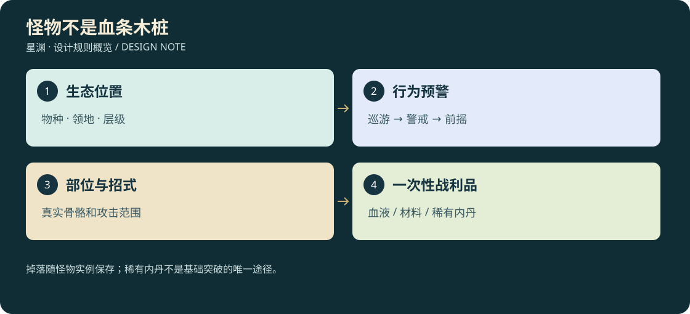

# D3-06 · 30 类生物、2 类机关与对应 3D

<!-- illustrated-overview:start -->

*图解：掉落随怪物实例保存；稀有内丹不是基础突破的唯一途径。*
<!-- illustrated-overview:end -->

依赖：[战斗](02_COMBAT_WEAPONS_SKILLS.md)、[掉落](03_ALCHEMY_MATERIALS_ECONOMY.md)、[地区](04_WORLD_REGIONS_EXPLORATION.md)。本文件交付的是造型、骨架、行为、掉落和制作验收规格；尚未生成这些模型，不消耗 aholo 积分。

## 1. 生态与成长的关系

规划 **30 类生物敌人**，每境 3 类（普通、精英、首领），另有 **2 类科技机关敌人**。同一生物族可有年龄/境界变种，但新境界至少增加一个行为或环境交互，不只变大换色加血。生物吸收地脉和灵石逐渐形成内丹，解释低阶核少、高阶核多。

所有生物掉血液，骨/皮/甲/筋按身体结构定义；完整内丹按 D3-03 的境界＋精英度表。表中“必得”表示成功领取一次掉落的最低产物；概率核和额外身体材料另按通用表，不与必得重复生成。首领的首次知识奖励只给一次，后续仅给可再生材料。

出生/死亡/再生代数、种群上限、可见入场、尸体与掉落保存统一遵循 [世界刷新系统](08_WORLD_DIRECTOR.md)。怪物模型加载失败不得激活不可见伤害，召唤怪是否奖励必须在事件配置显式声明。

## 2. 敌人、打法与收益清单

|ID / 境界 / 类别|生物与形态|核心招式、弱点、玩家解法|最低战利品与用途|
|---|---|---|---|
|M00 / R0 / 普通|砂脊掠兽，四足低伏、骨脊与长尾|刨地 0.8 秒后直扑；侧闪后攻击肋部；可诱开采草|掠兽血×1；R0-A，皮筋可造握带|
|M01 / R0 / 精英|棘背兽，重前肢、扇形背棘|正面角甲、冲撞后卡岩；重击/侧攻破甲|棘背兽血×2、角甲×1；R1-A 和盾甲|
|M02 / R0 / 首领|赤喉巢母，腹囊与四足厚壳|喷砂遮线、呼叫小兽、腹囊蓄气暴露；扫描识别真腹囊|掠兽血×5、巢母筋×2；首杀炼体路线知识|
|M03 / R1 / 普通|泽鳄，六肢浅水伏击兽|水纹提示扑咬，陆地转身慢；引到浅滩|泽鳄血×1；R2-A，鳄皮护具|
|M04 / R1 / 精英|腐雾孢蛛，八足菌囊|蛛丝封路、菌囊喷雾；打囊或点燃环境清路|孢蛛血×2、韧丝×1；通用炼丹净化/弓弦|
|M05 / R1 / 首领|沼冠巨蜥，背生水生药草|翻滚/尾扫、周期饮水恢复；关闭水道或持续打断|泽鳄同族血×5、潮冠甲×2；首杀药圃索引|
|M06 / R2 / 普通|熔甲兽，重甲四足|发热后冲撞，冷却时甲缝张开；火区调水降温|熔甲兽血×1；R3-A，耐热甲|
|M07 / R2 / 精英|炉鳞蜥，贴壁火蜥|贴壁喷射、尾部散热；远程断附着后近战|炉鳞血×2、耐热腱×1；锻造辅料/F3|
|M08 / R2 / 首领|熔巢巨兽，岩甲巨躯|三段踩踏、地火喷口；逐部位拆甲开弱点|熔甲兽同族血×5、炉心甲×2；首杀冷却阵蓝图|
|M09 / R3 / 普通|镜翼兽，晶膜双翼|假影突袭，真身落尘/有声；扫描或观察影子|镜翼兽血×1；R4-A，晶膜法器|
|M10 / R3 / 精英|盲鳞潜兽，地下长体|听脚步破土；慢走引位、出土后打头|潜兽血×2、感震鳞×1；感知装备|
|M11 / R3 / 首领|镜渊蛟，四肢长颈、水晶角|真假身交替、折射吐息；破镜台取消反射|镜翼同源血×5、镜角×2；首杀元婴传承碎页|
|M12 / R4 / 普通|雷脊兽，背部储雷角|竖角预警后跳砸；借避雷岩泄放再攻击|雷脊兽血×1；R5-A，雷筋御器|
|M13 / R4 / 精英|风镰隼，长翼钩爪|俯冲切线、横风击退；御器侧移或地面掩体|风隼血×2、风羽×1；轻型法器|
|M14 / R4 / 首领|天穹雷鹏，巨翼雷纹|导雷链与高空落雷；先破接地点再短暂上背|雷脊同源血×5、雷羽骨×2；首杀游空预修法|
|M15 / R5 / 普通|虚渊兽，六足半透明鳍|短距裂隙突袭，出口提前浮纹；辨出口方向|虚渊兽血×1；R6-A，界膜装备|
|M16 / R5 / 精英|盐海骨螯，四对足重钳|钳夹拖入盐池、背甲开合；打断钳部/飞到安全台|骨螯血×2、抗蚀甲×1；护具与阵器|
|M17 / R5 / 首领|裂界螭，长体双翼|撕开有限裂隙、阶段性坠地；空战与地面恢复交替|虚渊同源血×5、界角×2；首杀星门校准部件|
|M18 / R6 / 普通|重环兽，四足悬石甲环|局部重力压制；脱离环域/击破悬石|重环兽血×1；R7-A，重力武器芯|
|M19 / R6 / 精英|空折螳，双刃昆虫|两次折跃斩，第二斩留出口标记；不能只躲第一下|空螳血×2、折刃×1；空间武器|
|M20 / R6 / 首领|虚衡巨龟，浮陆背壳|重力翻转、甲柱保护核心；利用平台稳定区|重环同源血×5、衡甲×2；首杀领域入门典籍|
|M21 / R7 / 普通|噬星鳐幼体，气海游鳐|在星球高空灵流中游动，尾束横扫；可从浮台战斗|噬星鳐血×1；R8-A，不要求先有真空飞行|
|M22 / R7 / 精英|法纹獬，角兽、移动纹阵|切换冲击/反射领域；观察角纹选攻击时机|法纹血×2、纹角×1；领域法器|
|M23 / R7 / 首领|万象麒麟，四足披云鳞|昼夜相与场地规则切换；控制两处领域锚点|噬星同源血×5、万象鳞×2；首杀护域知识|
|M24 / R8 / 普通|界鲸幼体，真空鳍兽|引力吸入、侧鳍拍击；绕侧避开吸入口|界鲸血×1；R9-A，星空护具|
|M25 / R8 / 精英|陨甲螯，附着小天体的甲兽|抛碎陨、锚定翻转；先断锚脚，利用陨石掩体|陨螯血×2、星甲×1；星炉装备|
|M26 / R8 / 首领|吞曜巨鲸，真空大型生物|吸收星光、护膜分区与喷流；多次接近/撤离补气|界鲸血×5、曜骨×2；首杀道源线索|
|M27 / R9 / 普通|源蚀龙，能量脊与长躯|侵蚀护域、标记区域爆发；领域切换清除附着|源龙血×1；道源终局淬体/武器改良|
|M28 / R9 / 精英|星核卫兽，晶骨四足|星核连线护盾，破节点进入输出窗口|核兽血×2、源晶骨×1；星核事件准备|
|M29 / R9 / 首领|寂源古兽，四足长颈与星核冠|多节点跨场地战；阻止回流后选择封印/毁核|道源血×5、寂源核壳×2；终局构筑与唯一档案|

“同源血”不是把不同血随机混成原料：图鉴明确归入对应配方血型标签，掉落仍显示具体来源，可追溯生态关系。同境其他血液可净化成通用药用血浆；不能替代命名突破血型，除非配方明确列出替代品。

机关 G00 舰内失控维护机：前向焊枪、侧后冷却口，掉合金与电容，可战斗或恢复权限停机。G01 遗址巡阵傀儡：方向盾与阵核连线，掉阵纹板/能晶，可破盾或解阵。两者不掉内丹与生物血；停机路线给研究奖励，不能反复开关刷材料。

## 3. 第一只怪物的具体模型与动作合同

M00 砂脊掠兽：肩高 0.75 m，鼻到臀 1.45 m，尾 0.9 m；前肢略粗、胸廓低、后腿反关节但有明确膝踝，四足接地；灰沙色短皮配暗红颈褶，骨脊为外露角质。眼睛位于头侧，不画成发光机械镜头；禁止用胶囊加球体直接当最终生物。

参考图制作需正/侧/后/四分之三、张口/闭口、骨脊与脚掌细节，比例尺一致。概念图确定以后制作真实闭合网格、UV、PBR、骨架与动画；不能把平面怪物图立在场景里冒充 3D。

基础骨架目标 32—44 骨：根/骨盆、脊柱 3、颈 2、头/下颌、四肢各 3—4、尾 5—7；足底与口部有命中/接触挂点。视觉眼睛骨可选，不让尾巴碰撞承担整个身体受击箱。

首套动画 13 段：待机呼吸、嗅探、步行、疾跑、左转、右转、扑击前摇、扑击生效、落地收招、轻受击、破势倒地、起身、死亡。前摇约 0.8 s，扑击约 0.3 s，收招约 0.7 s；根运动与实际扫掠位移只能选一个权威来源，不能双重移动。血样采集为玩家工具动作，不要求每只尸体做一套循环血动画。

## 4. 复用骨架，不复用全部玩法

|骨架家族|可复用对象|必须单独制作的差异|
|---|---|---|
|低伏四足|掠兽、棘背兽、熔甲兽、雷脊兽|甲片、体重、步态、冲撞/扑击时序|
|重型四足|巢母、巨蜥、重环兽、麒麟、卫兽|受击部位、躯干骨、首领攻击与阶段|
|多足节肢|孢蛛、骨螯、陨甲螯|足数、钳/蛛丝/喷囊结构|
|蜥/长体|炉鳞蜥、潜兽、蛟、螭、源龙|贴壁、潜地、翼、脊柱数量|
|双翼|镜翼兽、风隼、雷鹏|翼膜/羽毛轮廓、起落与俯冲|
|刃虫|空折螳|双臂攻击扫掠与折跃预告|
|巨壳|虚衡巨龟|可站立背部、平台与甲柱|
|鳐/鲸|噬星鳐、界鲸、吞曜鲸|鳍面、尾链、真空运动与可打部位|

寂源古兽用重型四足扩展星核冠与长颈，禁止为了凑复用牺牲可辨识形态。远景高阶首领采用分部位渲染与碰撞，先以 20—120 m 可战斗个体制作；设定中的巨型投影不等于一张百万面模型覆盖整个星球。

## 5. 资产预算与交付要求

普通怪 LOD0 18k—35k 三角，LOD1 8k—15k，LOD2 2k—5k；精英 30k—60k；首领 60k—120k，按部位拆分。普通怪最多 2 套 2K 纹理、3 个材质；首领最多 4 套，低画质使用 1K。预算为制作上限，实际同屏首轮目标 8 普通＋2 精英或 1 首领，超预算必须测量降级，不默认所有 30 种一起加载。

每种交付：概念图与提示词/来源、`.blend` 可编辑源、`.glb` 游戏资产、贴图、骨骼映射、动画事件表、碰撞尺寸、掉落/行为配置 ID、许可记录、版本清单。文件目标目录 `playable/assets/monsters/<id>/`，尚未生成时不创建假 GLB。

命中事件来自动画生效区间与实际空间扫掠；受击部位用简化碰撞而非高模逐三角碰撞。死尸可采集后转低成本残留或淡出，已采记录保留。离开区域释放动画、粒子和贴图引用；重新进入不能复制未领取掉落。

## 6. 制作优先级与验收

先 M00 普通怪 → M01 精英 → 一种药草和一块陨石 → M02 首领 → G00 机关，配合真实炼丹闭环。怪物每次至少验收：无灯/有灯可读轮廓、前后左右视图、脚底与转弯、第一人称近距离、被刀/远程命中、尸体采集、实际掉落进入库存，以及重载和区域往返后的去重。

若使用 aholo，先核验剩余积分与单次报价，优先一次生成一只已确定造型的样板，在 Blender 内修骨架、权重和动作再复用；不一次生成三十只未经验证的怪物。效果不佳时保留来源与问题记录，不声称只调用了工具就实现美术目标。
