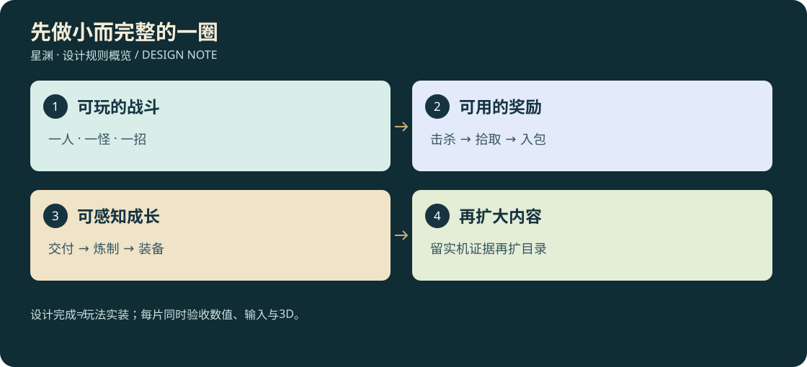

# D3-07 · 分阶段开发、数据与验收

<!-- illustrated-overview:start -->

*图解：设计完成≠玩法实装；每片同时验收数值、输入与3D。*
<!-- illustrated-overview:end -->

依赖：[D3 总览](README.md)。这里只安排工作，不把文档完成计为游戏实现。禁止直接将当前离线探索原型改成满级全功能菜单。

## 1. 开发切片

|阶段|读取规范|实际交付闭环|结束标准|
|---|---|---|---|
|C0 基线与存档|01、07；既有输入/存档/模型文档|旧档备份、字段审计、当前任务资产清单、D3 schema 草案|迁移可逆，未覆盖旧档；确认旧扫描/闪避/飞行/车辆操作|
|C1 第一场战斗|02、06|玩家生命、刀/发射器、M00 前摇扑击、闪避、受击、昏迷救援|真实武器/怪物 3D，一场完整可输可赢战斗；无固定假伤害、无双倍掉落|
|C2 战利品与采集|03、04、06|M00 血液、草药、铁陨、背包、一次性拾取、材料品质|击杀/采集→库存→存档，重载不复制；普通路线不靠内丹|
|C3 NPC 与经济|03、05|领队/医师/锻造师/商人/教习的共用对话框、买卖/炼丹/锻造|掉落→出售/加工→真实装备和制剂；不足、取消、背包满可恢复|
|C4 后天成长|01、03、05|修为、小级、打坐、72 小时离线、灵石预存、后天淬体槽的三条替换路线|每一级属性可核算；后天只有一个体质槽，三路线互替；离线不跨境|
|C5 先天突破与首领|01—06|M01/M02、R1 三丹方、先天能力、教习传承突破、F1 交通|两条不同材料路线能突破；一次普通远征目标 20—30 分钟，不等于 30 分钟从后天一级升先天；低核率不软锁|
|C6 先天—金丹区域|01—06|Z1/Z2/Z3 分批、F2/F3、枪剑锤、相应药材/NPC/怪物|每区新战术与新材料闭环；真实自由往返和强敌救援；分区加载可测|
|C7 元婴—化神|01—06|Z4/Z5、御器、御空、能量耗尽降落、母星 R6 突破准备|200 m 飞行器上限与御空区分；低气返航、安全落点、界隙材料可收齐|
|C8 跨星与合道|01—06|空衡/万象落地区、传送、R6/R7 成长、工匠与交易|来回闭环、首次返程保障、下一境材料无循环依赖|
|C9 星劫与道源|01—06|星空场景、真空护域、巨兽、R8/R9 制剂和装备|回气/救援不软锁，天体尺度与碰撞/加载可验证|
|C10 终局星核事件|01、04—06|无居民试炼星毁星/封印两结果、陨带、持久化世界变化|目标明确确认，回程与唯一任务不丢失，存档不复原被毁天体|

C4 表中的“淬体槽”指后天一个境界槽中的 A/B/C 三路线，绝不是同时装备三个后天槽。各阶段结束更新当前验收台账与对应规范，报告真实复测路径。后续阶段不能靠测试夹具授予等级就宣称玩家已能正常解锁。

新增横向依赖：[世界刷新 WD0—WD6](09_WORLD_DIRECTOR_CONFIG_AND_TOOLS.md) 嵌入上述阶段。C0 准备定义/种子/存档，C1 接第一组怪，C2 接采集再生，C3—C5 接经济约束，再扩随机事件和大地图。刷新系统不单开项目，也不等所有玩法完成后才补建。

本轮补充的开发依赖：C0 先分离 character/world/container/transaction ID；C1 同步实现真实追击、脱战和后天地速；C2 的库存必须有格数/体积/负重，并接车货舱；C3 接恢复药与扩容教学界面；C4—C5 接首个随机洞府/纳物袋、离线疗养与先天速度；C6 扩储物戒、定居洞府和爆发后遗症；C7—C9 接高级空间容器与飞行追逐。不能先把所有物品无限塞进背包，最后才补重量。

未来联网按第 14 文档独立阶段推进，当前仅保持纯逻辑/存储适配边界；联网角色不直接接收不可验证的单机资产。

## 2. 数据模型建议

19—24新增横向切片：C1接统一伤害、WS01/WS03与五阶日志；C3接真实学习/兑换界面；C5接S01外门到正式入门、一个委托和一次NPC比武；C6接R2立宗、一个仓库、AR01告警/AR02盾的供能破坏修复；之后才扩六宗、六十武技和十二阵法。宠物先保留15的PET09地面/PET17载飞路线，再用22的PET03/04/05覆盖攻击/盾/治疗样板。每片同时交真实3D动画与图/视频版本，不能把设计数量当完工数量。

新增定义需明确SkillDefinition的C/a/b、tier、五阶系数、hitType、前/后摇、段权重、资源成本、effectVariant和动画事件；Sect/Building/Formation实例与账本字段见24。优先验收一次“领任务→学招→实战→交付→兑换有效补给”和“学阵→布设→供能→被破坏→修复”的闭环。

|对象|最低字段|
|---|---|
|RealmDefinition|id(R0—R9),name,levels,baseScale,capabilities,breakthroughRecipeIds|
|CultivationProgress|realm,level,xp,bodySlots[10],opportunityIds,trainingState,lastOnlineAt,lastSettledAt|
|TrainingState|stationId,startedAt,offlineEnabled,spiritBudget,spendEnabled,fractionalCostCarry|
|ItemDefinition|id,family,tier,qualityRules,stackLimit,tradeable,baseValue,sourceTags|
|ItemStack/EquipmentInstance|definitionId,quantity,quality,provenance,instanceId,affixes,durability|
|RecipeDefinition|id,targetRealm,route,inputs,allowedSubstitutes,output,bodySlotEffect,craftTime,serviceRule|
|CraftOrder|id,npcId,recipeId,lockedInputs,startAt,completeAt,resultSnapshot,status|
|MonsterDefinition|id,species,realm,rank,stats,aiProfile,animationEvents,hitVolumes,lootProfile|
|MonsterInstance|id,spawnSeed,zoneId,state,health,lootSeed,deathRecorded,lootClaimed|
|NPCDefinition|id,zoneId,dialogueRoot,services,stockProfile,craftTierCap,qualityCap|
|Transaction|id,kind,expectedStateVersion,inputs,outputs,committedAt|
|WorldProgress|discoveredZones,returnAnchors,rescueStations,uniqueEvents,planetStates,resourceNodes|
|ContainerDefinition/State|id,ownerId,type,slots,volumeMl,maxInternalMassGrams,transmittedMassRatio,items,bound,revision|
|StorageExpansionOrder|id,containerId,skillRank,lockedMaterials,beforeCapacity,deltaCapacity,status|
|CaveInstance/HomeState|id,characterId,seedVersion,roomGraph,coreRewardState,discovered,homeTier,storageIds|
|MedicineEffect|id,sourceItemId,appliedAt,remainingDuration,aftereffectDebt,treatmentUsed,cooldownFamily|
|PursuitState|targetId,lastKnownPosition,senseChannels,searchUntil,homeAnchor,velocity,state|

定义只读、进度可存档、战斗瞬态独立；不要把纹理路径、逻辑状态和余额塞进一个 UI 对象。所有稳定 ID 使用 R/W/M/N/Z/P 前缀与本文表对应，名称可以本地化。

金额以碎灵石整数 BigInt 表示，JSON 存十进制字符串。三十份制剂为 `R0-A` 至 `R9-C`；目标境界、材料层级与当前角色境界分开。掉落质量 Q 不与 NPC 段位 R、灵石面额混用。

## 3. 事务与恢复

购买、出售、兑换、炼丹开炉、领取、突破、采集与离线结算都执行：读取带版本状态 → 校验条件和数量 → 构建新状态 → 持久化完整结果 → 发布动画/UI。无法写入时不先播“成功”并从旧状态继续。浏览器本地存储先保留前一份完整备份与事务 ID，不假装多次独立写入天然原子。

重复确认同一事务返回已提交结果。炼丹开炉锁材料，完成后领取标志和入包同次提交；存档损坏不能读成新订单再领一遍。随机掉落在实例首次生成时确定、死亡时确认，载入不重掷。浏览器离线版不提供对抗修改客户端的经济安全承诺。

## 4. 现有原型迁移

- 当前调查主线、黑匣子、地图发现、车辆维修、电池、驾驶视角、扫描器装备、角色/车辆资产保持；D3 新字段以默认后天 1 级增加，不虚构旧玩家击杀历史。
- 现有身体/装备续航升级保留为 `legacyAdaptation`，先沿用当前 30/60/90/120 秒效果。D3 01 中基础移速不重复乘这些旧续航等级。
- 旧入门闪避直接视为已学习教学技能；未学玩家仍按教学解锁；保持 E 绑定。旧功法草案中的核心槽未实装部分不迁移成免费装备。
- R0 扫描/闪避/助推先由设备供电/体力解释；R1 真气上线时逐项指定资源来源，不同时扣两种池。老设备依然可用，不因突破突然消失。
- 原共振能量草案被“R0 科技电容/R1+真气”覆盖；不能保留一条隐藏恢复条形成无限供能。
- 旧存档离线时长在首次迁移时不追溯发放数月经验；创建训练记录后才开始计时，界面明确说明。
- 不删除独立 Godot 旧实现；引擎迁移是单独任务。当前浏览器版先验证战斗与经济，再基于性能决定扩大世界技术路线。

## 5. 必须执行的测试

|模块|关键用例|
|---|---|
|境界|100 等级、每境 10 级、9 次跨境、R0 淬体、R9 封顶、三路线互替不叠加、机缘不跨两境|
|战斗|攻击/重击/格挡/闪避、真实弱点、低帧扫掠、墙后不命中、死亡一次掉落、追击脱离不刷奖|
|失败救援|低境越区、无钱、空装备耐久、任务唯一样本、传送外星后败北、回站鼠标无需 Alt|
|掉落|固定种子、R0 0.2% 与 R9 80% 普通核率、机械无血核、10 内丹片替换、品质分布和最低奖励|
|配方|全部 30 配方有产地/NPC/层级，至少一条无核路线、目标 R 材料在 R−1 可达、R6 材料母星可得|
|修炼|0/1/71/72/73/96 小时、负时差、重复登录、满槽、自动小升级不跨境、有限预存/无授权不扣石|
|灵石|五面额各相邻 1:100、反向找零、高额精度、重复兑换无收益、吸收只扣实际价值|
|交易/制作|不足、背包满、取消、NPC 无钱、服务上限、离线单次完工、一次性领取、崩溃恢复|
|飞行|0—3 境必须有设备、200 m AGL 封顶、R4 御器、R5 耗气/缓降、R8 护域、无免费悬空回气|
|世界|地区无等级空气墙、危险预警、复访低阶无修为、首传回程、毁星只改目标、不丢 NPC|
|UI/3D|640/768/1440 中文不裁切、对话选项可点、第一/第三视角同命中、武器图模对应、怪物多角度/连续动作|

概率单测使用可控种子与大量廉价模拟，不跑几只怪就断言掉率正确；普通游戏流程测试不依赖随机内丹。离线边界使用注入时钟，不让测试真等 72 小时。真实浏览器手测不可用直接改背包绕过唯一的收益入口。

## 6. 调参观察与阶段退出条件

每轮记录首杀耗时、受击次数、失败后返回耗时、一个普通突破的有效游玩时间、材料库存积压、净灵石收入、飞行返航失败率。目标是玩家一次远征至少获得一个可解释的进展；若只获得无用途材料或重复回程，先改任务与经济，再加怪物种类。

C1—C5 验收时由玩家实际体验确认打击感、动作观感和成长回报，自动测试只证明规则一致。未完成动作/素材的项目必须列为未完成，不用文字特效和静态图替代真实玩法。

## 7. 本轮文档交付范围

D3 初稿完成：八份模块文档、十境级别表、三十丹方、二十四固定 NPC、三十生物与两机关、十大武器、母星六区与高阶星球路线、离线/救援/交易/飞行规则。此轮不修改游戏源代码、不生成收费模型、不迁移用户存档。文档检查通过不等于 C0—C10 实现或运行测试通过。

文档结构检查记录：[cultivation-doc-audit.json](../../artifacts/cultivation-doc-audit.json)。检查覆盖八份文档的相对链接、十境属性表与公式、24/30/10 个 NPC/生物/武器唯一编号，以及十境各三份配方共 30 份。复核流程：从总览依次检查模块 → 对照各目标境界材料的上一境来源 → 走查 NPC 产能/品质上限 → 按 C1—C5 首轮路线核对收益入口。本轮未执行游戏运行回归，因为未修改游戏代码。

2026-09-12 刷新系统补充后，文档包扩为十份，最新结构检查还覆盖第 08/09 文档链接与样板刷新配置的 JSON 可解析性。新增内容是架构和实施设计，未实现刷新逻辑或管理面板。

2026-09-12 储物/洞府/丹药/追逐/联网边界补充后，文档包共十五份。新增验收覆盖容量三约束、载具货重、袋戒禁嵌套、七种扩容材料、八类功能药的效果/债务、十境速度单调性、洞府奖励权重与角色种子、个人/在线资产分离。仅做文档结构/数值一致性检查，未宣称这些系统已实装。

2026-09-12 宠物补充：现十九份文档，33种谱系、26名固定NPC。C2—C3先接蛋/饲料/契约库存，C4—C5完成PET09孵化/收服/命名/迷你/地面助战，C5—C6用PET17做后天载飞，随后PET13羽翼空战，再按骨架家族扩品种。资产PA0—PA4顺序见第17文档；任何只完成图片的物种不得标记已可跟随战斗。

新增数据：PetDefinition/PetInstance/TamingProgress/PetMediaRecord参照第18文档。新增验证：33种唯一ID与飞行/食物引用、四档信任可达、七档血脉与十境不混用、普通/破限上限、骑手与宠物双高度/载重、模型和媒体哈希、同名/同种多角色归属。当前仅文档/资产盘点，不宣称宠物已实装。

本轮媒体盘点130份，共213,423,363字节，路径与哈希见第17文档。33条宠物资产注册记录全部 planned；独立备份状态未配置。自动文档检查结果继续写入 `artifacts/cultivation-doc-audit.json`，历史八/十/十五份记录只描述当时阶段，当前计数为十九份、26名NPC。
