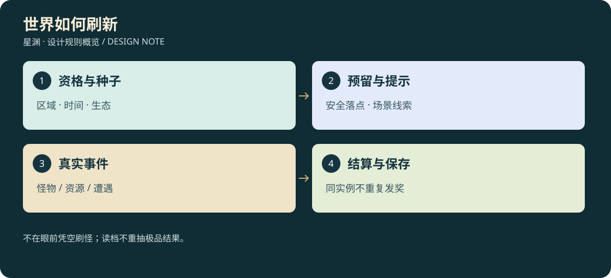
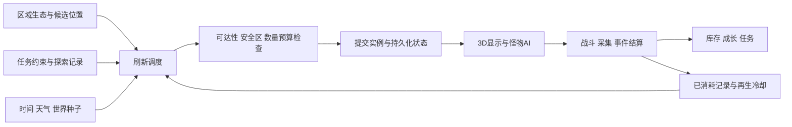

# D3-08 · 世界刷新系统：野怪、材料与随机事件

<!-- illustrated-overview:start -->


*图解：不在眼前凭空刷怪；读档不重抽极品结果。*
<!-- illustrated-overview:end -->

2026-09-12。状态：设计规格，尚未实现。依赖 [D3 总览](README.md)、[境界](01_REALMS_AND_CULTIVATION.md)、[经济](03_ALCHEMY_MATERIALS_ECONOMY.md)、[世界](04_WORLD_REGIONS_EXPLORATION.md)、[怪物](06_MONSTERS_AND_3D.md)。配套 [配置与开发面板](09_WORLD_DIRECTOR_CONFIG_AND_TOOLS.md)。

## 1. 放在哪里：同项目、独立模块

当前选择：**放在 star-abyss-game 内，建立独立 world-director 模块，不新建第二个仓库、不另开一个运行服务。** 它是游戏的世界内容调度器，负责何时、何地、以什么条件出现哪些对象；不是独立于玩法的随机刷怪器。

|方案|适用情形|本次判断|
|---|---|---|
|同项目独立模块＋数据目录＋调试入口|当前单人、离线浏览器原型，需要共享任务/存档/碰撞/资产|采用，调参与正常游戏共用规则|
|同仓库独立包/进程|第二款游戏复用，或大规模模拟需要隔离运行|保留边界，以后按证据拆包|
|独立后端项目|多人共享世界、服务器权威掉落、跨服交易、远程运营|未来另立架构；不为当前单人游戏先做网络依赖|

开新项目不会自动让刷新更可靠；现在反而会把境界、物品 ID、任务状态和存档协议复制两份。开发面板可以有独立网页入口，但仍属于本仓库，也不成为玩家必须打开的第二个软件。

当前源码核对：`playable/src/rocks.mjs` 用固定种子构造岩石，服务地形显示与碰撞；`meteor-scene.mjs` 增加陨石外观细节；`main.mjs` 集中序列化与本地保存探索状态。它们都不是 D3 的资源采集/野怪刷新系统。新模块不得把现有岩石 ID 重排后破坏旧坐标，也不得把每块岩石都默认为可采陨石。

## 2. 系统管什么、不越权管什么

输入：世界种子、规则版本、区域生态、可达地形、时间/天气、发现记录、任务约束、玩家位置、渲染/AI预算。输出：可落盘的刷新计划、对象实例、事件资格、候选被拒原因与统计。

管理六类内容：普通/精英/首领种群、药草与矿物节点、动态陨落、随机遭遇、稀有机缘、商站补货资格。境界系统负责升级，战斗系统负责生命/伤害，库存系统负责入包，交易系统负责价格；刷新系统不直接给玩家加等级、调物价或扣钱。

新增 [随机洞府](11_CAVES_AND_FORTUNES.md) 作为有入口/布局/守卫/一次性奖励的事件实例；法器、扩容材料、丹药进入合法奖励池，不另做一套无来源发奖器。私人定居洞府由角色所有权管理，登记后不被普通刷新替换。联网权威与个人机缘种子边界见 [第 14 文档](14_OFFLINE_AND_ONLINE_BOUNDARY.md)。

固定 NPC、主线唯一证据、已建安全点、传送阵由内容定义和任务状态控制，不混入普通随机池。商店只收到“可补货”事件，实际库存与钱由经济模块一次性提交。随机事件的脚本可以产生委托，不能随意改主线前置。



## 3. 四层世界内容

1. 固定层：营地、地形、主线终端、NPC、传送阵、保护通道。不能被随机刷怪占住。
2. 生态层：生境区、怪物巢穴、药圃、矿脉、巡游路线。定义长期在哪里可能出现什么。
3. 实例层：某一代掠兽、某一株月露苔、某次陨落，含数量、质量、状态与冷却。
4. 事件层：猎兽迁徙、受困勘测队、星辉机缘等，拥有独立条件、参与状态和一次性结果。

同一巢穴可以再次出怪，但上一代尸体未处理时不能在尸体上无条件叠新怪。材料可再生，但采过一次的节点在冷却内不能因区域卸载再出现。随机位置必须在已制作的生境候选区，不把整个 64×64 公里大陆当作均匀撒点平面。

## 4. 与境界、任务、经济绑定的原则

- 怪物境界由区域和物种定义，R0 区不会因玩家到 R5 就自动变 R5；高境返回仍能收低阶材料，但不刷低阶修为。
- 玩家的境界影响传闻、可参与的事件和奖励使用资格，不用于暗中提高当前怪物血量或暗改内丹率。
- 主线用“约束”保证至少一条成长路径：必需草、普通血与基础矿有固定可再生来源；随机事件增加选择，不决定能否升级。
- 目标境界 R 的配方材料需要在 R−1 的可达内容中存在，R6 材料必须在母星 Z5 可得。系统加载配置时先检查依赖图，发现循环就拒绝该规则包。
- 怪物死亡通知掉落模块，掉落模块引用 D3-03 概率表；调度器绝不因为“玩家最近运气差”改完整内丹概率。若增加公开保底，须另写规则和 UI，不偷偷实现。
- 采集、委托和掉落共同产生经济供给，但“材料库存少”仅可让已定义的商人发布需求或传闻，不直接往玩家脚下塞缺失材料。
- 药草消失、矿点枯竭、怪物返巢都有可读状态；地图只显示玩家发现的地点和大致成熟信息，开发面板的完整位置不暴露给正常 UI。

## 5. 分区与运行预算

内容区域 Z0—Z5 是玩法尺度；内部以 **256×256 米调度块**索引候选点和状态，坐标含 `planetId/zoneId/cellX/cellZ/heightBand`。这与现有岩石的 32 米碰撞索引不是同一层，不替换它。地下、地表、浮空平台用 heightBand 区分。

初始三档：距玩家约 160 米内进行完整 AI/碰撞；160—600 米保留低频活动状态与合适 LOD；更远仅保存数据和到期时间。边界带 40 米滞回，避免站在边界来回加载。数字只是首轮配置，需按实机性能调整。

步行以所在块和相邻块预热；载具/飞行按实际速度预测前方 5 秒路径，至少预热两块。相机看见的远景也要保证已有对象可显示，但不能只因为转头就新建一批怪物实例。

首轮战斗预算：同时完整运行最多 8 普通＋2 精英，或 1 首领及其最多 4 个普通召唤物；首领战时使用后者预算。超预算对象保留既有身份、降频或延后入场，不直接无痕删除正在追击的敌人。预算是性能上限，生态数量上限另外配置。

调度默认每秒一次；战斗命中沿现有仿真步运行，不能让每秒刷新的节奏降低碰撞精度。每次最多检测 8 个新生点、提交 2 个普通刷新计划，首领计划独占一次提交；超时排队。最终帧耗时上限由目标机器测量确定。

## 6. 刷新默认规则

本节所有“间隔”是**真实消耗后的最早补充时间**，不是定时覆盖现物。消费事务生成一次性空缺令牌；没有令牌，即使过期也不能再生。首次布置与后续换代分开；具体消耗条件、建筑例外、不同组合和世界唯一账本以[27](27_CONSUMPTION_AND_UNIQUE_WORLD.md)为准。

时间均为有效游玩时钟的秒数；菜单/暂停冻结。显示昼夜可加速，但不把“8 分钟刷新”隐式变成 8 秒。

|对象|再生起点与间隔候选|数量/生成限制|生成后的保存方式|
|---|---|---|---|
|普通怪群|该群最后一只死亡后 8—12 分钟，间隔首次确定|每巢 2—4 只，区域种群上限；未结束追击不重建|每只实例和巢代数保存|
|精英|死亡后 25—40 分钟|每个精英栖地最多 1 只；需环境条件|身份、冷却、掉落种子保存|
|可重复首领|首次任务胜利后进入 90—120 分钟再挑战冷却|需明确再挑战交互/进入场地，不在玩家身后自动刷|首杀知识永不再发；后续挑战有新实例|
|普通药草|采完后 12—20 分钟|每药圃 3—6 个节点，一次成熟 1 代|成熟时间、质量、产量固定|
|环境药草|采完后至少 30 分钟且满足天气/昼夜|符合条件才成熟；普通任务须有替代路线|条件窗口和已成熟状态保存|
|小矿脉|采尽后 30—45 分钟|每脉储量固定，分次开采不重置品级|剩余储量/代数保存|
|稀有矿脉|采尽后 90—120 分钟|在定义的高级矿带出现，有产量上限|本代主材和副产物提前确定|
|动态陨落|首次可布置；旧陨落采尽/实际清理后间隔30—60分钟|每区最多1个未处理陨落，未采不因计时过期|轨迹、落点、热度、矿量及消耗令牌保存|
|一般遭遇|新探索推进后，距上次约 8—15 分钟|最多 1 个主要遭遇；不能覆盖首领战/重要对话|已提示、参与、结算/过期状态保存|
|极稀有机缘|每次独立合格首次调查尝试 0.3%|同唯一事件一次，非计时刷出|成功或失败的尝试都记录|

每次间隔采用该代独立随机数固定抽取，不能每帧重抽延后时间。正在打的怪、已成熟未采的草不因为新时段开始换一份品质。事件召唤物也占种群/AI预算，须指定能否掉落；首领无限召唤的小怪默认无材料/修为，防止拖战刷收益。

## 7. 出生位置与“不能当面凭空出现”

先选生境候选点，再检查地形坡度/支撑、碰撞占用、怪物尺寸、巡游可达性、水深/洞内权限、活动预算和保护范围。新出生普通怪至少离玩家 45 米，精英 80 米；安全站边界外再留 80 米无敌对生成缓冲，唯一交互点周边留 20 米，必要通道不可阻塞。

距离只是最低条件：还必须不在当前可见空间，或有合法的洞穴出洞/掘地/降落等可见入场动画。第一人称正前方、第三人称相机视野、载具预测路径均参与检查；不能按玩家身体朝向判断“背后就安全”。相机视野外也不能在 45 米内突然出生。

已有怪物正常巡逻走入视野不算刷新。触发式伏击必须事先有足迹/声音/任务提示，并通过实际入口进入；不会把敌人直接放在玩家碰撞体内。无法找到位置就排队，记录 blocked_reason，不降低安全条件硬塞。

药草采完后的新一代可在合法邻近空位生长，或由旧根株长出不同组合的新收成；正在生长/未采一代的品质固定，不能瞬间换点。矿脉采尽后的下一代矿芯按27轮换伴生组合，不移动整座碰撞岩体。陨落须先有实际采尽/清理空缺，再给轨迹、声响与落点预兆；提交前复核保护区域和玩家位置，冲突就延后，不靠改落点新增第二份资源。

## 8. 随机数与可复现性

新档创建并保存 `worldSeed`。派生流使用稳定编码的 `worldSeed + rulesVersion + planetId + zoneId + anchorId + generation + purpose`，purpose 分为 spawn/species/interval/loot/quality/event。禁止业务奖励使用 `Math.random()` 或全局共享可变随机流；粒子可另用不影响玩法的随机数。

种子产生的是可重复结果，不自动等于保存：还要保存哪些代已经生成、死亡、采集、结算。怪物首次建立持久化实例时确定 lootSeed；质量/具体掉落可延迟计算，但算法版本与种子固定。修改其余区域内容不能改变已经存在的怪物掉落。

个人洞府/机缘另用 `characterId + characterFortuneSeed + discoveryOpportunityId + purpose` 派生，不与共享地形种子混用；结果附规则版本。新角色有独立机会记录，重进同一角色不会重抽。已有普通生态实例仍按世界种子；未来共享野怪与个人奖励权威分离，不能每客户端生成不同公共怪物。

只对新增代应用新版规则；已存在的实例绑定其原规则快照或可解析版本。游戏更新不能将旧尸体重新抽成新品，也不能因为排序改变发出不同 IDs。PRNG 具体算法在实现时选定并加入固定输入/输出向量；跨平台须一致，不能只保存“seed”而忘记算法版本。

这能防止正常刷新、重进和重新载入当前状态时重复抽奖，**不能阻止纯离线玩家回滚整份旧存档或修改客户端**。若以后接联网交易，掉落和时间必须转为服务端权威，不能把本地种子当防作弊方案。

## 9. 对象状态与掉落事务

普通种群：`alive → defeatCommitted → vacancyCreated → cooling → eligible → reserved → nextGenerationCommitted`；合法收服也可通过人口转移产生空缺。eligible要求空缺令牌和到期条件同时满足。每只个体独立记录，群体补充仍在最后成员死亡/转移后开始；掉落容器走独立生命周期，不将物品未领误当怪物还活着。

可采节点：`growing → mature → harvesting → depleted → growing`。采集提交扣剩余储量并入包同次完成；取消读条回 mature，不偷扣一份材料。资源品质属于当前代，剩余次数属于同一库存。

事件：`candidate → reserved → telegraphed → active → resolved/expired`。玩家接受的事件在远处卸载时保留简化状态；未参与的一般事件到期可消失，但不会自动发奖励。唯一机缘成功触发后转为已发现机会，未领取不会离线悄悄消失；已拒绝/已完成按事件明示规则记录，不能换区重新抽。

战利品id采用`monsterInstanceId + rewardIndex`；死亡记录、空缺来源与战利品清单同次落盘，拾取与入库同次落盘。尸体3D可淡出，但未领物品转为持久遗留标记，取消旧15分钟自动过期规则。普通剩余物可由玩家明确放弃，唯一/任务物不自动清理。新怪不得与原尸体叠放，每锚点未结算普通战利品容器达到3个时暂停该锚点补怪；其它锚点独立运转，详见27。

## 10. 离线、暂停与重登

三个时钟各有职责：

|时钟|推进方式|用途|
|---|---|---|
|simTime|只在正常游玩时推进，暂停不动|战斗、追击、物品期限、在线生态冷却|
|civilTime|昼夜/气象日历，由配置控制与 simTime 的比例|夜开花、雷雨条件、商站在线补货日历|
|wallTime|真实时间，带已结算最大值/可信来源说明|离线修炼、单次制单完成、离线生态资格|

离线修炼仍独立遵守 72 小时上限。刷新模块不会离线打怪、自动采矿、累计数百次陨落或奖励。离线生态采用保守恢复：本次未结算离线间隔最多提供 **30 分钟再生抵扣**，且每个已消耗普通怪巢/草/矿最多推进一代；抵扣只用于变成 eligible，回到游戏并通过出生检查后才实际生成。

活动中的怪、未采成熟节点、未领尸体不在离线期间视为被杀/被采或换代；追击载入时在原合理位置复原，先有可控输入和安全恢复窗口，不能玩家还在载入就受伤。精英、首领、动态陨落与机缘不获得离线冷却抵扣，必须通过各自有效游玩/挑战规则。

每个耗尽状态保存剩余冷却与已应用离线区间；同一离线区间只结算一次，反复登录不重复赠送 30 分钟。暂停只是暂停，不当作一次离线领取；只有正常退出或确认的后台长挂进入重登流程才计算一次，不能开关菜单刷再生。

商站“每24游戏小时、离线最多一次”仅是对已售缺额的补货窗口。未卖的货原样保留；新到货有运输/生产来源，不整页重抽品质。在线civilTime以12倍simTime推进，窗口为120分钟游玩；离线至少24小时才获一次缺额补充资格。每NPC保存缺额令牌、到货单和lastRestockAt；玩家卖给商人的回购物独立保留。

## 11. 事件多样性与稀有机缘

一般遭遇每 60 秒检查一次资格，但必须满足距上一事件 8—15 分钟、推进到一个未消耗探索机会点、当前不在首领战/关键对话、存在可达入口，才尝试挑选；不是每 60 秒都抽 0.3% 机缘。最近三个同类事件降低一般选择权重，最多同类连续两次；不影响独立的内丹/品质骰。

“合格首次调查”是作者或区域生成器定义的 `discoveryOpportunityId`，如首次完成某遗址调查、找到某独特地脉；穿过一个调度块、打开一次地图、重复杀同一巢的怪都不算。ID 集合持久化，首次完成时原子记录已尝试，再用专属流进行一次 0.3% 机缘尝试；失败也记录，不能刷进出。

成功后在匹配资格的机缘池选择内容；唯一类先查世界根唯一账，未领取但已预留也不可再次抽到。无落点可保留原资格，不能重掷稀有概率；唯一池耗尽与空间暂缺分别处理，见27。普通生态换代不生成新的首次调查机会；26的逆天传承也不能靠反复采同一矿重抽。

普通探索洞府采用独立的 8% 线索尝试/第七次保底规则（第 11 文档），不调用永久机缘 0.3% 骰；线索、洞府布局、主要奖励三者都有稳定实例 ID。人物负重只影响到达能力和拾取容量，不改变奖励品质；满包时保留洞府核心领取状态供回取，不把一次未入包当作已领取。

宠物新增独立 PET 野生/蛋巢规则：生成时固定血脉潜力、性格和外观种子，收服信任/有效喂食/迁徙轨迹随实例保存。成熟期难度按第15文档，不因角色升级重抽幼体；已契约宠从野生人口账转个人所有权，死亡战利品和收服奖励互斥。宠物蛋作为第11文档既有主要奖励类别下的版本化子项配置，完整权重必须重新归一化，不能不改总表又附加一个无限额33种蛋骰。稀有破限契约只进入永久机缘的合法子池。

当前新洞府奖励表已在第11文档调整为七类，宠物类8%，其中50%蛋/50%培养材料；旧洞府仍保持原实例版本。已缔约宠倒地不产血液/内丹，也不能释放后按原实例反复抓取/击杀领取唯一奖励。

## 12. 与存档、版本和工程的边界

建议目录（将来实现，不预先放空模块冒充完成）：

```text
playable/src/world-director/
  director.mjs          # 调度与计划
  state.mjs             # 实例、代数、冷却、事务状态
  rng.mjs               # 可复现派生随机流
  policies.mjs          # 任务、区域、安全与预算约束
  placement.mjs         # 位置校验接口
  events.mjs            # 遭遇/稀有机会
  persistence.mjs       # 序列化/迁移
  adapters/             # 接 main、战斗、库存、3D；逻辑核心不依赖 Three.js
playable/data/world-director/  # 生境、刷新、掉落引用、事件配置
tools/world-director/         # 校验、模拟、诊断与开发入口
```

逻辑核心接收注入时钟、随机流和空间查询，输出 plans，不直接操纵 DOM/Three.js/localStorage。适配层统一提交世界状态及库存相关事务。世界视图只消费已确认实例，不能先显示怪物再补存档。

旧档迁移新增 `director.schemaVersion/worldSeed/rulesVersion/cellStates/anchorGenerations/uniqueClaims/discoveryAttempts`；首次迁移不追溯几年离线资源、不替换固定地形。只存变化过的块和必要高水位，远处未访问区域按定义懒生成。死亡/已领记录可压缩成代数高水位＋未结算例外；旧实例请求仍需被高水位拒绝，不因垃圾回收再次有效。

首片小数据可接现有存储适配器；64×64 公里阶段评估 IndexedDB 分块存储和事务，达到容量/写入耗时阈值前必须迁移，不能把全部世界每帧 JSON.stringify 到 localStorage。迁移失败保留原档，显示错误并禁止继续生成有奖励对象。

## 13. 可验收的第一版

只做 Z0 一小块：2 个掠兽巢、1 个棘背精英点、2 个药圃、1 条铁陨矿脉、1 个普通陨落事件候选；再接一次固定教学任务。验证杀怪/采集后冷却，远离回来才安全再生；存档与重进结果一致；同一材料能进入 D3 的炼丹/锻造。没有真实采集与库存时，不能只在地图上循环出现光点就算完成。

验收必须覆盖：视线内不凭空刷怪、顶着巢穴不无限出怪、进出块不重置、离线不积累奖励、暂停不刷新、固定种子复现、老版本实例不变、缺候选只排队、必需材料可达、资源/实例上限、已领取无法再领，以及高阶返回新手区不会把怪物升级。
