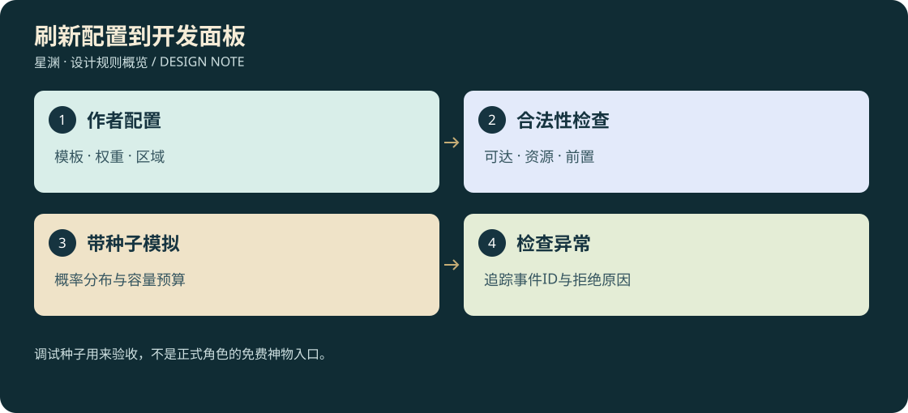

# D3-09 · 刷新配置、开发面板与实施顺序

<!-- illustrated-overview:start -->


*图解：调试种子用来验收，不是正式角色的免费神物入口。*
<!-- illustrated-overview:end -->

依赖：[世界刷新规则](08_WORLD_DIRECTOR.md)。此文件定义给开发者使用的工具，正常玩家只看到世界、图鉴与传闻，不看到全部随机种子或刷新倒计时。

## 1. 配置不是一串随机概率

每个候选内容必须绑定合法 ID、来源用途、生态条件、空间约束和持久化策略。掉落概率只维护在经济配置里一处，刷新表引用 `lootProfileId`，不复制十境内丹概率。

|定义|必填字段|拒绝示例|
|---|---|---|
|BiomeRule|id,planetId,zoneId,realmRange,habitats,candidateSets,protectedVolumes|生境在未制作地图外；R0 区无解释刷新 R8|
|SpawnAnchor|id,biomeId,speciesPool,populationCap,respawnPolicy,placementProfile|缺 M ID、无地面支撑、上限为负|
|ResourceAnchor|id,itemFamily,tier,qualityProfile,yieldRange,regenPolicy,sourceTags|无材料用途、纯机械掉血、低阶矿伪装高层|
|EventRule|id,eligibility,weight,cooldown,entryProfile,maxConcurrent,expiry,rewardPolicy|没有进场方式、无法结束、无限召唤发奖励|
|OpportunityRule|id,discoverySet,realmEligibility,uniqueKey,rewardId,fallback|每帧抽机缘、重复唯一奖励、成功却无落点丢失|
|SpawnPolicy|safeDistance,visibleEntry,groundRequirements,pathClearance,maxAttempts|只按距离不检查视线；失败时忽略碰撞|
|LootProfile|id,tableVersion,guaranteed,rolls,tier,qualityProfile|概率和大于1、数量负数、读取当前等级重抽尸体|
|CaveTemplate|id,entranceCandidates,roomGraph,realmRange,coreRewardProfile,inhabitable|门钥匙依赖循环、无退出路线、普通洞府重复给唯一核心奖励|
|CharacterOpportunity|characterId,discoveryId,fortuneSeedVersion,attempted,result,reservation|个人结果用共享随机流重抽、失败尝试未记录|

配置用 JSON 或可验证的静态模块。数值统一单位：时间秒、距离米、概率 [0,1]、金额碎灵石整数串。每份配置写 `schemaVersion`、`balanceVersion` 与变更摘要；稳定 ID 不含中文显示名。

## 2. Z0 样板配置（拟实现）

此例说明一只普通怪在既定地点如何再生，尚不是可运行模块。候选位置指内容制作时验证过的点集；不在设计阶段猜造会撞上现有舰体的坐标。

```json
{
  "schemaVersion": 2,
  "id": "Z0-LAIR-01",
  "planetId": "P1",
  "zoneId": "Z0",
  "candidateSetId": "Z0-SAND-HABITAT-01",
  "speciesPool": [{"monsterId": "M00", "weight": 1}],
  "realm": "R0",
  "levelRange": [1, 3],
  "groupSize": [2, 3],
  "populationCap": 3,
  "respawn": {
    "clock": "simTime",
    "after": "lastMemberConsumptionCommitted",
    "requiresVacancyToken": true,
    "delaySeconds": [480, 720],
    "offlineCreditMaxSeconds": 1800,
    "offlineGenerationsMax": 1
  },
  "replacement": {
    "newInstanceRequired": true,
    "excludePreviousComposition": true,
    "fingerprintFields": ["species", "groupSize", "entryLayout", "patrolVariant"],
    "onNoDistinctCandidate": "wait",
    "qualityIsNotExclusionField": true
  },
  "uniqueScope": "none",
  "placementProfileId": "GROUND-NORMAL-SAFE",
  "lootProfileId": "BIO-R0-NORMAL-V1",
  "sourceTags": ["blood:scavenger", "hide:basic"],
  "consumers": ["R0-A", "W01"]
}
```

`consumers` 是配置可达性检查与图鉴引用，不是击杀后直接生成成品丹/武器。M00 的血型对应掠兽血；由掉落/物品定义统一映射，显示名字变化不使配方失效。

## 3. 调度和提交接口

第27新增配置：consumePolicy、replacementPolicy、distinctFingerprintFields、uniqueScope/uniqueDefinitionId、minSupplyFamilies；世界根保存vacancyTokens与uniqueLedger。调度先查旧实例实际消费提交，再查时间/空间；新代事务同时消耗令牌、提交新实例和唯一预留。`explainAnchor`须能区分noConsumption、cooling、noDistinctCandidate、uniqueReserved、uniquePoolExhausted、unsafePlacement；不能统一显示“刷新中”。

建议契约，不在此实现空函数：

- `createDirector(definitions, savedState, adapters)`：校验定义和存档版本，不能失败后默默用随机新世界覆盖。
- `planTick(context)`：输入玩家/时间/视线/天气/任务与预算，返回 plans 和 rejectionReasons，不直接发掉落。
- `reservePlan(plan, expectedRevision)`：锁位置、数量和候选事件；重复调用返回同一 reservation。
- `commitWorldTransaction(transaction)`：由存储适配器原子记录生成、死亡或采集等结果；带实例 ID 与状态版本。
- `acknowledgeView(instanceId)`：仅标记 3D 已创建，不产生第二份世界对象。
- `applyOfflineEligibility(intervalId, elapsed)`：按规则产生到期资格，不能批量模拟玩家击杀。
- `serializeDirector()/restoreDirector()`：保留实例、代数、高水位、规则版本及未完成订单关联。
- `explainAnchor(anchorId)`：返回何时到期、为什么没刷、占了哪项预算、来源和消费端，供开发面板用。

状态提交顺序：定义校验 → 判断资格 → 空间查询 → reservation → 持久化 → 3D 创建；3D 加载失败时实例保持“待显示”且不激活伤害，进行有限重试或明确错误。不能模型失败时留一只看不见的攻击怪，也不能每次重试再增一只。

## 4. 开发面板：同仓库的独立入口

计划入口 `tools/world-director/preview.html`，由本地开发服务加载，使用隔离的测试存档与明确的“开发模拟”标识；不污染用户正常存档。构建发布时不包含强制掉落/跳时间操作。不是为玩家增加一页管理野怪的游戏菜单。

|页签|功能|必须能回答的问题|
|---|---|---|
|区域图|生境、候选点、保护范围、正在活动/冷却的对象|为什么这里有怪、那里没有？会挡 NPC 或通道吗？|
|生态与资源|巢穴人口、材料储量、品质分布、下一次资格时间|血、草、矿能否支撑本阶段配方？|
|事件时间线|候选→预告→参与→结算、被拒原因、唯一机缘尝试|随机事件为什么没触发？是否重复尝试？|
|概率模拟|固定种子批次、击杀量、实际分布与区间|低阶内丹是否仍稀有？是否引用错掉落表？|
|成长可达图|区域→怪物/节点→材料→配方→境界→下一区|有无需要先突破才能取得突破材料的循环？|
|回放与存档|快照、时间推进、区域往返、模拟载入失败|重登是否复刷、掉落是否重复、旧实例是否改变？|
|洞府与运输|角色种子对比、布局可达性、奖励量/重量、背包/货舱运力、追击走廊|不同角色是否有差异？拿到材料能否分批带回？追兵是否跨块消失？|

允许开发者切换天气、快进仿真、传送测试角色、强制一代生成、预置背包，但所有这些操作有日志，测试报告标记使用了哪些夹具。强制操作不得计入真实通关/掉率证据。

配置编辑流程：草稿 → schema/引用/可达性检查 → 固定种子模拟 → 3D 实机路线 → 人工采用 → 新版本。运行中的现有怪物保持旧规则，新代用新规则；需要改变既有实例必须显式迁移和备份，不能热更新悄悄重抽。

## 5. 数据校验与调参证据

校验四层：结构类型与单位；跨表 ID 与数量范围；成长可达性与替代来源；运行安全与资源预算。仅校验 JSON 格式远远不够。

最低预算检查为：Z0 普通路线在一次 20—30 分钟远征中有机会取得一次 R0-A 所需草×3、血×2、铁陨粉×1的原料，不保证玩家不探索就自动集齐；教学路线提供确定来源。两群 M00 共 4—6 只，即使完整内丹零掉落也不影响第一条淬体配方。

模拟分为经济仿真与行为仿真。经济仿真用 D3 掉落表统计 10 万次廉价抽样及置信区间；行为仿真用固定玩家路径检查何时看见/触发/错过节点。自动化路径不能代表所有玩家实际体验，最终还要实机玩一趟。

报告记录：规则版本、种子、测试区域、时钟推进、夹具开关、计划/拒绝计数、生成/死亡/拾取数、各材料净产出、唯一事件次数、活动对象峰值、存档大小和写入耗时。不能只展示“随机效果很丰富”。

## 6. 如何嵌入既有 C0—C10 开发

|切片|刷新系统工作|对应主开发阶段|
|---|---|---|
|WD0 规则与种子|schema、稳定 ID、独立随机流、旧档新增字段、候选点人工标定|C0，并先于 C1 动态刷怪|
|WD1 第一组种群|M00 两巢、数量预算、出生检查、死亡/冷却/再生|C1，接真实战斗，不先做所有怪|
|WD2 采集与掉落|草/矿代数、血液/内丹引用、采集去重、离线资格|C2，接真实库存|
|WD3 经济和任务约束|配方可达图、教学保底、NPC 补货事件、调试面板前三页|C3—C5|
|WD4 一般事件和机缘|陨落/迁徙样板、唯一发现尝试、永久机缘事务|C5 后，先做两类一般事件再稀有事件|
|WD5 大地图与跨星|调度块/预热、持久化压缩、IndexedDB、每星独立生态|C6—C9，不先生成全部行星|
|WD6 世界永久变化|毁星目标停刷、陨带新规则、NPC/唯一物保留|C10|

不能等所有怪物/丹方做完才加刷新系统，也不需要先造一个完整编辑器才能打第一只怪。先做稳定的规则和单一实例闭环，再扩开发工具。

## 7. 首版验收清单

1. 固定种子启动相同世界；改变粒子随机数不改变怪物或掉落。
2. 击杀/采集→离开→返回，冷却内不重生；冷却到期但玩家正在看着巢穴时不凭空出现。
3. 保存并重载后保持实例与品质；反复跨块不新增资源；重复拾取请求只成功一次。
4. 暂停 15 分钟不推进仿真；一次离线 96 小时仍不累积多代资源，修炼只算独立的前 72 小时。
5. 没有合法位置、模型加载失败、存储失败都不产生看不见的伤害怪或丢失物品。
6. 不掉任何内丹仍能完成后天普通配方；R6 依赖图能在母星闭合。
7. 高境回 Z0 不改变 M00 的境界；强敌区可进入且失败后能救援。
8. 开发快进/强制极品仅影响测试存档，正常包没有这些按钮；当前游戏按键/视角恢复仍有效。

9. 按[27的RF01—RF20](27_CONSUMPTION_AND_UNIQUE_WORLD.md)逐项验收：部分采集/满包没有令牌，成功耗尽只给一个；未取物不消失；新代组合不同但材料家族不断供；原器交易、拆分、换角色和多来源提交均不释放唯一键。

本轮仅文档设计与引用检查，不宣称 WD0—WD6 已实现，也未新建第二项目或后台服务。
