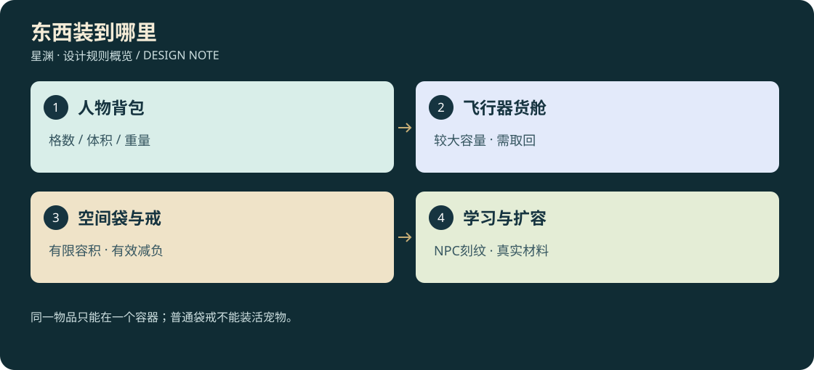

# D3-10 · 背包、货舱、储物法器与扩容

<!-- illustrated-overview:start -->

*图解：同一物品只能在一个容器；普通袋戒不能装活宠物。*
<!-- illustrated-overview:end -->

2026-09-12；设计规格，尚未实现。依赖 [经济](03_ALCHEMY_MATERIALS_ECONOMY.md)、[NPC](05_NPCS_DIALOGUE_TASKS.md)、[随机洞府](11_CAVES_AND_FORTUNES.md)、[移动追逐](13_MOVEMENT_AND_PURSUIT.md)、[单机与联网](14_OFFLINE_AND_ONLINE_BOUNDARY.md)。本文件覆盖旧设计中未定义容量的背包/钱包假设。

## 1. 三种容量同时存在

物理背包同时受格数、体积（升 L）和玩家负重限制；飞行器货舱受格数、体积和载重限制。空间法器仍有格数、内部容积和内部质量上限，并大幅降低传给持有者的重量。任何一个上限先到，就不能继续放入；界面说明是哪一项满了。

统一规则：物品具有单件体积、质量、最大堆叠数；同 ID、品质、状态和可堆叠属性才能合堆。合堆只省格子，不减质量/体积。装备每件一格，材料默认每格 20，丹药 10，灵石 100；特殊物品另定义。初片不做拼图式旋转背包，避免操作负担。

参考物品：草药一份 0.10 kg/0.20 L，血液一管 0.25 kg/0.30 L，完整内丹 0.08 kg/0.05 L，陨矿一块 2 kg/0.40 L，刀 2 kg/3 L，药剂一份 0.10 kg/0.10 L。各物种大材料另配重量；原矿不能无损变成同样重量的“粉末”来绕过体积限制。

## 2. 开局与物理升级

|容器 ID|格数|容积|容器自身重|结构载重上限|取得方式|
|---|---:|---:|---:|---:|---|
|ST-PACK-01 标准背包|24|40 L|2 kg|35 kg|开局配发|
|ST-PACK-02 加固背包|32|65 L|3 kg|55 kg|N03 韩铸：韧皮×3、铁陨材×2、纤维×2|
|ST-PACK-03 探索背架|40|90 L|4.5 kg|90 kg|先天地区：轻陨材×3、韧丝×3、导气纹×1|
|ST-SKIMMER 勘探车货箱|48|180 L|计入车体|250 kg|原勘探车维修后附带|
|ST-F1 轻型飞行器货舱|32|100 L|计入机体|120 kg|F1 蓝图附带|
|ST-F2 探索飞行器货舱|56|300 L|计入机体|400 kg|F2 升级|
|ST-F3 高空飞行器货舱|80|800 L|计入机体|1,200 kg|F3 升级|
|ST-CAMP 营地仓库|120|2,000 L|不随身|10,000 kg|营地初始免费仓格|

容量是收纳能力，不自动赋予角色承重。后天背了 90 L 背架也可能跑不动。营地可付材料扩建到 240 格/8,000 L，再高转洞府仓库；不是默认无限背包。原型未来接入时以旧资产迁移规则决定默认归属，不能把玩家既有物品截断删除。

## 3. 人物负重怎样影响移动

无临时效果时安全负重 `C(r,l)=30×2^r×(1+0.04×(l−1)) kg`。外穿衣甲、武器、背包、普通物品、空间法器外壳和传递重量都计入；身体自身质量不计。宇航服初始计 8 kg，标准背包 2 kg，训练刀 2 kg，因此后天一级在满速舒适阈值前还有 6 kg 可装，安全负重前还有 18 kg。

定义 `q=有效负重/C`：

|负重区间|移动倍率|动作限制|
|---|---|---|
|q≤0.60|1.00|正常|
|0.60<q≤1.00|从 1.00 线性降到 0.75|加速能力同步降低；体力消耗从 1.00 升至 1.25 倍|
|1.00<q≤1.20|从 0.75 线性降到 0.50|禁止疾跑、闪避和主动起飞，能慢移/整理/卸货|
|q>1.20|停止主动移动|只允许整理、近处转移、丢放、求援；不自动删除物品|

普通拾取在会超过 120% 负重时拒绝；若因取下减负装备、法器失稳等导致被动超载，保留物品并给解决入口。眩晕、伤势等不凭空缩小容器。不能靠丢包再立即远程取药规避负重，地面包需要靠近操作。

最终速度按第 13 文档计算。负重影响所有姿势的移动和加速，不缩短动作时间、不把武器动画直接慢放。空间法器不是绝对零重，因此装满高密度陨铁仍有代价。

## 4. 载具装货与性能

停稳并在真实货舱交互点 3 米内 F 打开双栏，或在安全停泊状态从座舱打开。飞行中、被攻击中、远离载具时不可随意转移。飞行器格数不与玩家格数合并，快捷药不能远程从货舱取用。

令 `f=货物有效质量/额定货重`，允许装入至 100%，超出拒绝；背包仍背在驾驶者身上时也算货重，放入货舱后只能算一次。标准乘员质量已包含在机体基准，额外装备与背负质量计入货重。

- `f≤0.25`：速度/加速/爬升无额外惩罚。
- `0.25<f≤1`：最大速度线性降至 80%，加速降至 65%，爬升降至 60%；同距离能耗最高增加 35%。
- 满载 F3 依然能够在正常气象达到 200 米上限，只是更慢更费电；超载不能起飞，不能以增加高度补偿载重。

货舱加固升级只提升该机体额定值，必须配套推进/支撑模块，不能无限加箱子。追逐中的载具速度严格使用相同负重结果，怪物不得忽略自身速度瞬移追上。

## 5. 储物法器的大小

|法器 ID / 形态|建议可用境界|初始→最大容积|初始格数 / 每增加多少 L 加一格|外壳重 / 内物传重系数|
|---|---|---|---|---|
|ST-BAG-01 纳物袋|后天后期，稳定符芯供能|60→240 L|32 / 8 L|0.8 kg / 2%|
|ST-BAG-02 灵纹袋|先天|300→1,200 L|48 / 25 L|0.6 kg / 0.5%|
|ST-RING-01 储物戒|灵海|1,000→6,000 L|72 / 100 L|0.05 kg / 0.1%|
|ST-RING-02 须弥戒|金丹—元婴|10,000→60,000 L|96 / 1,000 L|0.05 kg / 0.01%|
|ST-RING-03 洞天戒|化神—合道|100,000→600,000 L|144 / 10,000 L|0.08 kg / 0.001%|
|ST-RING-04 星海戒|星劫—道源|1,000,000→6,000,000 L|192 / 100,000 L|0.10 kg / 0.0001%|

格数 `S=S0+floor((V−V0)/k)`，大容积显示 m³，计算仍用整数毫升。内部质量上限统一为 `5 kg × 容积 L`，不能把无限质量塞入一点体积。有效携重=外壳重＋内部物品实际质量×传重系数。例如基础储物戒装满 5,000 kg 原料传重约 5 kg，仍然需要真的有 1,000 L 和足够格数。

稀有机缘可能较早获得高一档法器，但使用门槛不满足时处于封存状态；可鉴定、交易或存放，不能跳过承载条件直接装备星海戒。后天纳物袋使用外置符芯，不要求先有真气；已装物品在符芯耗尽时仍封存保留，补能后可取，不爆掉库存。正常收取不持续耗真气，扩容才需要阵台与耗材。

一名角色最多绑定 1 个袋＋1 枚戒作为可访问空间容器，其他只能空置封存。**禁止把含物品的空间容器放进任何其他容器或空间容器**；要装进载具/仓库，先清空、解除绑定后按普通空壳存放。由此避免袋中套戒无限压重、换所有者复制库存。活物、整辆载具、已锚定场景建筑不接受收纳；载具拆件必须是独立物品且满足容量。

袋/戒使用人物专门佩戴槽，佩戴不等于塞入背包；角色佩戴它们乘车也不算容器嵌套，但传递后的携重计入载具货重。满袋作为物品拖到货舱则明确拒绝，二者在数据层分别为装备关系与容器包含关系。

宠物不装普通袋戒；灵栖契是单独的宠物休养/召回关系，不提供可交易物品空间。宠物驮架和骑乘质量规则见第15/17文档，骑手背负的折算质量只计一次。未孵化封存蛋为特殊物品可短期装入防护背包，初始按每蛋2格、8 L、3 kg；在空间容器中停止孵化，活体破壳必须移至合法孵化器，不能在背包里突然生成完整宠物。

## 6. 扩容材料和基本技能

后天六级、完成一次基础采集/鉴定后，可向 **N05 闻止** 学《纳物铭纹》Ⅰ。N03 提供科技稳纹台，教玩家用练习空壳刻一条纹路；练习对象不产生可交易储物袋。玩家没遇到储物袋也能先学知识。纳物袋的确定备用来源是 N03 后天十级的较长制作委托，随机洞府可能更早给出；不让容量系统完全被稀有运气锁死。

技能Ⅰ服务纳物/灵纹袋；灵海在 **N12 玄仪** 学Ⅱ，服务储物/须弥戒；化神在 **N16 宁照** 学Ⅲ，服务洞天戒；星劫在 **N21 星岚** 学Ⅳ，服务星海戒。学习需当前境界、前一阶知识和一次刻纹试验，不用空放数千次技能；NPC 学习不新增固定 NPC 名额。

|扩容材料 ID|来源层级/路径|Q3 标准单份增加|适用容器|所需技能|
|---|---|---:|---|---|
|EX01 空纹碎片|T0 洞府残阵、后天精英委托|8 L|纳物袋、灵纹袋|Ⅰ|
|EX02 凝空砂|T1 药谷空间矿夹层|30 L|纳物袋、灵纹袋|Ⅰ|
|EX03 空髓晶|T2 镜晶矿的外围支脉/灵海洞府|200 L|储物戒、须弥戒|Ⅱ|
|EX04 须弥石|T3—T4 镜渊秘室/雷原裂隙|1,200 L|储物戒、须弥戒|Ⅱ|
|EX05 界隙结晶|T5—T6 母星界隙谷/空衡星|12,000 L|洞天戒|Ⅲ|
|EX06 星核砂|T7 万象星陨矿/高阶洞府|60,000 L|洞天戒|Ⅲ|
|EX07 原初空髓|T8—T9 陨星带/源寂残阵|400,000 L|星海戒|Ⅳ|

单份有效增容 `ΔV=基础增容×品质系数`，Q1—Q6 系数 0.65/0.85/1/1.25/1.6/2，与材料通用规则一致，取整至 1 L。可混合多份适用材料；低档容器不能用更高材料强行突破壳体上限，高档容器也不能无限吞低阶沙子。

一次订单还需本阶导气纹×1＋溶媒×1及服务费；技能学会后在营地/洞府稳纹台操作，NPC 可代操作但不绕过玩家知识前置。预览增容前后、增格阈值、材料消耗和是否溢出。会超过壳体上限的整份材料默认不投入，允许明确确认损失余量；不在后台截断又吞掉所有材料。

容器非空可扩容，但必须安置在稳纹台并锁定其内容，制作期间不可存取；完成只增加容量，不改物品 IDs。扩容无随机碎袋，失败的事务全退。由袋升戒是制作新容器再搬运，扩容过的袋不会被静默销毁。

## 7. 灵石、快捷栏与物品归属

灵石实体五面额每颗默认 0.005 kg/0.002 L，兑换 100 碎为 1 初级后携重也降低，提供兑换意义。钱包显示可访问容器里灵石的总等值，**只是派生显示，不是额外一份可花余额**。营地银行余额是独立账本，仅在授权的交易/仓储终端使用；野外吸收不能远程扣银行或货舱中的石头。

快捷栏绑定物品实例/堆叠位置；丹药要在身上已绑定可访问容器或药囊中才可用。放进飞行器、扩容中的戒指、未开启封存戒后，快捷栏显示不可取用。一次按键先校验容量位置/绑定/状态，再进入服药；不先播吃药再提示物品在远处。

双栏转移先预览格数、体积和双方负重，提交时同时从源扣除并加入目标；同一个实例只有一个 owner/container/location。交易装满的戒指必须先卸货，避免“卖戒却保留内容”或隐含替人转让大量资产。联网所有权遵循第 14 文档。

## 8. 掉落、货舱遗留与恢复

满包战利品保留原容器，可标记返回，原有 15 分钟有效游玩期限仍显示。玩家主动丢放的物品装入独立地面包，保留至少 60 分钟有效游玩，不能通过丢弃重置原战利品资格或伪造新原料。

人物昏迷救援带回穿戴、背包和已绑定空间袋/戒，保留既有成长。停在野外的载具及其货舱留在原处并地图标记；可步行取回，或在救援站付费用无人拖运，首次教学免费；没钱不丢唯一物，可以先接委托。载具失能后货舱不因模型销毁消失，生成持久残骸容器，修复或打捞才能取回。

## 9. 界面与验收

背包窗口显示格数、体积、负重三条信息，预览拿起物品后的速度变化；人物/袋/戒/附近货舱/仓库明确分栏，无远程“整理全部”。扩容面板显示材料来源、技能等级与本次增量。中文容量文字不能只挤进一条窄状态栏。

背包默认计划用 I 打开，保留现有 M 地图、J 档案、U 成长、Q 扫描、E 闪避、F 交互；不直接抢占历史 B 闪避别名。暂停/HUD 同时给背包入口，关窗恢复输入但不误触攻击。未靠近货舱时可查看已知货物清单，但转移按钮明确禁用，避免把只读预览当作远程取物。

验收包括满格未满体积、满体积未超重、堆叠不减重量、超重禁止动作、载具重复计重、袋戒嵌套拒绝、空壳交易、不同品质材料精确增容、溢出未授权不扣料、绑定容器迁移、恢复旧档物品不丢、断线转移不复制，以及负重与追逐采用同一速度结果。
