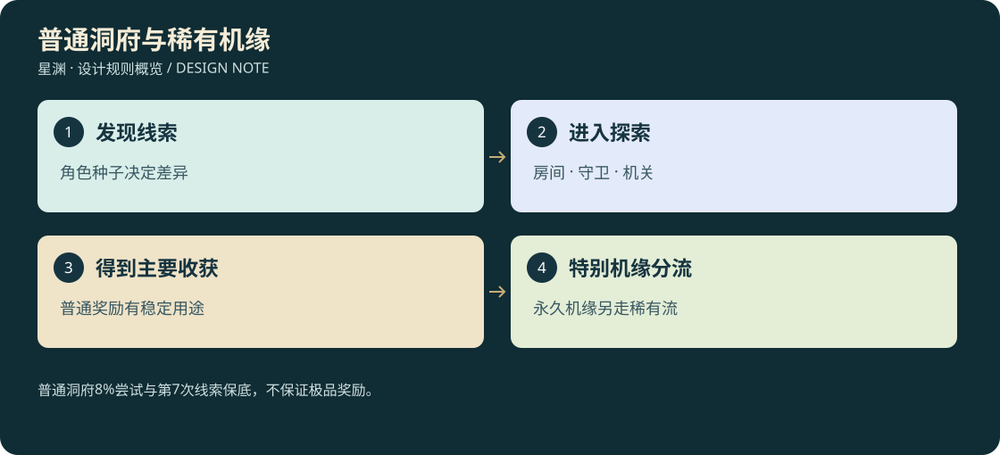

# D3-11 · 随机洞府、机缘与角色差异

<!-- illustrated-overview:start -->

*图解：普通洞府8%尝试与第7次线索保底，不保证极品奖励。*
<!-- illustrated-overview:end -->

<!-- wandering-npc-update -->
新增残图与公共遗迹竞争：地图提供可核验入口知识，复印不复制机缘；玩家个人已预留机缘不会被远区NPC偷领，公共未归属机缘允许真实探索竞争，核心被取后不重置。 详见[28地图与游历NPC](28_MAPS_AND_WANDERING_NPCS.md)。

2026-09-12；拟实现。依赖 [刷新系统](08_WORLD_DIRECTOR.md)、[储物](10_STORAGE_AND_ENCUMBRANCE.md)、[联网边界](14_OFFLINE_AND_ONLINE_BOUNDARY.md)。覆盖旧“机缘可能固定放置”的表述：固定的是模板、生态规律与验证过的候选入口，**机缘实例及奖励不再是全角色同坐标同答案**。

## 1. 两类洞府不能混淆

探索洞府是远古实验室、修士遗居、丹室、兽巢等可进入空间，有线索、遭遇、收获和离开路线。定居洞府是玩家完成净化/修复后占用的一处私人据点，有仓储、打坐、炼制与展示功能。并非每个洞穴都能占为家，也不是进入一扇门就直接抽一个宝箱。

首个永久定居资格在先天，由 N10 陆行舟介绍并发放勘定工具；玩家在已发现可居住候选中选择。若之前没遇到随机可居洞府，NPC 提供一处普通租用洞室作为保底，只有基础居住功能，不附赠稀有机缘。后天可发现探索洞府、使用临时营棚；不能没有气脉知识就免费拥有高阶洞天。

## 2. 每个角色为什么遇到的不一样

新角色创建唯一 `characterId` 和 `characterFortuneSeed`，后者与 worldSeed 分开保存；机缘种子由角色、规则版本、区域、独立发现 ID、机缘代号稳定派生。新建角色即使使用同一地图种子，也会有不同的洞府入口子集、布局、机关、守卫、传闻和奖励组合；统计差异不保证每个角色每一处都绝不相同。

一次生成后固定保存，不因读档、人物升级、打开宝箱前换武器而重抽。角色身上的缺料不能直接决定箱子必出缺料。低阶角色偶遇高阶遗物时可带走封存物/线索，但守卫和使用门槛仍真实存在。

作者提供房间、机关与生态模板，系统在验证过的组装图中变化；不要让纯随机组合生成无出口、打不开的唯一门或需要洞内宝物才能进洞的循环。

## 3. 洞府模板与探险结构

|模板 ID|背景/风格|主要过程|偏好奖励|
|---|---|---|---|
|CV01 遗弃勘测站|后天，科技进入修真线索|恢复供电、避开失控机、打开样本柜|普通药剂、材料、空纹碎片、储物知识|
|CV02 旧修士居|后天后期—先天|追踪生活痕迹、解除保护阵、判断遗嘱|纳物袋、功法书、少量灵石|
|CV03 地脉药府|先天—灵海|识别毒/药、恢复水脉、绕开巢兽|药草、丹方、回气/疗伤丹|
|CV04 陨炉洞|灵海—金丹|降温/修炉、矿甲兽、分岔矿室|陨材、武器、扩容晶石|
|CV05 镜心居|金丹—元婴|真假门、回声定位、镜阵守卫|储物戒、功法、一次传承挑战|
|CV06 雷云别府|元婴—化神|避雷点、御器路线、稳住阵眼|御空知识、须弥石、珍品药草|
|CV07 虚界残府|化神—合道|空间锚点、有限重力变化、退路维护|洞天戒、界隙结晶、高阶法器|
|CV08 星海遗宫|星劫—道源|护域/补气站、小天体分室、星兽遗骸|星海戒、原初空髓、顶级传承|

每个洞府有入口预兆、2—5 个探索房间、至少一个非纯战斗互动、一个核心目标和出口；目标游玩约 8—20 分钟。战斗压力、谜题难度和房间数量取自模板范围，不能三项都因“稀有”自动拉满。

随机维度包括候选位置、入口显露条件、支路顺序、可见破损、守卫变体、资源室类型、传闻文本参数。地形和资产必须匹配：门通向实际可进入空间，外观图与内景 3D 使用同一模板，不用不相关背景画遮掩加载。

## 4. 洞府出现与普通/极品机缘

普通洞府发现是常规探索内容，不套 0.3% 极稀有机缘概率。每个首次完成的合格探索单元可进行一次 8% 普通洞府线索尝试；尝试 ID 需足够稀疏，不能把每 256 米调度块都算一次。连续 6 次合格发现未出线索，第 7 次保证给一条普通洞府线索；保底仅是探索内容，不保证储物戒或永久加成。

0.3%仍只用于极稀有永久机缘，在另一独立随机流中尝试。普通洞府最终房间可以是合格调查点，但每座只试一次，重复挑战不再重试。新增26后，此流分为互斥5%护主破限、2%逆天传承、93%其他永久机缘；逆天线总概率0.006%，普通洞府保底不影响它。具体资格、节流、封存线索和30类奖励见[26](26_HEAVEN_DEFYING_LEGACIES.md)。任务给予的确定突破试炼称“传承任务”，不伪装成随机机缘。

所有机缘都进入 director 的资格→预留→提示→活动→结算状态。成功但暂时无安全落点时保留资格，不重复重抽。已获得的洞府线索和独特奖励机会不因离线超过三天消失；无人参与的一般天气预兆可以结束，但同一线索可在后续合适天气再显现。

## 5. 普通洞府奖励与稀有奖励

普通洞府核心完成后给少量保证补给和一份“主要收获”，后者权重表如下；质量仍引用 D3-03 的适用奖励档，不等于所有箱子都出 Q6。

|主要收获类别|基础权重|用途|
|---|---:|---|
|药草/炼丹材料|22%|突破、恢复、交易|
|丹药|18%|疗伤、回气、护脉或短时战斗选择|
|灵石|18%|修炼、服务、消费|
|武器/锻造材料|14%|构筑和精炼|
|功法书/残页|12%|学习、补全或交易|
|储物袋/储物戒/扩容材料|8%|改善携带能力|
|宠物蛋/契约材料|8%|孵化、缔约与血脉培养|

先按洞府层级过滤合法子池再选择物品；封存的超阶遗物在专属表中最多占主要收获结果的 1%，不能在每个类别再独立加一次 1%。储物类 8% 内部默认为 25% 完整合法法器、75% 扩容材料，意味着普通基准完整法器率约 2%，不是每洞 8% 必出戒。不同模板可调整偏好，但发布前归一化、明示版本且保存当次结果。

宠物补充后主表为七类共100%，只用于新增洞府实例；已生成旧版六类奖励不重抽。宠物类内部50%合法蛋、50%契约/营养材料，基准完整蛋约4%；蛋物种和血脉只从本区合法范围抽取，不再同时额外独立抽33次。蛋来源与种子在首次生成时固定。

永久加成/强行突破只来自独立极稀有机缘，不混在普通掉落表里乘多次概率。主要收获在洞府实例创建时固定；不要先保存“随机宝箱”，等玩家开箱时按最新等级改成高级物品。

不需要特定武器才能通过唯一出口。钥匙、控制节点和任务物在同一个可达图中验证；如果玩家离开、阵亡、背包满，可返回未结算房间。洞府核心收获一次，不能退出重进再领；可重复采集的边缘药圃按普通再生政策，不重置核心奖励。

## 6. 玩家定居洞府

一名角色初期可绑定一处主洞府，解锁跨星后最多每星一个已登记据点、同时仅一个主修炼洞府。购买或更换主洞府不复制旧仓储；迁居先打包、核对运力与目的容量，旧址保留至搬运确认。

|洞府等级|建议境界|设施/仓储|修炼室倍率|升级材料方向|
|---|---|---|---:|---|
|H0 普通洞室|先天|安全床位、基础阵、120 格/3,000 L 仓库|1.0|净息晶×4、普通石材×20、铁陨材×4|
|H1 灵脉洞府|灵海—金丹|稳纹台、炼丹工作台、180 格/10,000 L|1.2|潮汐砂×8、玄陨材×6、阵纹板×4|
|H2 须弥别府|元婴—化神|高级刻纹台、温室、240 格/50,000 L|1.35|镜心晶×8、须弥石×3、风雷髓×4|
|H3 洞天府邸|炼虚以上|跨星登记、300 格/200,000 L、独立展示室|1.5|界隙结晶×4、法纹石×8、星陨材×6|

仓储每 L 最高 5 kg，仍有格数与体积。丹台可用于已学配方的准备/委托领取；固定 NPC 仍负责需要其资格的炼制，不因放个台子自动学会全部高级丹方。温室需要种子和水/灵石预算，每真实玩家采收周期只有一代，离线不堆积无限成熟作物。

修炼室倍率替代当前选择的练功场倍率，不能与 NPC 练功室再次相乘；总修炼倍率仍封顶 3，离线仍最多 72 小时。升级洞府不扩大离线奖励天数。

主洞府为恢复与陈列空间，首期不做离线被怪/其他玩家洗劫。玩家可放丹炉、武器架、标本、功法书架与储物柜，均来自真实库存或独立设施状态，不靠摆放复制可交易物。洞府的独特外观由随机模板和玩家布置共同形成。

## 7. 单机/联网场景边界

单机：洞府绑定角色种子，拥有者可随时暂停和保存，未完成洞府复入保持状态。联网规划：野外入口可共享发现，但核心探索空间默认队伍实例，机缘领取与私人住宅归属由服务器记录；不能把单机 worldSeed 直接当共享服务器世界。

默认联网不开放抢占私人洞府或破坏他人仓库。组队战利品采用个人结算、同一机会 ID 每人一次；核心规则及个人随机结果由服务器生成。队伍重复带同一角色进入不重置资格，邀请新成员不让已领奖成员再次领奖。详细经济隔离与断线规则见第 14 文档。

## 8. 生成验收

至少用 1,000 个角色种子廉价验证：入口可达、门钥匙依赖无环、必有退出路线、主奖励总权重为 1、同角色重复生成稳定、不同角色有统计差异、已领资格不重复、普通保底不升级为极品保底、无合适地点可延迟布置、洞府仓库满不吞任务奖励。

实机检查多个随机布局中的战斗/谜题与 3D 一致，复活后可返回，背包满可以标记回取；不能只用地图缩略图证明洞府可玩。
