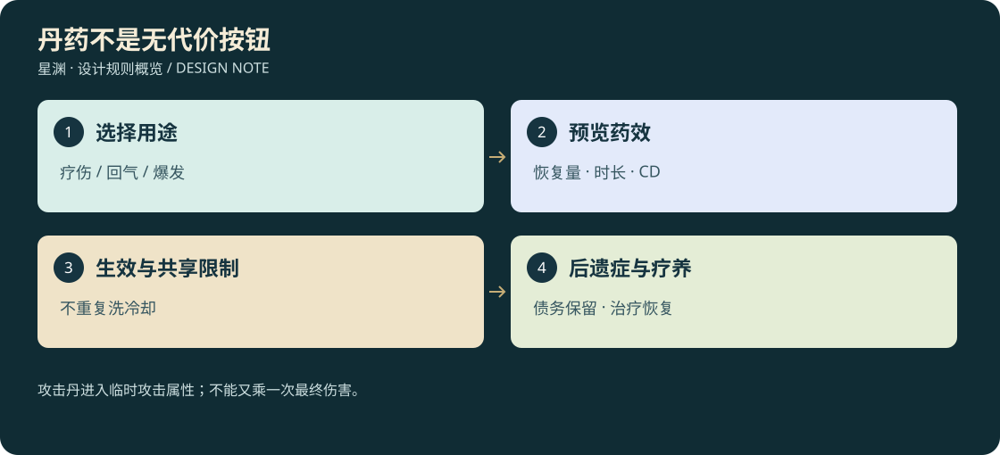

# D3-12 · 丹药分类、服用与后遗症

<!-- illustrated-overview:start -->

*图解：攻击丹进入临时攻击属性；不能又乘一次最终伤害。*
<!-- illustrated-overview:end -->

2026-09-12；拟实现。依赖 [丹方材料](03_ALCHEMY_MATERIALS_ECONOMY.md)、[储物与快捷栏](10_STORAGE_AND_ENCUMBRANCE.md)、[境界](01_REALMS_AND_CULTIVATION.md)。本文件成为功能丹的统一行为来源；三十种突破/淬体制剂仍用 D3-03。

## 1. 分类与适用层级

丹药分疗伤、回气、体力恢复、解毒、护脉、短时爆发、后遗症治疗、突破/淬体八个功能方向。每种功能丹可按 T0—T9 配方模板制作，本阶草药与结晶取自该层材料目录；不会把后天注射剂改名就说能恢复道源全身力量。

R0 使用科技医剂/兴奋剂等名义；R1 起同类功能表现为丹药与真气调节。UI 显示类别、层级 T、品质 Q、即时/持续收益、共用冷却、服用时间、后遗症及禁用条件。

恢复类匹配系数 `P=6^min(0,T药−R角色)`；同阶和更高阶恢复上限相同，低一阶只发挥 1/6 基准百分比。高于角色一阶以上的药不能安全服用，保留为交易/鉴定物。战力丹必须匹配本阶或高一阶且完成医师适应试验，不允许后天药按百分比强化道源。

功能丹 Q1—Q6 有效系数 0.8/0.9/1/1.1/1.2/1.25；这是功能效果系数，不替换材料估价/体质品质系数。恢复百分比封顶 60%，后遗症不能因 Q6 变成零。突破丹按原体质槽公式，不套本表恢复系数。

品质缩放“增量”而非整个最终倍率：Q6 燃血攻击为 `1+0.45×1.25=1.5625`，不是 `1.45×1.25`。负面效果、持续时长和气耗不因品质自动下降；解毒层数取定义整数，不做 1.25 层这种无法解释的状态。MED08 消减比例可随品质增加，但始终受后遗症最少承担 50% 原时长限制。

## 2. 功能丹规格

|ID / 名称|Q3 同阶效果|服用 / 持续|冷却族|基础配方（各 1 份溶媒另加）|
|---|---|---|---|---|
|MED01 疗伤丹 / R0 止血注剂|恢复最大生命 20%，再于 5 秒恢复 15%|2 秒 / 5 秒|恢复族 45 秒|炼体草×2、净化血浆×1|
|MED02 回气丹 / R0 电容补剂|恢复最大真气/电容 35%|3 秒 / 即时|恢复族 45 秒|通脉草×2、环境结晶×1|
|MED03 续力丹 / R0 肌能补剂|体力恢复 40 点|2 秒 / 即时|恢复族 45 秒|通脉草×1、药用盐×1|
|MED04 清瘴丹|清除一层本阶可解中毒，30 秒抗毒 +40%|2 秒 / 30 秒|净化族 60 秒|通脉草×2、净水晶×1|
|MED05 护脉丹|减轻下一次战力丹后遗症时长 25%，仅一次|3 秒 / 保护 10 分钟|护脉族 10 分钟|炼体草×2、环境结晶×2|
|MED06 燃血丹 / R0 战斗兴奋剂|最终攻击×1.45，承受伤害×1.15|2 秒 / 30 秒|爆发族 10 分钟|炼体草×3、净化血浆×2、环境结晶×1|
|MED07 逆脉丹|最终攻击×1.70，移动×1.20；持续期间每秒消耗最大真气 2%|3 秒 / 最长 20 秒|爆发族 15 分钟|炼体草×3、通脉草×2、同阶内丹×1|
|MED08 调息复元丹|安全打坐时消减当前后遗症剩余时长 20%|5 秒 / 一次|复元族 10 分钟|通脉草×3、环境结晶×2|

药用盐/净水晶由商人或普通环境采集供应，净化血浆从非配方限定的生物血加工取得。机械能芯只能做电容类科技补剂的明确替代配方，不能当作血浆。

恢复族共享冷却：刚吃疗伤丹，不能立即用回气/续力丹轮流绕过 45 秒限制。灵石吸收沿用独立 5 秒站定、15 秒冷却，但仍要真的有可访问灵石且引导不被打断。品质缩放作用于收益，不缩短冷却、不改变动作生效帧。

## 3. 强行提升战力的代价

燃血丹结束后进入“气血亏耗”5 分钟有效游玩时间：攻击 −20%、自然生命/真气恢复 −30%、最大体力 −20。逆脉丹结束、气尽或主动取消后进入“经脉紊乱”10 分钟：攻击 −30%、防御 −20%、普通/疾跑移动 −15%、自然回气 −50%，且 30 秒内不能主动起飞。已经飞行时转安全降落，不在空中突然删掉所有托举力。

两种爆发药同族互斥，激活中或后遗症未结束时拒绝再次服用同族；不允许用下一颗覆盖上一颗的债务。先验禁用条件再扣药，拒绝时明确显示剩余限制。不能先用护脉丹再喝无限兴奋剂永久保持强化。

MED05 只减持续时长至原来的 75%，不减负面强度；MED08 再减少当时剩余时长 20%，每段后遗症最多成功治疗一次。即使叠加两者，也保留至少原始时长 50%的应承担时间；治疗前展示净效果。MED08 只在安全区或已安全登记的洞府打坐时可用，战斗中不能一边爆发一边瞬间治好。

后遗症不掉境界、不永久删属性；进入昏迷救援仍保存剩余债务，救援可提供普通疗养而不是免费清空。到期、完成疗养和保存使用同一状态，反复卸装、切地图、读档、下线都不会重置或抹除。

临时爆发作用于当前同阶属性，不授予下一境的呼吸、御空、传送或毁星权限。逆脉移动加成纳入第 13 文档的速度上限，不额外突破载具上限或让负重禁飞失效。

## 4. 生效、打断与离线

状态机：校验可访问药物→锁定一份→取出→服用生效帧→消耗并提交效果→收回。生效前中断则释放锁定、药物不消耗；生效后中断收回动作也不能返还已服药。动画与库存同一事务 ID，第一/第三人称显示同一药瓶/药丸和时间点。

服用允许慢走，禁止攻击、疾跑和自由闪避；主动闪避或受重击会中断。已解锁御空且稳定悬停时可服恢复药，但持续飞行仍耗气，气尽需先降落；高速巡航、驾驶、坠落中拒绝服用。药在货舱/未启用法器中时不能施放。

单机在线增益/冷却/后遗症用 simTime，暂停冻结。主动退出战斗后下线，尚未结束的爆发增益取消，剩余后遗症完整记账；若退出时已在后遗症，只保存原剩余值，不能再次叠一遍。安全洞府或练功室选择“离线疗养”时，离线每 2 分钟抵消 1 分钟后遗症，最多消减退出时已有债务，不生成额外增益；时间和消费结算均去重。未选择疗养或野外下线不自动洗掉负面。

离线疗养与离线修炼共用一次结算记录，疗养期间无修为收益，债务消除后剩余有效时间才按修炼设置计修为。不能双倍计算同一时间。联网时战斗增益、退出与后遗症由服务器时钟结算，断线不能暂停敌人或药效，见第 14 文档。

## 5. 医师/NPC 与经济

N02 苏禾在第一次受伤后教 MED01—03，并明确战斗兴奋剂风险；MED06 需完成医师适应测试，不作为强制新手教程。N09 解锁净化/护脉，N12 及后续丹师提供逆脉与复元配方。NPC 制作能力沿原境界/Q上限，不增加重复药商。

丹药可交易，但已打开/锁定的药不可重复上架。药物效果不凭空改变卖价；剩余药与装备独立保存。主线挑战要能通过装备、技能和打法完成，不强制吃爆发药才能看到剧情。

## 6. 验收

验证相邻层恢复 1/6、同阶恢复系数、共享冷却、两爆发互斥、生效帧前后中断、空货舱快捷使用拒绝、自然回复与持续飞行互斥、气尽触发后遗症、救援/下线不洗债、离线疗养与修炼时段不重叠、同一药实例只消费一次，以及 Q6 不消除后遗症。
