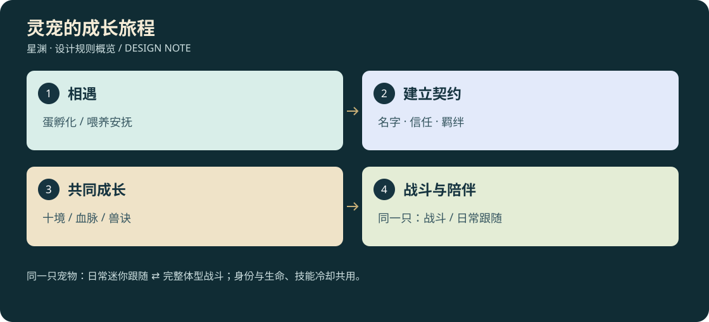

# D3-15 · 灵宠：收服、血脉、成长与陪伴

<!-- illustrated-overview:start -->

*图解：同一只宠物：日常迷你跟随 ⇄ 完整体型战斗；身份与生命、技能冷却共用。*
<!-- illustrated-overview:end -->

2026-09-12；完整设计草案，未实装。配套 [33 种图鉴](16_PET_BESTIARY_33.md)、[骑乘空战与资产](17_PET_3D_FLIGHT_AND_ASSETS.md)、[命名装扮与身份](18_NAMES_PET_STYLE_AND_IDENTITY.md)。本文新增宠物成长，不覆盖人物境界或野怪血核表。

## 1. 玩家获得一位怎样的伙伴

探索蛋巢/遇见灵兽 → 观察习性、救助和喂食 → 孵化或建立契约 → 起名 → 跟随、训练、共同战斗 → 学习功法/突破 → 觉醒血脉 → 解锁新外形与骑乘 → 在洞府照料、装扮和记录旅程。

宠物具有自己的境界、血脉、年龄阶段、性格、信任、饱食和精力。名称相同不意味着数值/花纹相同；青龙幼裔不是刚孵化就能毁星。33 种属于神话血统的游戏谱系，普通幼裔也能长期养成，不用抓到成年神兽才开始系统。

场景中同时只有 **1只当前随行宠物**，由同一个体切换两种模式：**日常跟随模式是迷你版，战斗模式是完整体型**。两种模式互斥，共用petInstanceId、名字、血脉、等级、羁绊、装备、生命、灵力与技能冷却，没有独立陪伴宠槽。迷你模式不攻击、不骑乘，不提供战斗/探宝/采集增益。

随行契约栏3个是候选名单，不代表同时显示3只；切换成另一只宠物须脱战、落地并遵守60秒共享换宠冷却。同一只宠物变换模式不算换宠、不触发这项60秒冷却，也不恢复气血或技能。洞府灵兽栏从6席扩到18、再到66席，允许拥有同种不同个体，但当前只带其中一只在身边。

## 2. 四条独立成长轴

|轴|范围|决定什么|
|---|---|---|
|修为境界|R0 后天至 R9 道源，每境 1—10 级|生命、攻防、灵力、技能/飞行承载|
|血脉|B0—B6 七档|成长资质、天赋分支、标志性外形；不是角色境界|
|生命阶段|蛋/幼生/成长期/成熟期/古兽期|体型、基础动作、能否承载骑乘、野生收服难度|
|羁绊|契约后 0—100，独立于收服前信任|配合精度、互动、伙伴回忆与外观动作|

血脉七档：**B0 凡裔、B1 灵种、B2 异血、B3 玄脉、B4 王血、B5 圣裔、B6 祖脉**。高档更稀有，低档可通过进化提升；B6 不是花钱反复喂同一颗丹就必得。

## 3. 从蛋孵化

宠物蛋来自可探索蛋巢、随机洞府、救助委托或允许交易的未绑定蛋。新手任务可在 PET09 幼狐、PET27 幼当康、PET32 精卫幼裔三种 B0 蛋中选择一个，不把第一只伙伴锁在随机掉落后面；此任务不叫极品机缘。

蛋首次生成就确定 `eggId/speciesId/bloodlinePotential/appearanceSeed/temperamentSeed`，鉴定可以逐步公开信息，但存放/孵化/读档不重抽。初始 B0—B2 孵化约 30/60/120 分钟有效照料时间；B3—B4 约 4/8 小时，B5—B6 需独特孵化环境及传承验证，时间不是唯一门槛。

孵化需要本种偏好的温度/灵气档、营养 2 份和一个稳定孵化器。在线照料满足条件按 1 倍推进；离线仅在安全孵化器内、已预存必要能量时按 0.5 倍最多结算前 72 小时，完成后只等待破壳，不自动繁殖下一枚。缺能量暂停而不是坏蛋，长期不登录不损坏蛋或让宠物饿死。

破壳仪式由玩家确认，进入起名/首次互动；新生自带 60 羁绊和基础亲近，不再重复收服小游戏。不同照料选择可影响一个温和的性格倾向，不改变预定物种或用温度小误差毁掉极品血脉。未绑定蛋可交易；进入孵化/绑定后锁定所有权，取消孵化退回同一枚进度蛋，不复制。

## 4. 野外收服：成熟越高越难

只有带 `tameable` 标记的野生个体可收服。主线首领、已被他人契约的宠物、临时召唤物不能直接抓；图鉴显示“可接近/可缔约/不可收服”。普通野怪 M 系列不自动全变宠，野生神兽幼裔使用 PET 对应的独立刷新配置。

收服前信任 0—100，每次有效喂食间隔至少 5 分钟有效游玩；一次只消耗 1 份匹配层级的偏好食物，同次扔十份只吃一份，不算十次。已饱食、战斗警戒或食物不匹配时先提示/拒绝，不暗扣。信任保存在该野生实例，不因离开调度块重置。

|生命阶段|最低有效喂食次数|每次偏好喂食信任|缔约信任门槛|额外条件|
|---|---:|---:|---:|---|
|幼生|5|+8|60|完成 2 次不同的照料/安抚互动，各 +10|
|成长期|8|+6|75|完成一次救助/护送 +20、一次共同探索 +10|
|成熟期|14|+4|85|完成 3 项物种考验共 +24，稳定照料 +10|
|古兽期|20|+3|95|两项专属试炼各 +15、一次偏好照料 +5；需稀有缔约资格|

表中条件满足时信任有确定路线达到阈值，不把“喂14次”藏成永远差一点的抽奖。事件加信任有唯一 ID，同一段护送不能反复领。首次受伤救助可作为互动，不鼓励先打伤再治疗刷好感：由玩家/宠物造成的伤害不生成救助奖励，攻击该个体降低信任并进入警戒。

达到条件后在安全位置发出契约邀请，消耗一枚匹配契纹，5 秒无伤害引导后确定成功；不最后再用 1% 随机成功率吞掉几十次喂食。普通契约只允许目标不高于主人当前境界，且具备对应御灵知识；超过主人大境界要走第 8 节稀有破限契约。古兽难收服来自准备与考验，不来自无限重掷。

野生目标离开时图鉴保留足迹范围与信任；未契约目标依然是世界生物，不必永久站原地等玩家。迁徙只去已定义的可达栖息地，重要收服目标失踪时给追踪线索。联网预留和资格规则见第 18 文档。

## 5. 等级、修为与功法

每级需求 `petXp(r,l)=round(80×4^r×l^1.35)`，十级满槽后选择突破，不自动跨境。有效战斗结束，实际参与的出战宠获得对应宠物奖励基数，默认按玩家该次合格战斗修为的 70% 换算；不从玩家经验中分走。无收益教学木桩、低两个境界的刷怪、仅处于迷你跟随、未实际参战的同一只宠物不增长实战经验。

洞府训练提供每小时 `8×4^r` 宠物修为；离线 0.5 倍、最多 72 小时，每个角色一次只训练 1 只指定宠。离线训练消耗已授权宠物口粮预算，缺粮暂停，不能自动耗完背包丹药。生命阶段不按现实年龄自动老死，幼生成长期通过照料次数、有效探索和一项体能挑战解锁；成熟需两类战斗/骑乘试炼，古兽为血脉传承阶段，不是上线几年才有资格。

宠物功法结构：1部主修兽诀、2个主动技能、1个血脉天赋、1个羁绊协同槽。技能熟练阶仍为入门/小成/精通/大成/圆满，使用真实护主/命中/避险事件成长，挂机不能练满主动技能。33种各两主动与一天赋、解锁与伤害系数以[21](21_PET_SKILLS_33.md)为准；补充术强5B、灵抗6B，五阶倍率共用19。

六套通用兽诀：`PM01 吐纳篇`（灵力）、`PM02 奔雷步`（地面机动）、`PM03 护主诀`（拦截）、`PM04 掠空诀`（已具飞行资质者的控制）、`PM05 归巢息`（脱战恢复）、`PM06 合击章`（协同窗口）。物种天赋在图鉴逐项列出；不会飞的物种不能只读 PM04 就长出可载人翅膀。

## 6. 基础数值与定位

宠物采用同一境界缩放 `B=6^r×(1+0.18×(l−1))`。同级 B0 幼裔参考：生命 `90B×体型系数`、攻击 `6B×攻击型系数`、防御 `7B×防护系数`、灵力 `80×2^r×(1+0.08×(l−1))`。种族各定位系数限定 0.7—1.5，不能某种同时拿三项最大。

血脉 B0—B6 常驻成长系数为 1.00/1.05/1.12/1.22/1.38/1.65/2.00；最终再加本种突破槽与功法，但不共享主人装备倍率。普通战斗宠实际 DPS 目标约主人参考同级战斗 DPS 的 25%—45%，防护宠可以生命高但输出低。宠物可以协助而不要求主人每秒微操；不能同时无限站桩奶人和输出。

羁绊不直接无限倍增攻击：达到 20/40/60/80/100 分别解锁回应名字、拾取提示、一个协同窗口、专属安抚动作、关系纪念/装扮。协同收益受冷却和能量约束，宠物受伤需要恢复，不能换出再换入满血。

## 7. 境界突破与血脉进化

宠物每次跨大境界有三个可选配方模板（目标 R1—R9），配料来源须在 R−1 可达：

|路线|主材（另加兽用溶媒×1）|本境体质槽 Q3 增量|
|---|---|---|
|PF-A 健体|目标阶炼体草×3、同源环境精华×2、普通营养髓×2|生命 +4%、防御 +3%|
|PF-B 灵慧|目标阶通脉草×3、环境结晶×3、净息露×2|灵力 +5%、技能耗费 −1%|
|PF-C 兽战|目标阶炼体草×2、合法异种净化血浆×2、上一境内丹×1|攻击 +4%、破势 +3%|

兽用配方由 N25 灵兽医师及高阶丹师协作；A/B 无内丹，不用献祭另一只宠物。每境一个槽，改良替换不叠加，品质规则与体质上限继承角色系统的原则。境界突破不能顺便刷新冷却/补满灵力，健康条件和材料一次提交。

血脉进化独立于境界：

|目标血脉|最低宠物境界|确定准备|验证事件|
|---|---|---|---|
|B1 灵种|R0 六级|初灵露×3、本种偏好食物×5|完成一次安抚/共同探索|
|B2 异血|R1|同源灵髓×3、通脉草×4|本种栖地试炼|
|B3 玄脉|R2|血纹结晶×2、同源灵髓×5|一次物种天赋验证|
|B4 王血|R4|祖纹碎片×3、同源精华×6|野外王种挑战或保护其栖地|
|B5 圣裔|R6|完整圣纹×1、同源精华×8|个人血脉传承洞府|
|B6 祖脉|R8|祖源印×1、星核砂×4、完整圣纹×2|独特祖脉机缘与最终伙伴试炼|

同源指谱系对应的火/水/木/金/土/风/雷/空间能量精华，通过草药、矿脉与事件获得，不是杀自己养的宠物取血。稀有祖纹可由多种探索路线收集；B6 无固定日常刷点，资格实例唯一。进化前预览新能力、外形和可保留旧外观选项，原名字、petId、装扮、回忆不丢。只在安全稳灵台进化，不在空中变体导致骑手坠落。

## 8. 宠物超过主人：允许，但罕见

普通契约的修为突破上限是主人达到过的最高境界，通常靠共同活动保持接近；允许宠物同境小级领先，主人的临时负伤/脱装不触发宠物自动降级。血脉成长和主人构筑不同，个别单项超过主人是合理的。

设计中的稀有“护主破限”指综合战斗能力明显超越主人，且可高出主人 **1 个大境界**。只通过一次匹配角色的特殊机缘授予破限契约，不在每次喂食/孵蛋/杀怪都抽。它在 0.3% 永久机缘成功后的合法子池中默认权重 5%，未过滤基准联合概率约 0.015%；不是在任意场景保证这个概率，发布配置需验证过滤后的实际分布。

每角色最多一个破限契约位；宠物依旧需自己获取修为与材料，事件不同时免费赠送最高血脉、满级和全功法。特殊救主灌顶可以一次直接升一个宠物大境界，但仍受主人最高境界＋1、R9 封顶限制。替换契约位在安全 NPC 处进行，旧宠不降级但超出普通承载的技能进入休养封存，不复制双份超阶出战能力。

稀有强宠可以帮助越级，但传送资格、主人真空承受和任务本人验证不代打绕过。普通玩家无需获得强宠才能完成主线；阶段平衡目标是绝大多数早中期角色没有综合碾压主人的宠物，需在随机样本与实机中验证，不能仅用一个低概率数字宣称平衡已成立。

## 9. 跟随战斗、受伤与陪伴

命令为跟随、防御主人、协同目标、停留、撤回。防御默认只反击威胁主人/自己的目标，不擅自拉满整群怪；禁区、NPC 和玩家私人建筑不自动攻击。宠物助攻贡献和主人击杀共享同一遭遇结算，不能把同一怪物经验/血液再额外复制一份。

普通击倒变为受伤，契纹引导救援，主人回站可医治；不永久死亡、不因几天不上线叛逃。骑乘途中受伤先触发滑翔/护降，再撤回，不能把骑手留在空中。濒危默认撤退，可明确指令护主但不靠永久损失宠物制造压力。

33种均有可爱迷你形态，目标体长约0.25—0.65米，使用专门比例和细节表现。迷你→战斗：玩家下达指令（可设置遇敌自动响应），检查合法完整体积位置后用2秒展开；允许接敌时展开，不要求先脱战。战斗→迷你：脱战8秒、落地、没有骑手/驮货且空间安全，2秒收形。公共城镇默认日常迷你跟随。

变形只切同一个体的外观、碰撞与行为状态，不创建第二只宠物。过渡期间不攻击、不骑乘，不提供无敌帧、回血或清除减益；逻辑实体与受击账连续。位置不足就保留原模式并提示，不能穿过小缝再强行变大。战斗模式的骑乘是同只完整宠物的行为，不是第三只坐骑。

互动包括呼名回头、摸头/挠下巴（按物种选）、喂食、梳理羽鳞、投玩具、趴睡、主人回家迎接、共同拍照；每种至少一个专属动作。性格分好奇/沉稳/亲人/顽皮等，影响互动和非危险跟随偏好，不让同样指令随机拒绝到无法战斗。饥饿仅在线温和影响训练效率，离线冻结；重复同一互动的羁绊收益递减，但动画仍可玩，不强制每天上线签到维护关系。

## 10. 宠物住所与收纳

普通储物袋/戒不收活物。宠物可在洞府实体兽栏休息；远征切换使用专用“灵栖契”连接已登记兽栏/安全灵栖空间，与货物容量系统分开。召回/出战是有动画和安全检查的宠物事务，不是把100公斤活兽塞进60升背包。

宠物背袋另有最大20格、60 L的专属驮架样板，仅可骑乘的大体型成熟宠装备；里面实际重量计入载宠总载荷，不能与玩家背包无限套叠。未授权的离线宠物不会替玩家挖矿或刷材料；灵兽栏扩建不增加同时战斗数量。

## 11. 教学与验收

新增 N25 **林蘅**（曙光营地灵兽医师）：蛋鉴定、孵化、基础契约/兽诀、照料和治疗。新增 N26 **织翎**（栖息药谷兽装师）：骑具适配、服装、花纹登记与进化外观恢复。高阶契约由 N25 传承委托与现有各星 NPC 协作，不为每只宠物再加一个专属老师。

第一片仅做 PET09 幼狐的孵化/五次喂养野生路线、起名、迷你陪伴、地面助战；下一片 PET17 天马验证后天骑乘飞行，再 PET13 毕方验证羽翼空战。验收必须覆盖收服阈值确实可达、同一喂食不重复加信任、蛋不重抽、境界与血脉分离、离线不饿死、破限稀有且不越两境、宠物受伤/载主降落、模式切换不穿墙和进化不丢资产/名字。
