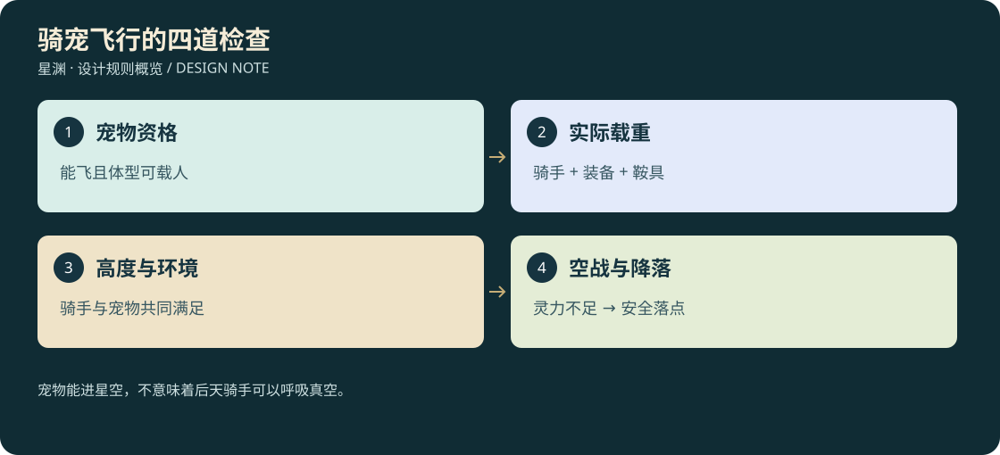

# D3-17 · 骑宠飞行、空战、3D 与媒体资产维护

<!-- illustrated-overview:start -->


*图解：宠物能进星空，不意味着后天骑手可以呼吸真空。*
<!-- illustrated-overview:end -->

2026-09-12；拟实现。依赖 [宠物成长](15_PET_PROGRESSION_AND_BOND.md)、[33种目录](16_PET_BESTIARY_33.md)、[人物移动](13_MOVEMENT_AND_PURSUIT.md)、[身份装扮](18_NAMES_PET_STYLE_AND_IDENTITY.md)。

## 1. 对低境飞行规则的补充

宠物两主动与天赋明细见[21](21_PET_SKILLS_33.md)，每招五阶专属轮廓、动画事件与双视角命中验收见[22](22_COMBAT_3D_AND_ANIMATION.md)。现有不可覆盖版本、源文件、真实预览与独立备份要求同样覆盖武技、宗门建筑和阵法资产；设计表不是已生成资产清单。

R0—R3 本人仍不能肉身飞行，但现在可使用 **飞行器或合格飞行坐骑**。R4 御器、R5 肉身御空仍有独立价值；坐骑不是把主人升级到宠物境界。主人宇航服、毒区防护、真空权限继续检验，宠物会飞不等于骑手能呼吸真空。

宠物能独飞与能载人是两个解锁。需成长阶段达到成长期、体型和鞍具适配、已学 PM04 或本能载飞、宠物灵力/精力足够，骑手完成 N26 教学。成熟度、血脉、境界、负重都在界面显示，不只看宠物有没有翅膀。

## 2. 七类移动/飞行档案

|码|适用形态|最低独飞/运动条件|载人条件|额外限制|
|---|---|---|---|---|
|G|普通四足地面|从幼生可跟随|大体型成长期＋鞍具，仅地面|没有飞行解锁，不把所有兽都改成飞兽|
|S|玄武等水陆|幼生游水与陆行|成长期＋合格水陆鞍|潜水时检查骑手供氧，首片不自动深潜|
|A|精卫、重明鸟小型灵鸟|R0 三级幼生成型，独飞最高20 m起|不可载人|高阶自身可依能力表更高飞，但小体型仍非人座|
|W|朱雀、凤凰、青鸾、毕方、穷奇|R0 六级且翼部成型后独飞|宠物至少 R1 一级＋成长期＋飞鞍|翼展/起飞跑道/单足落地按种族验证|
|C|腾云四足/帝江等|天马 R0 六级；其他本类至少 R2 一级|同独飞门槛＋成长期＋鞍具|天马是低境载飞样板；小型迷你态永不载人|
|L|青龙、应龙、烛龙|宠物 R2 一级，龙息维持升力|R2 成长期＋龙鞍|应龙翼部与无翼龙不能同用一套起飞动画|
|K|鲲鹏水空双形|R3 后解锁鹏态与水空转换|成长期＋两态共享的合法鞍座|不能在狭窄洞内变巨鹏；空中转水态须有合法水域与降落过程|

能力表是最低门槛，不改变各物种最早取得地区；例如高阶青龙不会只因表有 R2 就固定出现在新手区。

## 3. 境界高度、速度与骑手上限

|宠物境界|具飞行档案时独飞最高 AGL|基础巡航 m/s|默认有效载重 kg|
|---|---:|---:|---:|
|R0|20 m|18|90（仅合格天马等）|
|R1|60 m|28|140|
|R2|120 m|42|220|
|R3|200 m|65|350|
|R4|300 m|85|550|
|R5|800 m|120|850|
|R6|1,500 m|180|1,200|
|R7|3,000 m|280|1,800|
|R8|地表 3,000 m；真空另验|地表350；星空1,000|2,500|
|R9|地表 3,000 m；真空另验|地表450；星空2,500|4,000|

地表载飞高度 = 宠物上限、骑手资格上限、场景上限三者最小值。骑手 R0—R3 上限200 m，R4 300 m，R5 800 m，R6 1,500 m，R7+ 3,000 m；只有骑手 R8+ 和宠物 R8+ 同时具备护域才能载骑进真空。星空战斗档参照移动文档渐进减速，不直接以巡航速度撞进近战。

载重包含骑手基准75 kg＋身上有效负重＋鞍具（轻飞鞍3 kg起）＋宠物驮架货物；PET17 的R0基础90 kg起点针对轻装骑手，超载明确不能起飞。体型系数可在物种配置中0.8—1.5，必须写明最终额定载重。灵宠本身身体质量已算在其升力设计里，不重复加入货重。

载重比≤50%无额外惩罚，50%—100%最大速度降到80%、爬升降到65%、消耗升至135%；超过100%拒绝起飞，空中因拾物/装备变化超载则安全降落。不得通过迷你化主人背包或塞活宠进袋减重。

## 4. 灵力与紧急下降

宠物精力100，非飞行脱战可恢复；载飞消耗精力1点/秒及宠物最大灵力1%/秒，急加速再耗0.5%/秒。低境飞行不是无限代步，基础满精力约100秒；地面休息/营养恢复，不能用同一颗食物无限刷新飞行计时。高境效率可由功法改善，气耗最低保留基础65%。

余量20%预警，10%提示落点，5%启用护降储备、停止攻击与加速。最后5%不能被普通技能抢走；飞行前依据路线高度检验能否有可达应急落点，复杂空间不允许凭储备“永远滑翔”。失控/重伤时先滑翔/云托下降，骑手仍附着；地面后才能收回宠物。彻底失败用既有救援流程，不把宠物永久删掉。

宠物死亡/受伤和人物下坐骑是两套状态，落地切换须清除骑乘环视/身体方向残留；必须回归现有“下车后无需Alt即可转向”测试。人物已会御空时可主动安全离鞍转御空，需本人真气；R0空中不能直接跳下就获得同样能力。

## 5. 地面跟随与空中战斗

地面命令沿 PET 感知/路径状态运行，跟随距主人约1.5—3 m，避开准星、门口和交互点。跟随落后时先加速/绕路，不因主人奔袭就直接传送到前方；远离且脱战、不可见时才允许有提示的契纹重聚，不能用它在战斗中绕墙。

骑乘操作：W/S推进/减速，A/D侧向转向，鼠标观察；按住Alt独立环视，V切第一/第三人称；空格爬升、Ctrl下降，F在停稳落地时下骑。步行空间键原行为不变，明确按上下文切换。指令键建议 H 打开宠物命令轮盘，长按/快捷键分配在实现时做冲突检查。

骑乘空战左键为宠物基础攻击，右键锁定可见目标/瞄准，1/2为宠物主动技能；默认禁止骑手同时普通攻击再叠宠物普攻。高阶“合击章”只在短协同窗口允许人物一次合法远程技能，不是两套DPS常驻相加。

空战不是原地互扣血：接近→预告→俯冲/吐息→错身→拉升→调整方位；翼/角/口的命中体积按真实轨迹扫掠。不能在贴墙时强行转180度，转弯半径和制动有体型配置；吐息有射程、视线遮挡和每目标每段命中上限。小型 A 类空中助战可攻击地面目标，但不载人，地面怪的反制能力必须可读。

## 6. 第一/第三人称与迷你形态

第一人称锚点来自骑手鞍座头部，不是宠物头顶随意悬浮；手扶缰/鞍结构、腿部跨坐、宠物颈背前景都是真实同模型。俯冲不会让镜头跟着翻滚到晕眩，世界姿态与玩家观察分离；可设置有限/关闭镜头震动。第三人称扫掠考虑翼展、尾、地形，必要时拉高/收近，不能穿宠物胸腔。

每只宠物的完整态、骑乘态、迷你态共享 petId、外观基因、装备和纹章。迷你专用网格/比例需要保留角、羽、尾等标识，衣服有对应简化模型；不得把全尺寸鞍具直接缩小穿进脸里。战斗态缩回迷你态须脱战且无骑手/货架占用；迷你展开战斗态按15可在接敌时进行，驮架货物先卸下，否则明确拒绝迷你化；不能靠变小降低货物实际质量。

## 7. 图像、视频、3D 的必交付项

每种 PET 必须有：

1. 普通形态正/侧/背/3/4概念图、成年/成长期比例、迷你设计、至少三套服装分件图。
2. 骨架/挂点图、材质与色域说明、骑乘鞍座图；不能骑乘的明确标记“不制作人座”。
3. `.blend` 源、`.glb` 运行资产、贴图、动画事件、碰撞/载重/翼展数据。
4. 真实3D八角度转台视频、迷你互动视频、步行/攻击连续视频；飞行种类还需起降/骑乘/空战视频。
5. 每次进化/服装变体的来源链、哈希、版本、测试截图和未解决问题。

概念视频可用于动势参考，但必须标记 concept，不替代实际游戏录像。生成图、示意图、Blender渲染、真实游戏截图、实际运行视频分别标类型，禁止把生成视频当成已能玩的空战演示。

## 8. 不覆盖、不遗失的资产维护规则

建议目录：

```text
docs/pet-assets/PET09/v001/
  concept/        # 原始生成图、参考出处、提示词
  reviews/        # 对照、批注、决定采用/拒绝理由
  video/          # 概念和实机录像分别命名
  manifest.json   # 文件清单、哈希、类型、来源和依赖
playable/assets/pets/PET09/v001/
  source/         # blend与原始贴图
  runtime/        # glb、压缩贴图、动画配置
  manifest.json
```

这些是目标路径，尚未制作时不创建假模型或占位空视频。每次新结果进入新版本 v002…，保留 v001；当前采用版本通过单独 registry 指针选择，不覆盖原始文件。宠物注册表33条允许 `planned` 状态，无文件时不得标 ready。

下载工具/插件产物后，先复制到稳定项目路径、确认可打开、计算 SHA-256、记录来源任务/提示词/积分消耗与生成时间，再引用。临时目录、远程任务链接、聊天图片都不能作为唯一保存地址；视频要同时保留原文件与轻量预览版。禁止将密钥写进 manifest 或提示词归档。

每个 manifest 字段至少含 assetId、petSpeciesId、version、kind、relativePath、bytes、sha256、sourceAssetIds、sourceMethod、license/sourceUrl、createdAt、reviewStatus、runtimeCompatibleVersion。模型引用贴图、骑具引用骨架、视频引用确切运行构建，避免“有图却不知对应哪版模型”。

阶段完成前验证文件存在、哈希匹配、解码/导入成功及引用完整。原图、源模型、旧版视频原则上保留；空间不足先报告体积、列出可再生缓存，再按已批准清理范围处理，不自动删除唯一源文件。Git只保存小型源码/清单；大资产未来选择Git LFS或有版本的对象存储，不能把“在仓库目录”误认为已备份。

备份目标为一份工作副本＋一份独立位置副本，备份后需按哈希校验并抽样恢复。没有已配置备份目的地时明确写 `backupStatus:not_configured`，不能承诺绝不会丢。当前媒体盘点只证明当时文件存在，不是独立备份；用户已有图片/视频/模型不得因本轮新增宠物而替换或清理。

## 9. 骨架、服装和性能预算

基础家族：四足猫科、鹿马科、猪/厚躯、鸟翼、游龙、龟蛇双体、球形多肢、鲲鹏双形。毕方单足、帝江六足四翼、开明多首等需专用扩展。成年普通体30k—60k三角、迷你8k—18k、骑乘重点体60k—100k为候选上限；最多3个基础材质＋2个服装材质，普通2K贴图，远处LOD与1K降级。

每种最低地面动画：待机、走/跑、左右转、攻击、生效/收招、受击、倒地、恢复、喂食、呼名、亲昵、睡眠、变形。载飞另加起飞/巡航/转弯/爬升/下降/急停/落地/疲劳滑翔；骑手有上/下骑、稳定坐姿、缰绳跟随和空战施放。

宠物与敌人共用全场预算，但为一个战斗宠保留资源，不因敌人达到上限消失；多人阶段默认仅附近队友显示完整战宠，远处同模式模型做LOD简化，不能将战斗模式改成迷你跟随模式，不加载所有33种全分辨率。不得为性能无提示隐藏具有伤害判定的敌我实体。

## 10. 制作顺序与证据

PA0：PET09 概念→完整/迷你模型→命名/喂食/跟随视频。PA1：地面战斗与倒地恢复。PA2：PET17 载重/鞍座/后天载飞，验证第一/第三视角。PA3：PET13 翼展/单足/俯冲空战。PA4：逐家族扩展33种，边做边归档，不能一口气花积分生成33个未验证模型。

本轮只设计并盘点已存在媒体，不生成宠物图片/视频/模型，也未配置独立备份。每个PA切片都必须更新资产清单和用户可复验步骤。

本轮实际记录：[现有资产盘点 v001](../pet-assets/EXISTING_ASSETS_20260912_v001.json) 共130份、213,423,363字节，包含图像/视频/模型/音频及嵌入资产模块；不表示130份都是宠物资产或已重新验收。对应 [33种宠物注册表](../pet-assets/PET_ASSET_REGISTRY.json) 当前全部 planned、无伪造版本。后续执行 `node tools/inventory-design-assets.cjs` 生成新编号盘点，不覆盖旧快照；注册表已有数据时脚本不覆盖人工登记的宠物版本。
