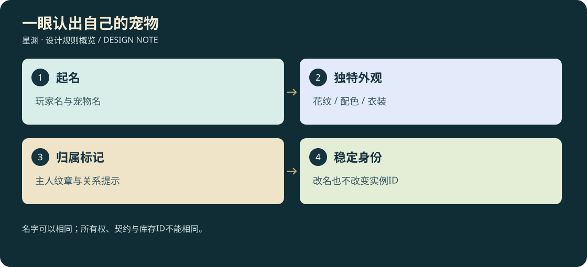

# D3-18 · 玩家命名、宠物个性装扮与多人辨识

<!-- illustrated-overview:start -->

*图解：名字可以相同；所有权、契约与库存ID不能相同。*
<!-- illustrated-overview:end -->

2026-09-12；拟实现。依赖 [宠物](15_PET_PROGRESSION_AND_BOND.md)、[3D归档](17_PET_3D_FLIGHT_AND_ASSETS.md)、[联网](14_OFFLINE_AND_ONLINE_BOUNDARY.md)。33是物种数，不是只能有33种外观或33只唯一宠物。

## 1. 玩家与宠物的名字

创建角色时输入显示名，建议2—12个可见字符（中文/字母/数字，允许内部空格），长度按Unicode字素簇计算，不按UTF-16长度把汉字和表情截断。默认提供可编辑候选，第一次开始前可确认。拒绝空白名、控制字符、不可见方向控制、脚本/HTML内容；界面全部按纯文本渲染。

宠物破壳/契约后可起1—12字昵称；可暂用“幼狐”等默认称谓，之后安全区免费改名。玩家改显示名也保留 characterId，首次单机不收费；未来联网改名须服务器去重/冷却策略，但不通过改名改变成长、机缘或交易身份。

名字不是主键。稳定关系为 `characterId → petInstanceId → speciesId`，界面可显示“阿岚的青禾 · 九尾狐”。多人重名允许，通过服务器分配短识别码区分，例如“阿岚·7K2M”；不把UUID全文盖在每个人头上。模仿官方/系统样式的前缀和高亮标记不能通过输入名字获得。

## 2. 同种宠物的外观差异

每个体有固定 `appearanceSeed`，生成可调的毛羽主/辅色、花纹图层、眼色、角/鬃/尾装饰变体和轻微体型差异。体型变体控制在同档±8%，命中体积和骑具随真实尺寸配置，不通过装扮变成难命中的超小战宠。

玩家可用染料/兽装服务调整合法色域与花纹，但不能抹掉物种关键轮廓。青龙仍有青系主视觉、白虎保留主要白底/虎纹，服装可更多样；首次配色示例至少8主色域×6纹样×5眼色×多个服装方案，即便同物种也有很多组合，但组合数量不是绝不撞款的保证。

身份最终以petInstanceId、所属角色和个人徽记确认。同一只宠物的迷你日常跟随与完整战斗模式共用此身份，两种模式不同时生成两个场景实体。进化/迷你化使用同一个体色域映射，不重新抽一张脸；喜欢幼态外观的玩家可在安全区选已解锁外观皮层，不改变战斗年龄与载重资格。

## 3. 服装与骑具分开

每种至少三套专门适配的服装：远征实用、洞府休闲、血脉典礼。不是一件人类T恤套所有兽；具体方向见33种表。共用装扮槽：头/角饰、颈胸饰、背披、四肢或足环、尾饰、主人纹章。鸟类改为翼根/足环，玄武改为壳饰，帝江/开明按特殊骨架扩展。

纯服装不加攻防/速度。骑鞍、飞行缰具、宠物护具和驮架属于功能装备，单列容量、重量、适用体型；可覆盖外观但数据仍真实。披风/尾带不进入攻击判定，不能通过长装饰增加攻击距离。

制作/定制流程：选本人宠物→查看完整/迷你双预览→选槽与配色→检查挂点兼容/费用→确认→保存 loadout；没有完成迷你对应件的服装不得标全形态兼容。武器穿模、翼膜被覆盖、蛇首被壳饰挡住都属于不通过。

## 4. 如何一眼认出自己的宠物

- 主人可选一个稳定的个人纹章，宠物项牌/鞍毯和迷你配件同步显示；不是每次登录随机换徽章。
- 玩家自己的宠物优先显示昵称＋小爪标识；队友显示“昵称·主人”，陌生玩家近距离/选中才显示归属，减少满屏名字。
- 我方/队友/陌生/敌对使用形状标志和文本并辅以颜色，不只靠红绿区分。
- 呼叫指令带本人宠物的短回应音和可见小动作，其他同名宠物不响应；选择对象用实例ID而非名称搜索第一项。
- 多人主城默认迷你，完整坐骑在合法骑乘区展开；别人可选择隐藏远处纯装饰，但不能隐藏正在攻击自己的实体。

互动先展示所属者；陌生人不能F一下就骑走、喂药消耗主人的物品或打开驮架。允许主人授权队友抚摸/临时乘坐，但容器权限和转让契约需单独授权。单机角色名字不等于未来联网唯一账号。

## 5. 个性、回忆与情绪价值

每只宠物记录相遇地、生日（游戏纪念）、第一次击败精英、首次载飞、一次护主、玩家选择的合照。照片与录像按资产规范保存原文件和元数据；游戏内相册只是索引，删除一张相册展示不默认删除原图。

性格影响闲暇行为：好奇会看花和轻嗅物件，沉稳坐在门边，亲人靠近但不挡镜头，顽皮会追玩家投的玩具。行为有距离/冷却，不偷走稀有道具、不打断重要对话、不擅自引怪。主人久别返回有欢迎动作，但不会责备玩家没上线或扣关系。

呼名并不要求必须配置语音识别，按钮/快捷指令即可；未来语音选用同一宠物实例指令入口。每种至少一段特征叫声和三个非战斗情绪姿态，字幕可解释回应，关闭声音也可辨认。

## 6. 单机与联网所有权

未绑定宠物蛋可交易；已缔约宠物首期默认不可直接上架出售，防止培养关系变成无限倒卖。未来若开放玩家间赠养，需独立确认、清空驮架、释放活动状态、重置接收方信任教学，petId和来源档案仍保留；不作为本轮联机范围。

野外成熟宠收服在联网中需服务器记录目标信任贡献与缔约预留。同一只实体只能属于一个角色；进入最终缔约流程时有限时独占 reservation，超时释放，不允许先到者永远锁野生目标。个人洞府的蛋/宠物按个人资格生成，不能一名队友领走所有人的唯一奖励。

破限契约位、血脉机缘资格、名字、服装和照片索引都与characterId绑定；客户端只发改名/换装意图，服务器检查文字规则、所有权、已拥有服装和材料。单机宠物资产不能直接导入在线经济服，沿用在线角色分离政策。

## 7. 数据与验收

建议增加 `PetDefinition{speciesId,bloodlineRange,dietId,flightProfile,rigFamily,talents,styleSlots}`；`PetInstance{petId,ownerId,origin,displayName,realm,level,xp,bloodline,lifeStage,trust,bond,temperament,appearanceSeed,skills,styleLoadout,health,spirit,stamina,injury,breakLimitContractId,memoryIds}`；`TamingProgress{wildInstanceId,actorId,feedingEvents,trust,trialIds,reservation}`；`PetMediaRecord{id,petId,kind,path,sha256,assetVersion,createdAt}`。

验收：两个同名玩家和同名同种宠物仍正确选中；中文/组合字符长度准确；HTML按文本显示；服装不会改碰撞优势；迷你与进化保持纹章和名字；双客户端争抢同只宠物仅一个成功；换装/扩容/寄养并发不复制；照片归档后重启能找到；拒绝未授权骑乘/取货。
