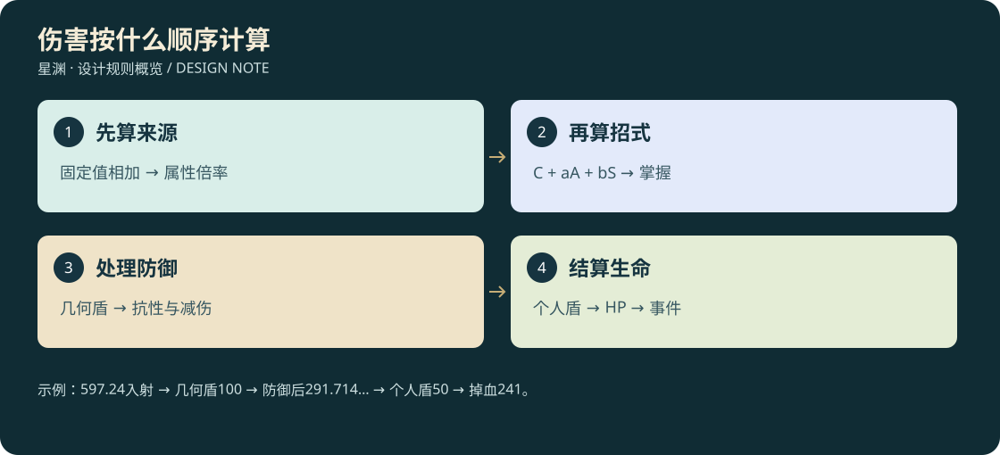

# D3-19 · 属性、伤害顺序与五阶掌握

<!-- illustrated-overview:start -->

*图解：示例：597.24入射 → 几何盾100 → 防御后291.714… → 个人盾50 → 掉血241。*
<!-- illustrated-overview:end -->

2026-09-12；拟实现数值基准。覆盖D3-02旧“所有技能只乘攻击”的伤害草案；人物十境基础值仍由D3-01提供。武技见[20](20_PLAYER_MARTIAL_ARTS_60.md)，宠技见[21](21_PET_SKILLS_33.md)，3D见[22](22_COMBAT_3D_AND_ANIMATION.md)。

## 1. 参考边界

参考动作对战游戏把基础伤害、属性加成、护盾和命中条件明示给玩家的表达方式。例如[王者荣耀官方吕布技能页](https://pvp.qq.com/web201605/herodetail/123.shtml)分别列技能基础值、额外攻击加成和护盾条件。本作不复制该角色技能、倍率或其护甲公式；以下常数、抗性、境界缩放和反制均为本作设计，需白盒测试调参。

## 2. 属性从哪里来：先加再乘，避免重复

角色基础仍为 `B=6^r×(1+0.18×(l−1))`，生命120B、攻击12B、防御10B。新增术强基础 `Sbase=10B`，灵抗基础 `Rbase=8B`；R0通过科技电容驱动术式，R1起转真气，但不能同时扣两种资源。

对生命H、攻击A、术强S、物防D、灵抗R分别计算：

`最终属性 = max(0,(境界基础值 + 装备固定值 + 限时固定值) × (1+体质百分比合计) × 功法常驻倍率 × 装备常驻倍率 × 临时属性倍率)`。

- 同类体质百分比先相加，总上限+80%，保留旧境界体质槽规则。
- 主修/辅修对同属性常驻加成先合并成一个倍率，最高1.8；装备同属性倍率最高1.8。不能每件装备各乘1.8。
- 装备固定值与装备百分比是独立词条，同一词条只能选一个入口。品质影响锻造时生成词条，伤害结算不再乘一次Q。
- 燃血/逆脉保留第12的“攻击×1.45/1.70”，只进入临时攻击属性倍率，不再进入造成伤害加成桶；术强不随攻击丹自动提高。其他明确写“造成伤害提高”的效果才进入后述增伤桶。
- 普通显示属性可四舍五入，内部保留固定精度。货物负重/移速公式仍由D3-10/13负责，不让伤害模块再缩放速度。

主修功法的五阶常驻倍率建议1.00/1.08/1.16/1.25/1.35。Q1—Q6只放大“超出1的增量”，系数0.8/0.9/1/1.1/1.2/1.3，再与辅修合并并封顶1.8。主动武技不以书籍Q直接二次乘伤害；高品质秘籍通过更好学习效率、合法招式选项与专长配置体现。

## 3. 技能数值写法

新增[26](26_HEAVEN_DEFYING_LEGACIES.md)的天命核心是本章普通上限的有名例外：普通常驻属性算完后进入单一核心覆盖，再建立施法快照；核心倍率与攻击丹取最高，不再次加入普通伤害桶。双分身、临时生命层、直伤分量必须各自记来源，不能递归复制核心。

卡片的`C,a,b`表示：`原始总伤害 = (C×6^t + a×A + b×S) × M(k)`，t为该技能当前已学习的层级版本，不能直接取目标境界；t≤施放者r，默认t为卡片的最低境界。随境升阶需有对应层级研习，不能用R0书固定值自动变成道源固定值；A/S本身会随人物成长。

主文档的卡片统一用 `C/a/b` 缩写，例如 `12/1.2/.4`。物理系卡片通常b=0，灵术a=0或混合，但最终按指定伤害类别处理，不能同一段伤害同时享受双份穿透。“物水”等表示物理通道和水的招式主题，除非技能明写状态，不自动附加水术伤害或潮湿。

五阶掌握保持：

|k|掌握程度|伤害M|治疗/护盾M|非伤害控制时长M|学习累计熟练度标尺|
|---|---|---:|---:|---:|---:|
|1|入门|1.00|1.00|1.00|0|
|2|小成|1.18|1.10|1.05|100×难度系数|
|3|精通|1.40|1.22|1.10|350×难度系数|
|4|大成|1.68|1.36|1.15|800×难度系数|
|5|圆满|2.00|1.50|1.20|1,500×难度系数|

卡片标注的多段/持续伤害是整次总量，按命中份额拆分，不能每一段都发全额。控制、距离和数量不跟伤害M一起翻倍；冷却、消耗默认五阶不变，改变必须在专属突破项写出。护盾/治疗用各自M，不再乘伤害M。

## 4. 学习难度与进阶

|难度|系数|入门学习前置|累计有效练习目标（不含找书）|
|---|---:|---|---|
|D1 易学|1.0|基础教学＋3次正确演示|约1—2小时可达精通|
|D2 常规|1.5|同系一项入门或该系基础导引教学＋5次演示|约2—4小时可达精通|
|D3 艰深|2.3|同系精通或宗门试炼＋8次演示|约4—6小时可达精通|
|D4 绝学|3.5|专属传承＋两类实战验证|约6—10小时可达精通|
|D5 秘传|5.0|唯一/稀有知识＋综合试炼|约10小时以上，按体验调参|

时间是有效练习调参目标，不能用现实挂机硬锁。一次有效命中/防御/避险普通给5、精确处理给10，同事件只取最高，独特试炼一次给30；无生命木桩仅满足入门教学，不产熟练刷满。防守技能以真实拦截结算，不要求挨打次数与进攻命中一样多。

基础导引是可重复的安全教学挑战，不额外赠送一招战斗技能；冰、毒、空间等首招没有D1前招时走此入口，避免前置循环。无伤害辅助技用真实净化、有效感知、受益恢复等事件核验，不能要求它造成伤害。

小成需1种实战记录、精通2种、大成对应挑战、圆满综合试炼；达到经验只解锁确认。书籍学习、境界研习、五阶掌握三者分开，不能为了一个技能重复购买同一阶三次。全部已学技能可永久保存，出战仍受2主动/2被动/武器战技槽限制。

## 5. 命中类型与可反制性

|代码|类型|能否用移动躲开|有效反制|
|---|---|---|---|
|H1|近战弧/刺|能，离开扫掠体积|距离、侧闪、格挡、打断|
|H2|定向弹体/射线预瞄|能，弹体存在速度或射线前摇|掩体、侧移、拦截|
|H3|地面/空中预告范围|能，离开范围|位移、打断施法、离开高度层|
|H4|可追踪弹体|能，转弯上限/射程明确|绕障、诱导、拦截，非无限追踪|
|H5|锁定结算|锁定完成后普通移动不能躲|在锁定前遮挡/超距/打断；锁定后护盾、解印或类型防御|
|H6|自身/友方增益、护盾、治疗|不适用|敌方可打断起手/驱散允许的状态|
|H7|持续区域/阵线|能离开，但已命中的持续效果仍有效|离区、净化、毁阵眼|

H5必须先有可见标记、至少0.8秒锁定、施放时视线与射程合法；不能隔墙点名字杀人。锁定后的迟滞确认最多0.2秒，伤害事件到期即结算，不无限追踪出地图。技能击杀不了已救援/离开实例的对象；其余普通位移不会让合法锁定落空。H5伤害预算通常低于同冷却可躲技能，且不可附加长硬控。H5不等于直伤，H2也可有少量直伤，命中方式和防御类型是两条维度。

## 6. 统一伤害管线

1. 校验施放资格、资源、状态和技能版本；提交施放ID，起手扣资源；中断默认不返还已释放消耗，未开始则不扣。
2. 起手快照来源A/S、技能t/k、属性加成；持续招式默认同一快照，换装不能使旧弹体突然变强。命中时读取目标当前抗性/护盾。
3. 计算卡片原始伤害与同类造成伤害加成桶：`X=raw×(1+min(.75,同类增伤合计))`。弱点属于这个桶，默认+25%，不再沿用旧+35%另乘；无默认随机暴击。
4. 如果有实际几何屏障，按命中方向和类型先扣屏障强度。该屏障承受的是本阶段入射伤害，不再享受人物护甲；溢出才进入人物防御。
5. 物理用物防，灵术用对应元素灵抗；直伤跳过这两类抗性，但仍受合法屏障、通用减伤和个人盾影响，本作不沿用别的游戏“真伤一定穿所有盾”的规则。
6. 计算目标受伤增幅与常规减伤：易伤同桶相加上限+50%；独立减伤合成 `1−Π(1−di)`，上限60%。抗性与通用减伤合计最多85%，不把多项百分比直接相减到无敌。
7. 扣个人护盾（有类型过滤），剩余伤害扣生命；吸血/反伤按实际扣除生命值计，不能反伤再触发反伤。
8. 记录hitId、来源、分量、屏障/盾消耗、生命损失、破势/状态和击倒事件。每个技能每目标的合法命中次数写在定义，帧率不改变次数。

## 7. 破防计算顺序

`D1=max(0,Dtarget−固定减防合计)`；`D2=D1×(1−min(.5,百分比减防合计))`；`D3=D2×(1−min(.5,来源百分比穿透))`；`Deff=max(0,D3−来源固定穿透)`。

减防作用于目标，可让队友受益；穿透只属于攻击者。不同ID减防在桶内加，同ID取最强刷新时长；不能每段伤害新叠一层。负护甲不额外增伤，穿透超出部分无收益。

`K=40×6^目标境界`，`抗性减伤=min(.8,Deff/(Deff+K))`；灵术将Deff换成对应元素有效灵抗，使用同K。新常数40替代旧20，必须重调怪物白盒，不把历史测试通过当新平衡通过。

## 8. 属性体系与状态

物理和灵术为伤害通道，元素为灵术子类：金、木、水、火、土、风、雷、冰、光、暗、毒、空间、神识。通用灵抗R可加该元素专抗，但多个元素命中是分量相加，不把最高穿透用于全部通道。

状态采用可解释有限组合：灼烧/中毒每秒最多一次共4跳；同来源刷新不叠伤，跨来源最多2份；潮湿＋雷击可额外造成一次卡片标注的10%增量，3秒内同目标一次；冰缓与潮湿不自动无限冻结。最终普通减速最多50%、眩晕/击飞单次≤1.2秒，5秒内首次全时长、第二次半时长、之后不再完整硬控；首领硬控转破势，不能永久控死。技能/宠物/阵法共用该抗控账本。

治疗公式与护盾公式都在卡片明示。实际治疗=min(缺失生命，基础治疗×治疗掌握M×(1+min(.5,受疗增益合计))×(1−min(.5,治疗抑制合计)))；不能给满血目标刷熟练。护盾只乘盾掌握M，不乘受疗倍率；同名取更高剩余值，不叠加；异名个人盾合计最高目标最大生命60%，几何阵盾独立但有阵眼/能量弱点。阵法与宠物恢复不复制丹药效果，所有来源都遵守上限。

防御阶段的精确表达为：个人盾前伤害=几何屏障溢出×(1+易伤桶)×max(.15,(1−抗性减伤)×(1−通用减伤))；直伤的抗性减伤取0。减伤不会反过来增加几何屏障耐久。五秒抗控窗口第三次及以后硬控时长为0，仅保留合法削韧，不用“不是完整控制”含糊地继续无限短控。

## 9. 可手算示例

输入：A=200，S=160，t=0，技能12/1.2/.4，精通M=1.40；同类增伤20%＋15%，对方境界R1、物防300、固定减防30、减防20%、穿透25%、固定穿透42，几何屏障100、个人盾50、易伤10%、通用减伤20%。

- raw=(12+1.2×200+.4×160)×1.4=442.4；增伤先加：442.4×1.35=597.24。
- 几何屏障挡100，剩497.24。
- Deff=((300−30)×.8)×.75−42=120；K=240；抗性减伤=1/3。
- 人物承伤=497.24×(2/3)×1.10×.80=291.714133333…；个人盾挡50，生命损失最后向下取整为241。

反例：同桶20%与15%不能乘成1.2×1.15；M不能在每段施放外再乘一遍；个人盾50不能在护甲前后各扣一次。

内部建议固定精度万分数与明确取整，单次伤害最后截断；多段总量按权重与余数分配，避免十段都最少1点导致高防目标反而怕碎粒子。R9高数值乘固定精度可能超JS安全整数，中间乘法用BigInt定点并在可视化层转换，不能只说整数就安全。

## 10. 验收

要求保存五阶伤害/盾/控制向量、正反手算样例、零防/超额穿透、同名状态、目标换盾、来源换装、H5锁定前后遮挡、跨实例、低帧率多段、宠物/阵法共同抗控、高阶整数溢出，以及UI显示与实际战斗日志一致。先做R0—R2验证，不以数值表代替实机打击感。
