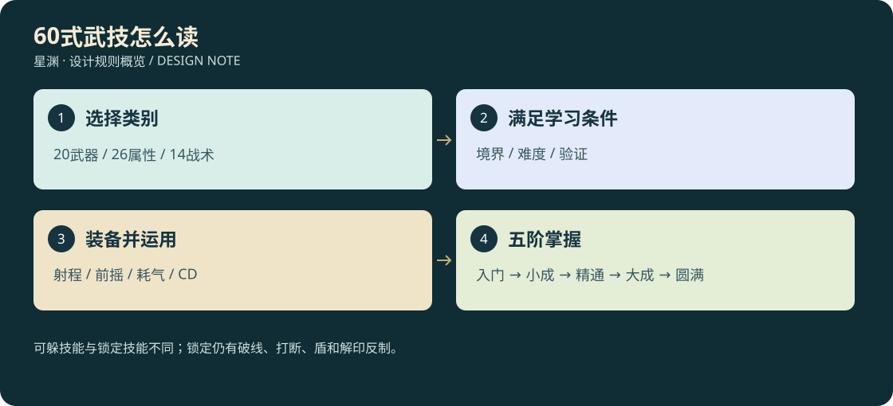

# 20 · 人物武技60式

<!-- illustrated-overview:start -->

*图解：可躲技能与锁定技能不同；锁定仍有破线、打断、盾和解印反制。*
<!-- illustrated-overview:end -->

设计稿，尚未实装。计算顺序与五阶掌握以[19](19_DAMAGE_ATTRIBUTES_AND_MASTERY.md)为准，表现以[22](22_COMBAT_3D_AND_ANIMATION.md)为准。所有数值为首轮平衡起点。

## 读表与学习

共20武器技、26属性术、14身法/防护技。表中 `C/a/b` 是一次完整施放总预算 `(C×6^t+a×攻击+b×术强)×掌握系数`，多段必须分摊总额。未写治疗/护盾即伤害；物=物理防御，术=对应元素灵抗。t初始为要求境界；升阶需该境传承页和一次实战验证，不能随敌人自动提升。无攻击公式的辅助技不得额外附带隐藏伤害。

门槛栏为最低境界/难度D1—D5，难度对应第19的前置和熟练度倍率；要求只用已学技能完成。D1由N06教学；D2由战斗任务或书商；D3由对应宗门或同境遗迹传承；D4由宗门试炼或散修挑战；D5由稀有传承，另有高阶长线研究保底（20次不同遗迹研究记录可选一本，不能刷同实例）。不以随机天赋锁死武器职业。

耗能是当前境界基础资源池百分比，基准 `Q0=R0时100，否则100×2^r×(1+.08×(l−1))`，装备扩池不增加施法成本。表中前/后摇、CD均为秒，距离为米。R0使用电容/体能的科技动作，R1后使用真气；身法移动仍同时受负重和碰撞约束。普通攻击不耗真气。

H1近战、H2直射、H3预警范围、H4有限追踪、H5锁定结算、H6自身/友方、H7持续场的反制详见19。H5锁定至少0.8秒，锁定完成前能破视线、离距或打断；完成后普通走位不能躲，仍可盾挡或解印。

## 武器技（绑定对应武器，不改变十大分类）

本章60式为常规可成长目录。第26的六式MYA禁传武技独立计数，来源为极稀有机缘，不在D5研究保底或宗门日常兑换中；仍使用本章已定义的两个主动槽与伤害合同。

|ID 名称|武器/属性|门槛|总预算|距离/形状；命中|前/后摇；CD/耗能%|独有效果与反制|3D谱系/专属形状|
|---|---|---|---|---|---|---|---|
|WS01 断浪斩|刀/物水|R0/D1|6/1.3/0|3/100°扇；H1|0.35/0.4；5/6|削韧20，后撤避开|VF01/单刃水弧|
|WS02 回峰三叠|刀/物金|R2/D3|12/2.1/0.2|3/三连；H1|0.5/0.7；12/15|三段25/30/45%，末段可打断|VF01/三道折峰|
|WS03 点星刺|剑/物金|R0/D1|4/1.15/0|3/窄刺；H1|0.2/0.3；4/5|弱点只走统一加成桶|VF01/剑尖星点|
|WS04 御剑归线|剑/术风|R3/D3|10/0.9/1.1|18/往返线；H2|0.6/0.5；14/16|往返各50%，实体墙截停|VF02/双向剑轨|
|WS05 破阵枪|长枪/物金|R0/D1|8/1.4/0|4.5/直线；H1|0.5/0.5；7/8|削韧30，侧移反制|VF01/枪头螺纹|
|WS06 雷贯长虹|长枪/术雷|R2/D3|10/1.2/0.7|10/地面冲刺；H2|0.7/0.6；13/15|撞墙停，不能跨崖瞬移|VF06/雷枪走廊|
|WS07 横扫千军|棍/物土|R0/D1|6/1.25/0|3.5/160°；H1|0.5/0.5；7/7|多人命中每人同预算，最多4人|VF01/棍端土环|
|WS08 镇岳落棍|棍/物土|R2/D2|12/1.8/0.2|4/落点圆；H3|0.9/0.8；12/13|0.6秒击倒，离开圈可躲|VF03/竖棍地裂|
|WS09 碎壳锤|锤/物金|R0/D1|10/1.65/0|2.5/单点；H1|0.8/0.7；9/9|固定减甲=0.15A，4秒|VF01/锤面碎纹|
|WS10 地脉震|锤/术土|R3/D3|15/0.8/1.2|6/扩散环；H3|1.1/0.8；18/18|环到达才命中，跳越可避|VF03/岩层环浪|
|WS11 裂木斧|斧/物木|R0/D1|8/1.5/0|2.8/劈砍；H1|0.6/0.6；8/8|正面格挡仍可防，削韧25|VF01/斧面木屑|
|WS12 血怒回旋|斧/物火|R2/D3|10/2.2/0|3/旋转2秒；H1|0.6/0.8；16/17|四段各25%，期间不能闪避|VF01/赤色斧轮|
|WS13 钩月戟|戟/物金|R1/D2|8/1.3/0.1|4/钩线；H1|0.4/0.5；8/8|轻敌拉近1米，重敌仅削韧|VF01/月牙钩痕|
|WS14 八荒架|戟/物土|R3/D3|10/1.4/0.4|4/反击扇；H1|0.25/0.6；14/12|先0.7秒正面格挡，成功才反击|VF04/交叉戟影|
|WS15 穿叶矢|弓弩/物金|R0/D1|5/1.2/0|30/弹道；H2|0.45/0.3；5/5|需箭，护甲与掩体有效|VF02/羽箭尾线|
|WS16 星落箭雨|弓弩/术光|R4/D4|12/0.8/1.5|25/半径4圈；H3|1.2/0.7；20/20|4波各25%，屋顶遮挡|VF03/星羽垂落|
|WS17 崩拳|拳爪/物土|R0/D1|5/1.25/0|1.8/拳；H1|0.25/0.4；5/5|削韧20，短距离风险|VF01/拳面震纹|
|WS18 伏虎连爪|拳爪/物暗|R2/D3|8/1.8/0.3|2/三爪；H1|0.35/0.6；11/12|40/30/30%，末击不自动追人|VF01/虎爪三痕|
|WS19 回燕环|环飞刃/物风|R1/D2|6/1.25/0.2|15/弧形；H4|0.4/0.4；8/8|转向上限60°/秒，可撞墙|VF02/燕尾环|
|WS20 太阴刃阵|环飞刃/术暗|R4/D4|12/0.7/1.5|12/半径3圈；H7|1/0.7；22/21|4秒四次，毁中心刃中止|VF07/四刃月阵|

## 属性术（攻击类型与元素分开记录）

|ID 名称|属性|门槛|总预算|距离/形状；命中|前/后摇；CD/耗能%|独有效果与反制|3D谱系/专属形状|
|---|---|---|---|---|---|---|---|
|ES01 金芒指|术金|R1/D1|6/0.2/1.2|18/射线；H2|0.4/0.3；6/7|前摇方向可读，无穿墙|VF02/指尖金针|
|ES02 锁锋印|术金|R3/D3|4/0.1/0.65|12/锁印；H5|0.9/0.4；16/12|伤害低，减目标百分比穿甲10个百分点4秒|VF05/金色剑锁|
|ES03 青藤缚|术木|R1/D2|5/0/0.7|14/半径2圈；H3|0.7/0.5；12/11|减速35%2秒，砍断藤核解脱|VF03/地表藤结|
|ES04 春回诀|术木|R2/D2|治疗8/0/1.0|8/单友方；H6|1/0.5；18/16|分4秒治疗，可打断前摇|VF08/叶脉回流|
|ES05 激流矢|术水|R1/D1|6/0/1.25|20/水弹；H2|0.4/0.3；7/7|潮湿3秒，不自动加雷伤|VF02/梭形水箭|
|ES06 沧浪壁|术水|R3/D3|几何盾10/0/1.6|前方宽4高2；H6|0.6/0.5；20/18|持续4秒，可绕侧/毁盾|VF04/竖立波壁|
|ES07 火鸦术|术火|R1/D1|6/0/1.3|18/火鸟；H4|0.5/0.4；8/8|追踪45°/秒，撞遮挡熄灭|VF02/折翼火鸦|
|ES08 焚野环|术火|R3/D3|12/0/1.7|16/半径3；H7|0.9/0.6；18/18|4秒四段含灼烧总预算，离圈止新增|VF07/逆燃火环|
|ES09 岩盾诀|术土|R1/D1|个人盾8/0/1.25|自身；H6|0.6/0.5；17/15|持续5秒，同名不叠加|VF04/悬岩六片|
|ES10 地刺林|术土|R3/D3|10/0.2/1.5|15/宽2长7；H3|1/0.7；17/17|逐段预警，不能无提示脚下生成|VF03/三列岩笋|
|ES11 风刃|术风|R1/D1|4/0.1/1.15|22/薄弧；H2|0.3/0.3；6/6|飞行快但仍有实体弹道|VF02/透明卷刃|
|ES12 回风步|术风|R2/D2|无伤害|自身位移6；H6|0.15/0.35；12/12|扫掠碰撞，无默认无敌|VF06/足下风旋|
|ES13 引雷针|术雷|R2/D2|8/0.1/1.35|20/落雷点半径1；H3|0.8/0.4；9/10|潮湿目标额外10%单桶，3秒触发间隔|VF03/针状雷柱|
|ES14 天罚印|术雷|R5/D4|5/0/0.8|16/锁印；H5|1.1/0.5；22/18|无硬控；解除印记阻止落雷|VF05/三节雷印|
|ES15 冰棱|术冰|R2/D2|6/0/1.2|20/锥弹；H2|0.5/0.4；8/9|减速25%2秒|VF02/六棱冰锥|
|ES16 霜牢|术冰|R4/D4|8/0/1.2|15/半径2.5；H3|1.2/0.6；22/20|冻住0.8秒，破冰不二次伤害|VF03/六柱冰牢|
|ES17 曜光束|术光|R2/D2|8/0/1.3|24/定向束；H2|0.7/0.4；10/10|发射前准线锁定，侧移可躲|VF02/棱镜束|
|ES18 明心灯|术光|R3/D3|治疗6/0/0.8|自身半径3；H6|0.8/0.5；24/18|最多2友方，解除一层可净化减益|VF08/悬灯光瓣|
|ES19 暗蚀弹|术暗|R2/D2|6/0.1/1.2|18/暗球；H2|0.5/0.4；9/9|灵抗固定减少0.1S持续3秒|VF02/内卷暗核|
|ES20 影缚契|术暗|R4/D4|4/0/0.65|10/锁印；H5|1/0.5；20/16|减速25%2秒，不禁闪避|VF05/影线结扣|
|ES21 蚀骨雾|术毒|R2/D2|8/0/1.3|12/半径2.5；H7|0.8/0.5；15/14|4秒总额，防毒和离圈有效|VF07/低伏绿雾|
|ES22 封脉针|术毒|R4/D3|6/0.2/0.8|16/细针；H2|0.6/0.4；18/14|治疗受益−20%4秒，最多一层|VF02/紫尖银针|
|ES23 折空刃|术空间|R6/D4|10/0.2/1.5|20/裂隙线；H3|0.9/0.6；16/17|预警后结算，仍计算空间灵抗|VF03/窄幅折面|
|ES24 虚空锚|术空间|R7/D5|5/0/0.75|15/锁印；H5|1.2/0.6；25/20|位移距离−25%2秒，不禁普通奔跑|VF05/双环空锚|
|ES25 震神音|术神识|R3/D3|5/0/0.9|8/60°锥；H1|0.6/0.5；16/13|打断可中断施法，首控0.4秒|VF09/折扇音波|
|ES26 问心烙|术神识|R6/D5|6/0/0.8|14/锁印；H5|1.2/0.6；24/19|显示目标下次攻击预兆2秒，不读未生成AI|VF05/同心眼纹|

## 身法、防护与战术

|ID 名称|属性|门槛|总预算|距离/形状；命中|前/后摇；CD/耗能%|独有效果与反制|3D谱系/专属形状|
|---|---|---|---|---|---|---|---|
|HS01 铁衣架|物土|R0/D1|无伤害|正面100°；H6|0.2/0.4；10/8|2秒减伤20%，背后无效|VF04/前臂锁架|
|HS02 矢量闪避|科技|R0/D1|无伤害|水平4；H6|0/0.35；6/体力按旧规格|保留五阶转向/储备规则，非无敌|VF06/踝部喷流|
|HS03 屏息伏影|物暗|R0/D1|无伤害|自身；H6|0.8/0.3；18/8|静止5秒脚步感知−50%，不隐身|VF10/呼吸收束|
|HS04 定向屏障|科技/土|R0/D2|几何盾10/0/1.5|前方120°高2；H6|0.4/0.4；15/15|持续4秒，R0术强由设备校准提供|VF04/蜂巢扇盾|
|HS05 听风辨位|术风|R1/D2|无伤害|周围15；H6|0.5/0.3；20/10|3秒显示发声目标方位，无穿墙轮廓|VF09/耳侧声环|
|HS06 金蝉脱印|术光|R2/D3|无伤害|自身；H6|0.25/0.3；24/16|解除一项可解H5印，已结算不回滚|VF10/外壳金裂|
|HS07 回元息|术木|R1/D2|无伤害|自身；H6|1/0.5；30/0|原地引导4秒回基础真气20%，受击中断|VF08/腹部气旋|
|HS08 磐石定心|术土|R2/D2|无伤害|自身；H6|0.5/0.4；22/14|4秒抗削韧30%，地速−20%|VF10/肩背岩纹|
|HS09 追星踏|术风|R3/D3|无伤害|前方10；H6|0.3/0.5；16/16|冲刺非瞬移，中途可撞停|VF06/双足星迹|
|HS10 移形留影|术暗|R4/D4|无伤害|自身/假影原地；H6|0.4/0.4；24/20|假影2秒只误导未识破普通AI，不强制玩家锁定|VF10/半透明残像|
|HS11 斗转御劲|术水|R3/D3|无伤害|正面90°；H6|0.2/0.5；20/16|0.6秒招架消除一次可格挡攻击，消耗额外5%体力|VF04/回折水镜|
|HS12 共鸣战意|术神识|R4/D3|无伤害|自身与战宠8；H6|0.8/0.5；35/22|6秒伤害加成10%入统一桶，不增加宠物基础A|VF09/双心连线|
|HS13 空行护息|术空间|R6/D4|个人盾6/0/0.8|自身；H6|0.6/0.4；25/17|4秒护盾且抗风偏20%，不授予真空权限|VF04/贴体流线罩|
|HS14 归一守命|术光|R8/D5|个人盾10/0/1.3|自身；H6|1/0.8；60/30|3秒盾；不免死、不复活，不能脱离剧情边界|VF04/胸口九瓣印|

## 五阶落实及配装

每条伤害技五阶预算等于表值×1/1.18/1.40/1.68/2；治疗护盾×1/1.10/1.22/1.36/1.50。例如WS01在A=12、t=0时五阶为21.6/25.488/30.24/36.288/43.2，最终掉血另算防御。控制按19上限缩放；纯辅助百分比、位移、时长不随伤害倍率翻倍。HS02例外保留[原五阶身法](../SKILL_PROGRESSION_SPEC.md)的4米、转向和串行储备，不叠加新位移倍率。

每招视觉由“表中专属形状＋VF五阶模板”唯一确定；低阶看得见实质动作，圆满增加细节与收势，不偷偷扩大攻击盒。纯辅助技能升级改善提示和施法稳定表现，其已有数值之外不自动加隐形属性。

普通连击/重击是武器基础动作；WS可装1个武器技槽，ES/HS装原有2主动槽，保留2被动和主辅功法。HS02仍使用E核心闪避，Q扫描，不占1/2；拥有相同技能不能双槽刷新CD。F交互、V视角、Z趴下保留。右键格挡/瞄准、R重击，武器技默认鼠标中键且允许重绑，驾驶时改由载具输入层接管。

HS07只可落地静止引导，期间停止其他真气自然恢复；不能一边御空消耗一边使用无成本回元永续飞行。无伤害辅助技能按成功避险、实际净化/发现/恢复事件增长熟练，次数与第19统一去重。

安全区训练显示每段系数/命中/被吸收/掉血和五阶对照；实战只显示简明结果。任一新技能交付必须同时有学习来源、资源闭环、真实动画和命中证据，不先做无法使用的60个按钮。
