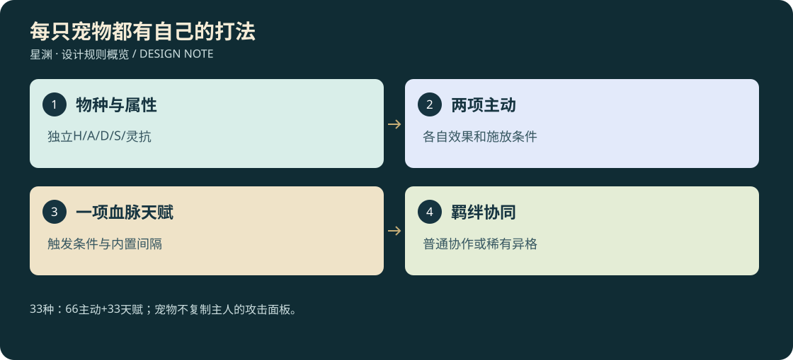

# 21 · 33种宠物专属技能

<!-- illustrated-overview:start -->

*图解：33种：66主动+33天赋；宠物不复制主人的攻击面板。*
<!-- illustrated-overview:end -->

设计稿。与[15成长](15_PET_PROGRESSION_AND_BOND.md)、[16谱系](16_PET_BESTIARY_33.md)、[17空战](17_PET_3D_FLIGHT_AND_ASSETS.md)共同使用；不是已制作66项技能。每种两主动、一血脉天赋，保留其原谱系招牌并细化为主动动作。天赋不与原描述重复领取。

## 统一合同

宠物独立计算属性，不复制主人攻击。沿用15的生命90B、攻击6B、防御7B，补充术强5B、灵抗6B。以下给出全部33种的初始种族系数，顺序H/A/D/S/灵抗；每项只乘一次，血脉/兽诀在其后各自进入单一加成桶。没有表外的隐藏“神兽全属性翻倍”。

|定位|种族系数H/A/D/S/灵抗|适用PET编号|
|---|---|---|
|突击|1/1.2/0.9/0.8/0.9|03、12、17、19、21、23、24、28|
|术攻|0.85/0.8/0.8/1.2/1.1|01、02、07、08、09、13、14、16、31|
|守护|1.3/0.9/1.2/0.85/1.1|04、11、20、22、25、29、30|
|辅援|1/0.8/1/1.1/1.2|05、06、10、15、18、26、27、32、33|

A主动：宠物小等级3解锁，羁绊30；B主动：宠物R1且羁绊60解锁。获得时已达条件仍需一次教学。血脉天赋B2、羁绊60解锁；低血脉同种也能正常战斗。两主动分别保留入门/小成/精通/大成/圆满，倍率同19，难度A=D1、B=D3；天赋固定一级，不重复吃五阶伤害倍率。技能升阶t需与主人无关的本境兽诀页和宠物实战记录，t≤宠物境界。

表内伤害/治疗/盾 `C/a/b` 代入宠物A/S，完整施放多段总预算；H和VF见19/22。格式：`公式；射程m/命中；前摇秒/CD秒/基础灵力池消耗%`。未列后摇默认0.5秒，扑击0.7秒；每次动作从真实口/角/爪/翼发出。费用基准为15的80×2^r×(1+.08×(l−1))，不是扩容后的池。持续伤害4次均摊，所有光环最多主人和自身两个目标。

## 技能清单

|谱系|A主动（唯一ID）|B主动（唯一ID）|血脉天赋（唯一ID）|3D专属表现|
|---|---|---|---|---|
|PET01 青龙|PET01-A 雷木龙息：6/0.2/1.3；12/H2；0.6/9/10；雷术直线，削甲0.1S持续3秒|PET01-B 云根护主：个人盾6/0/1.2；8/H6；0.8/24/20；4秒|PET01-T 雷鳞：受雷伤后雷抗+10%3秒，内置12秒|VF02龙须雷枝/VF04木鳞盾|
|PET02 朱雀|PET02-A 灼羽火域：8/0/1.5；12半径2/H7；0.8/14/15；火术4秒|PET02-B 赤羽掠击：6/0.8/0.5；8/H2；0.6/12/13；低空掠过，落点安全才施放|PET02-T 余烬：自身施加灼烧时回基础灵力2%，内置10秒|VF07羽形火地/VF06赤翼轨|
|PET03 白虎|PET03-A 裂金扑：8/1.5/0；6/H1；0.6/10/10；物金削韧30|PET03-B 啸锋震：5/0.4/0.6；6锥/H1；0.7/18/15；打断0.4秒|PET03-T 猎势：首次命中未交战目标伤害桶+10%，同目标30秒|VF06虎扑/VF09金声波|
|PET04 玄武|PET04-A 龟蛇护阵：几何盾10/0/1.5；前方宽4/H6；0.8/22/20；4秒|PET04-B 寒潮缠足：6/0.2/1.0；10半径2/H3；0.9/14/13；水术减速25%2秒|PET04-T 稳甲：静止2秒获得削韧抗性20%，移动消失|VF04龟甲蛇环/VF03龟纹水圈|
|PET05 凤凰|PET05-A 回护羽：治疗8/0/1.0；8/H6；1/22/18；4秒恢复|PET05-B 涅羽援护：个人盾8/0/1.3；8/H6；0.8/60/25；主人低于30%可自动施放，不复活|PET05-T 留温：自身受疗+10%，不增加输出伤害|VF08羽心回流/VF04护心火羽|
|PET06 麒麟|PET06-A 瑞泽踏：5/0.6/0.6；3圆/H3；0.6/12/12；术土削韧15|PET06-B 清瑞息：治疗5/0/0.7；8/H6；0.8/26/20；净化一项可解减益|PET06-T 瑞步：地面负面区域减速强度−15%，不免疫伤害|VF03蹄下祥云/VF08角端露光|
|PET07 应龙|PET07-A 风翼截击：8/1.0/0.5；10/H2；0.8/14/15；物风俯冲，可侧移|PET07-B 降雨幕：无伤害；8半径3/H7；0.8/25/18；4秒雨幕使穿过火弹伤害−15%，同弹一次|PET07-T 翼稳：被击飞位移减少15%，不免硬控|VF06双翼风叉/VF07细雨幕|
|PET08 烛龙|PET08-A 昼晦息：6/0/1.2；10锥/H1；0.7/12/12；术暗|PET08-B 烛目封印：4/0/0.6；10/H5；1.2/24/18；术光、治疗受益−15%3秒|PET08-T 明晦辨：自己视线内隐匿单位提示距离+20%，不穿墙|VF09明暗吐息/VF05竖瞳印|
|PET09 九尾狐|PET09-A 幻步诱影：无伤害；原地/H6；0.4/20/15；假影2秒，可被识破|PET09-B 狐火追珠：6/0/1.2；14/H4；0.6/11/11；术火，45°/秒追踪|PET09-T 心契：主人有效净化宠物后双方真气各回基础2%，内置20秒|VF10九尾残影/VF02尾尖狐珠|
|PET10 白泽|PET10-A 识妖眸：无伤害；12/H5；0.9/20/12；3秒标出已观察到弱点，不增加弱点倍率|PET10-B 辟邪言：5/0/1.1；10锥/H1；0.7/14/13；术光，命中驱散目标一个可驱散增益|PET10-T 博闻：首次观察新种奖励研究记录，无重复刷资源|VF05额目框/VF09文字形声波|
|PET11 貔貅|PET11-A 吞煞护：几何盾8/0/1.3；前方2/H6；0.5/18/16；3秒吸弹，不能吞人物/道具|PET11-B 吐金丸：6/0.5/0.8；15/H2；0.6/12/12；术金，与吸弹量无关|PET11-T 守财：背包物品散落标记持续时间+30%，不增掉率|VF04口前涡盾/VF02金丸|
|PET12 獬豸|PET12-A 定势角：6/1.3/0；5/H1；0.6/10/10；物金打断0.4秒|PET12-B 正法印：4/0/0.6；10/H5；1/22/16；术光，目标造成伤害−8%3秒|PET12-T 明断：成功打断回基础灵力3%，内置15秒|VF01独角直刺/VF05角纹衡印|
|PET13 毕方|PET13-A 点焰啄：6/1.1/0.3；2/H1；0.35/7/8；术火|PET13-B 独足火线：8/0/1.3；10长线/H7；0.8/16/15；4秒，不堵死通道|PET13-T 火立：火地形环境伤害−15%，不作用战斗火伤|VF01喙尖火星/VF07单足火痕|
|PET14 重明鸟|PET14-A 破妄鸣：5/0/0.9；8锥/H1；0.6/14/12；术光，破坏范围内假影|PET14-B 双睛光矢：6/0/1.3；16/H2；0.7/12/12；两束各50%|PET14-T 警醒：首次遭突袭的削韧−20%，同遭遇一次|VF09双层声环/VF02双瞳束|
|PET15 青鸾|PET15-A 回风翼：5/0.4/0.8；8锥/H1；0.6/12/12；术风偏转可偏转弹，不反射伤害|PET15-B 青羽抚伤：治疗6/0/0.85；8/H6；0.9/20/17|PET15-T 航伴：骑乘巡航耗灵−8%，不增加高度/载重|VF09羽扇风/VF08青羽落点|
|PET16 鲲鹏|PET16-A 水空转势：6/0.4/0.9；8/H2；0.7/12/13；水中水柱/空中风弹，共用CD|PET16-B 扶摇拍浪：8/0.6/0.9；6锥/H3；1/20/18；术风，轻敌推开1米|PET16-T 双栖：合法水空转换耗灵−10%，不在小空间强变体型|VF02鳍翼水风弹/VF03巨翼浪扇|
|PET17 天马|PET17-A 踏风跃：无伤害；位移6/H6；0.3/12/10；落点必须可达|PET17-B 星蹄冲：6/1.2/0.2；8/H2；0.6/14/13；物光，不带人穿敌模|PET17-T 安骑：乘客受震镜头幅度−20%，战斗判定不变|VF06四蹄风螺/VF06星蹄轨|
|PET18 天禄|PET18-A 灵嗅：无伤害；已加载20范围/H6；0.5/30/8；只提示附近矿物方向|PET18-B 禄光罩：个人盾6/0/1.1；8/H6；0.7/22/18；4秒|PET18-T 惜材：采集工具耐久消耗−5%，不凭空产矿|VF10鼻端光点/VF04鹿角护纹|
|PET19 辟邪|PET19-A 镇邪爪：6/1.2/0.2；2.5/H1；0.4/9/9；物金，减甲0.1A3秒|PET19-B 逐煞跃：7/1.2/0.2；6/H2；0.6/14/14；落地半径1.5，避落点可躲|PET19-T 镇心：恐惧类控制时长−15%，仍受最低可读时长约束|VF01双爪符痕/VF06狮跃印|
|PET20 狻猊|PET20-A 烟障息：无伤害；8半径3/H7；0.8/20/15；烟3秒，双方视线受阻|PET20-B 炉心咆：6/0.2/1.1；6锥/H1；0.7/12/12；术火|PET20-T 烟觉：自身烟内仅显示最近一次听到方位，非透视|VF07鬃烟/VF09炉口声火|
|PET21 睚眦|PET21-A 断锋咬：7/1.4/0；2/H1；0.4/9/10；物金削韧25|PET21-B 复仇刺：6/1.2/0.1；5/H1；0.6/15/14；对刚伤主人目标伤害桶+10%|PET21-T 护主怒：主人受实际生命伤害后自身削韧+10%3秒，内置15秒|VF01牙锋交错/VF01背刺刃鳍|
|PET22 饕餮|PET22-A 噬灵口：5/0.3/0.7；4锥/H1；0.7/14/12；术暗，回自身基础灵力3%，不扣敌资源|PET22-B 贪食震腹：8/0.8/0.4；3圆/H3；0.9/18/16；物土推轻敌1米|PET22-T 饱腹：一次有效喂食的饱足持续+15%，好感次数不增加|VF09口内暗涡/VF03腹震尘圈|
|PET23 穷奇|PET23-A 翼虎横击：7/1.3/0.1；6/H1；0.6/11/11；物风侧扑|PET23-B 凶翼刃：7/0.6/0.8；14/H2；0.8/15/14；两风刃各50%|PET23-T 游猎：侧后命中伤害桶+8%，不额外判定弱点|VF06侧翼扑/VF02虎翼双刃|
|PET24 梼杌|PET24-A 顽岩背：无伤害；自身/H6；0.5/22/15；3秒削韧抗性40%，结束2秒移速−15%|PET24-B 荒牙撞：8/1.4/0；6/H2；0.8/13/13；物土，撞墙自停|PET24-T 耐战：生命低于35%时防御+10%，不叠层|VF10脊岩亮纹/VF06獠牙尘轨|
|PET25 混沌|PET25-A 混元缓冲：无伤害；自身/H6；0.6/25/18；3秒内生命伤害20%延至随后4秒，债务不消失|PET25-B 浑息波：6/0/1.2；10/H2；0.7/13/12；术空间|PET25-T 稳息：缓冲债务期间受疗+10%，不能通过收宠删除债务|VF04无面薄膜/VF02浑圆波|
|PET26 夫诸|PET26-A 润泽步：治疗5/0/0.8；8/H6；0.8/20/16；4秒且移除一层环境过热|PET26-B 四角水锁：6/0/1.0；12半径2/H3；0.8/14/13；减速30%2秒|PET26-T 水亲：涉浅水的地形减速减少20%，不增加裸速度|VF08鹿蹄涟漪/VF03四角水笼|
|PET27 当康|PET27-A 拱土震：6/1.1/0.1；3锥/H1；0.5/10/9；物土削韧20|PET27-B 寻苗哼：无伤害；已加载15范围/H6；0.6/30/8；提示成熟草药，不采集|PET27-T 护苗：自家已种药圃缺水宽限+10%，不改珍稀概率|VF01鼻拱土浪/VF10鼻叶光点|
|PET28 驺吾|PET28-A 长尾掠：6/1.2/0；3/120°/H1；0.4/9/9；物风|PET28-B 归主跃：个人盾4/0/0.7；向主人8/H6；0.4/20/15；路径扫掠，抵达才给主人盾3秒|PET28-T 路熟：脱战跟随寻路重规划更积极，不瞬移/加攻击|VF01彩尾弧/VF06返身彩纹|
|PET29 陆吾|PET29-A 守山势：5/0.2/0.8；自身半径3/H7；0.8/18/15；术土4秒、减速20%|PET29-B 九尾镇击：8/1.1/0.4；4扇/H3；0.9/16/15；九尾视觉只有三段各1/3|PET29-T 岗守：守卫指令下探测距离+10%，仍需视线/声音|VF07山纹地界/VF03尾峰拍地|
|PET30 开明兽|PET30-A 多目警戒：无伤害；视线内18/H6；0.5/25/10；3秒提示至多3个攻击方向|PET30-B 镇门爪：7/1.2/0.1；3/H1；0.6/11/11；物金、削韧25|PET30-T 守门：守卫范围内自身受削韧−10%，九首不九倍伤害|VF10多目扇线/VF01门形爪印|
|PET31 帝江|PET31-A 四翼移阵：无伤害；自身位移5/H6；0.3/16/14；不是跨墙传送|PET31-B 空鼓震：7/0/1.25；8半径2/H3；0.8/15/14；术空间，预警鼓面|PET31-T 翼律：完成有效闪避后下一主动耗能−10%，12秒内一次|VF06四翼折迹/VF03无面鼓波|
|PET32 精卫|PET32-A 衔石点击：4/0.8/0.4；15/H2；0.4/7/7；物土，三石总额|PET32-B 填隙石幕：几何盾5/0/1.0；前方宽2/H6；0.7/20/16；3秒悬石不生成永久地形|PET32-T 不倦：有效采集陪伴后饱足消耗−10%60秒，内置120秒|VF02喙衔三石/VF04小石拼幕|
|PET33 乘黄|PET33-A 引风驰：无伤害；自身与主人8/H6；0.5/24/16；地速+10%4秒入移动上限|PET33-B 黄光角：6/0.8/0.6；8/H2；0.6/12/12；术光窄线|PET33-T 伴行：脱战同行时主人奔跑体力消耗−5%，不影响飞行权限|VF06白尾黄风/VF02角端弧光|

## 自动战斗、空战和情绪交互

第26的MYP01—06是本33种中的极稀有异格，不增加常规物种数。其专属能力占原羁绊协同槽，不额外复制A/B/T；原先护主破限5%稀有分支仍保留，与新增逆天分支互斥。

战宠每1秒评估一次高层意图，逐帧只执行运动/动画；优先躲危险、保护主人，再使用技能。自动H5须自身有视线，AI不能提前知道玩家输入。主人可选择主动/护卫/跟随/停留，并手动优先施放A/B；默认宠物轮盘召出后点击，避免占用人物Q/E、1/2。手动指令不跳过资源、距离、冷却与前摇。两主动共用0.8秒施法间隔；冷却从成功开始扣费时计，打断不返全资源。

扑击、地面阵、落地震波只有找到合法地表才施放。空中使用吐息/弹体/空域锥；骑乘时不自动发动造成乘客无法控制的俯冲，先显示意图并由玩家确认。高空失能进入17的滑翔/救援规则，不能通过技能令低阶骑手获得星空生存能力。

一只战宠的持续输出目标为同境、同品质参考人物的25—45%，治疗/坦克取低端；测试固定60秒和180秒遭遇，计入冷却、耗灵、追敌、空放与防御时间，不能用单次倍率宣称达标。基础普攻暂定1.0A每2秒，攻击动画与距离影响实际频率；超标优先调CD、基础普攻频率和系数，不偷偷把主人属性复制给宠物。极少数护主破限事件允许超越主人，沿用15的稀有条件，不人为削成同阶。

同一只随行宠物切到日常迷你模式时停止战斗技能；切回完整战斗模式使用原A/B/T与原冷却，不另召一只宠物。保留每种尾/耳/翼、蹭手、睡觉、被夸奖等动作。表中3D形状可缩为无判定的情绪小特效，禁止视觉卖萌偷偷治疗。收宠、改名、变迷你不重置冷却、伤势或混沌缓冲债务。

验收：33种均有A/B/T唯一ID；每个技能至少录制命中、落空/被挡、打断三段；检查66主动五阶表现、33天赋触发间隔；骑乘和迷你模式分别验证。当前只完成设计，资产状态仍为planned。
