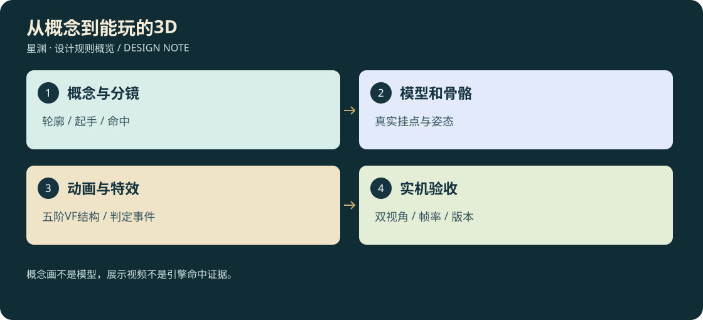

# 22 · 武技、宠物、阵法的3D与动画制作合同

<!-- illustrated-overview:start -->

*图解：概念画不是模型，展示视频不是引擎命中证据。*
<!-- illustrated-overview:end -->

设计稿；本轮没有生成新图片、视频或3D资产，也没有消耗Aholo积分。资产继续按[17](17_PET_3D_FLIGHT_AND_ASSETS.md)保存源文件、导出文件、预览、校验和与独立备份状态。

## 1. 五阶效果的可制作定义

[20人物](20_PLAYER_MARTIAL_ARTS_60.md)、[21宠物](21_PET_SKILLS_33.md)每招的“专属形状”是不可替换的轮廓身份，以下VF是制作结构而非把所有技能换颜色。每个技能都导出K1—K5五个表现配置；粒子和纹样升级不改变没有写入技能表的判定半径、弹体数或距离。

|谱系|入门K1|小成K2|精通K3|大成K4|圆满K5|
|---|---|---|---|---|---|
|VF01 近战轨迹|武器/肢体真实扫掠+短单轨|轨迹边缘清晰、击点碎屑|专属纹样沿轨流动|前摇亮起纹样，命中形成短内环|纹样完整闭合后收束回武器；不额外判一次|
|VF02 弹体射线|实体弹核+短尾迹|增加外壳与方向箭纹|专属内核旋转、碰撞破裂|双层尾迹、起手聚能|完整纹样绕核、终点消散；装饰卫星不造成伤害|
|VF03 落点/震波|清晰边界预警+一层冲击|加边界倒计时刻度|地表专属裂纹/符号|立体预警轮廓与分段到达提示|内外纹样贯通，收势回流；所有层仍同一事件预算|
|VF04 护盾/招架|可读薄面+受击点|厚度边缘与剩余强度裂纹|分片受击光，背侧不伪装防护|专属结构分区开合|完整结构及破碎收束；低血盾仍能看出快碎|
|VF05 锁定印|目标脚下与身体印记+倒计时|增加来源连线|专属锁扣逐段闭合|断锁时清晰分裂反馈|完整印面/极短结算闪光；锁定时间不缩短|
|VF06 位移/扑击|起步、接触地面、刹停三动作|专属尾迹与制动碎屑|路径曲率连续，身体倾斜更自然|起终点纹样呼应|完整短轨收束；不复制实体/增加无敌帧|
|VF07 持续场|实际边界+核心|每次结算脉冲|显示剩余时间与可破坏核心|专属立体低矮构件|层次完整但视线中央留空；不得扩大安全/危险边界|
|VF08 治疗/恢复|源到目标柔和流线|目标受益点有专属纹样|逐次恢复脉冲|纹样顺经脉/毛羽展开|完整回路后熄灭；不做持续满屏绿光|
|VF09 声波/感知|方向锥/环短暂可见|分清源方向和受影响点|专属声纹带清晰节奏|多层细纹呈现传播|完整声纹回收；不能显示未感知敌人|
|VF10 姿态/假影|真实姿态改变/一个标明的假影|皮肤/装备局部纹样|启动与结束独立动画|专属纹样短暂连贯|完整姿态演出，保留轮廓和反制提示|

例如WS01五阶一直是刀刃带水弧，WS02一直是三道折峰，不共用同一刀光贴图代替差异。PET01雷枝从龙须与口发出，PET02火域按羽形向地面铺开；两者即使同属弹体也不同源骨骼、模型、动画、音色和末端碎片。技能强度通过命中反馈与数值共同表达，不靠无限增大人物或光柱。

## 2. 动画与判定时间轴

每套技能资源包包含概念正/侧视图、起手/命中/收势分镜、Blender源、带骨骼GLB、动画事件表、材质/贴图、五阶VFX配置、第一/第三人称验收视频。视频必须录真实可运行模型，不能用概念视频替代引擎验收。

统一状态：Idle→Anticipation→Release/Active→Recovery→Locomotion；Interrupt、Blocked、OutOfResource各有退出。技能表前摇p对应Release时刻；后摇q为最后有效帧后的恢复时间。多段技能在自己的activeDuration内分段，持续场由场实体计时，人物完成释放后可移动。脚底贴地、重心、骨盆转动、肩肘跟随必须由骨骼与IK实现；不能把整人刚体向前平移当出拳。

近战以上一帧至当前帧武器/爪尖扫掠体命中，去重键为castId+segmentId+targetId。投射物从真实发射挂点生成，枪口/口部到初始弹点做短射线，贴墙不能越墙出生。左右手切换、骑宠、趴下、第一人称镜头都不能改变服务器意义上的发射来源。

施放中何时可转向/移动固定配置：近战前摇允许转向最多90°/秒，生效帧最多30°/秒；定向射线在释放前0.15秒冻结方向；H5开始锁定后移动速度50%，需要持续视线，完成后至结算不超过0.2秒。恢复期前50%不能接攻击，后50%可用闪避取消，已扣费用/冷却不退。按技能明确例外，不能以帧率改变取消窗口。

H3至少0.6秒有效预警，表内更长者沿用；H5至少0.8秒，印记颜色加形状/音效双重编码，色盲模式可辨。多段预警按真实到达次序播放；地面坡度使用地形投影，不能悬空贴一张平面图掩盖碰撞误差。

## 3. 双视角、宠物与空战

未单列的弹体默认：H2速度24米/秒、碰撞半径0.15米；H4速度14米/秒、碰撞半径0.2米、最大转向45°/秒（WS19例外60°/秒）；最大路程为表中射程，耗尽即销毁。射线按卡片射线标记使用释放帧射线，不能同时生成第二份弹伤。H1默认最多4目标，H3/H7默认最多4目标且按离中心距离选择；友方默认单目标，明确光环才两目标。未写圆半径的锥为60°，未写线宽为0.6米。制作时不能靠视觉大小自行猜判定。

第一人称模型显示实际装备：空手时无默认道具；扫描有取出/扫描/收起，剑技用剑，御法用手印，骑乘时双手随缰绳/鞍具。采用共享世界骨架加近景手臂层，遮挡处理不删除第三人称武器。施法镜头不强行夺取鼠标；可选轻微后坐与震动，可关闭。

第三人称要看得见足步、髋肩扭转、武器重心和收势；宠物由真实四足/双足/翼/蛇形骨架驱动。朱雀与凤凰在羽冠、尾型、飞行节奏区分；青龙与应龙在翼和躯干结构区分；九尾狐尾巴数量不等于命中数量。迷你形态独立比例和碰撞，不能直接把成熟模型等比缩成难看的小点。

骑宠空战：乘客、鞍座、宠物身体三个层级；俯仰滚转有舒适镜头限制，身体仍表现真实转向。地面专属招式在无合法地表时显示原因，提供可用空中技，不自动转换成未定义攻击。下宠后清除骑乘输入所有权和自由观察锁，验证鼠标不需要再按Alt才能控制方向。

## 4. 首轮性能预算与资源目录

预算是待实测目标：1080p中档单机同时8战斗单位，最多12高优先技能效果；总可见透明粒子≤4000，透明层叠主要区域≤4，动态技能灯≤4、投影阴影灯≤1。超过预算优先裁剪远处装饰尾迹，必须保留危险边界、锁印、弹核与核心；多人预算另行测定，不把此数当普适硬件保证。

LOD0角色轮廓/骨架细节完整；LOD1减细分和装饰骨，LOD2烘焙次要材质并简化动画更新。近战命中永远用物理代理，不能因低LOD失去攻击；物理代理误差验收：近景攻击边界与画面主要轮廓差距≤0.15米或该招半径5%中较大者。

建议 `assets/combat/{skillId}/v001/{source,concept,model,textures,animations,vfx,preview,manifest}`。manifest包含skillDefinitionVersion、skeletonVersion、五阶effectVariant、许可证、输入参考hash、生成任务ID、源/导出hash、验收视频路径。密钥不得进入清单；不要覆盖v001重做。项目引用具体发布版本，不引用下载临时目录。

## 5. 开发顺序与验收

先WS01、WS03、ES05、ES13、HS04、HS06六个人物样板；PET03/PET04/PET05三只宠物覆盖扑击/护盾/治疗；AR01/AR02覆盖告警与几何阵盾。每个样板先用真实3D白盒验证动作，再做概念批准和精模，最终五阶同镜头对照。确认原型乐趣与预算后扩展126主动配置，不能一次买完全部资产。

逐招检查：命中/落空/挡住/打断/资源不足；五阶真实掉血与表一致；1/3视角、趴下、骑乘、空中、贴墙；30/60/120FPS判定一致；低特效模式仍看见危险；中文技能详情与兑换按钮不重叠。保存场景种子、版本、录屏与报告；当前文档审计不能替代这些未来引擎验收。
