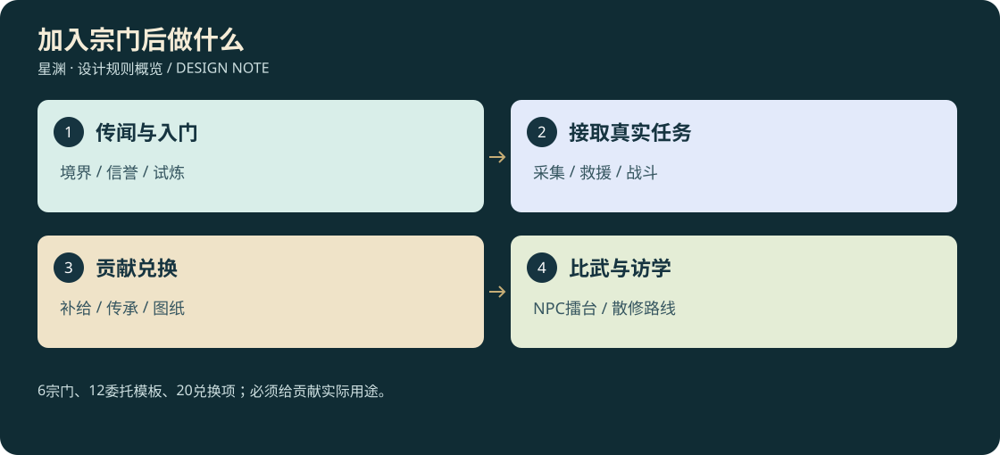

# 23 · 宗门、NPC、任务兑换与比武

<!-- illustrated-overview:start -->

*图解：6宗门、12委托模板、20兑换项；必须给贡献实际用途。*
<!-- illustrated-overview:end -->

设计稿；沿用单机优先，[14](14_OFFLINE_AND_ONLINE_BOUNDARY.md)定义后续联网归属。六个宗门不是六个必须依次加入的职业，科技营地始终保留医治、维修、基础教学和救援。

## 1. 发现与加入

世界上层新增一神国、二洞天、三学府、四圣地，六宗门的上层关联及个人关系分离规则见[29](29_SUPREME_FACTIONS_AND_STORY.md)。本章仍负责六个可加入宗门的前期服务，不将20个支门派直接复制成20套职业菜单。

后天R0三级由N05解释“武技不是境界，传承不止科技”；地图只记录听过的传闻。六级开放武院外门试炼；正式入门一般R1起。高阶宗门可从传闻了解到，实际会面仍受星际交通与区域危险约束。接引匹配按已发现宗门、最低境界、任务信誉、玩家意向筛选，显示具体缺项，不随机抽一个决定终身路线。

|ID 宗门|地区/定位|入门要求|传承与实用服务|冲突与探索线索|
|---|---|---|---|---|
|S01 玄衡武院|Z0边缘，科技与武修桥梁|外门R0六级完成格挡/闪避/救援；正式R1、信誉20|刀枪拳基础、训练木人、阵法入门、立宗登记|救援路线被兽潮阻断，保护归航塔|
|S02 青岚剑宗|Z2高崖，剑/风|R1五级、信誉30、通过移动靶试剑|御剑传承、身法、轻装锻造|失落剑碑与山门风眼|
|S03 赤炉门|Z2熔谷，器/火/金|R2、信誉30、交一次合格自采陨铁样本|陨石分级、锻造、阵器核心|矿脉争夺，熔炉污染治理|
|S04 回春谷|Z1水林，丹/木/水|R1三级、信誉25、成功采药救人|疗伤丹、回气丹、药圃与净化|毒瘴与失传药谱|
|S05 御灵山|Z2兽谷，灵宠/羁绊|R1、信誉25、完成非伤害安抚任务；不要求已有稀宠|兽诀、孵化、鞍具、灵兽栏|迁徙兽群和遗失兽卵|
|S06 太虚星宫|空衡星，空间/星阵|R6、信誉50、完成安全传送测绘|空间术、跨星阵维护、星材研究|失稳星门、远古坐标与护航|

信誉来自完成对应任务，普通每次+5、不同支线首次+10；达到要求只证明合作，不直接给属性。入门不收稀有内丹。一次只能有一个正式宗籍，可以访学其他宗门；访学买基础配方价格+20%，核心研究需公开试炼。退出保留学过武技、贡献和个人资产，停止仅在岗生效的设施服务；再次任职有3个有效游玩小时间隔，不靠读档反复领入门礼。入门礼按角色+宗门永久一次。

宗门被毁时必要技能转由幸存导师/书商公开路线提供；第20的散修挑战和研究保底始终存在。任何必需突破材料都不能被一个可毁建筑独占。

## 2. 新增12名固定NPC

本章历史增补将NPC从26增至38；最新第29章再增顶层领袖10名和支门派人物20名，现固定名册68名。本章12人的编号不变。这里是详细职能，第05同步总名册，ID不复用。

|NPC|所属|职务与界面|可领取的长期线|
|---|---|---|---|
|N27 顾行简|S01|院正/立宗登记：宗籍、试炼、宗门章程|从训练伤员到护卫一方|
|N28 叶知锋|S01|演武执事：招式教学、贡献兑换、比武报名|六种实战情境考核|
|N29 沈清岳|S02|传剑长老：剑风武技、进阶验证|寻找断裂剑碑|
|N30 乔听澜|S02|巡山执事：巡逻、护送、风眼材料兑换|重建高崖索道|
|N31 炎百炼|S03|炉主：高品质锻造研究、阵器核心|修复古炉而非无限投矿|
|N32 罗星砂|S03|矿务执事：采矿、熔渣治理、锻材兑换|揭露矿区失衡|
|N33 温素问|S04|谷主：功能丹谱、疑难伤势、药圃教学|净化水源三阶段|
|N34 何采苓|S04|药圃执事：采集、疗养委托、药材兑换|按生态补种药圃|
|N35 牧云生|S05|御灵长老：兽诀、契约、载宠训练|与成熟兽建立信任|
|N36 鹿小满|S05|灵兽执事：饲料、走失宠救援、鞍具兑换|找回有个体身份的幼兽|
|N37 裴观辰|S06|星阵长老：空间术、星际阵图|校准三处真实星门|
|N38 闻星渡|S06|远征执事：星际护航、星材、比武联络|寻回失联勘探队|

N25宠物医师、N26服装师继续提供通用服务，不被御灵山取代。上述NPC是固定角色；临时弟子、护卫、商旅由世界刷新系统分配实例ID，不计入38名固定剧情人物。

## 3. 任务模板与奖励预算

|ID|任务|真实完成事件|贡献/信誉|防重复与失败恢复|
|---|---|---|---|---|
|SQ01|清剿威胁|消灭指定区域3只当前合格敌人|30/+5|敌实例死亡ID去重，不刷教学怪|
|SQ02|采集样本|上交4份任务指定普通材料|25/+5|先显示品级、重量、扣除清单|
|SQ03|救援新手|找到伤员并护送抵安全点|40/+5|昏迷不死亡，可重新寻人|
|SQ04|护送商队|经过3段实际路线保护货箱|45/+5|不是点击等待领奖，损坏有分档|
|SQ05|试炼武技|对三类威胁正确运用技能|35/+5|无空挥刷进度，允许失败重试|
|SQ06|炼制补给|炼成并交付两份指定功能丹|40/+5|同ID药品扣除，任务成本预览|
|SQ07|锻造阵器|完成一个合格核心制作|50/+5|成品上交后不能仍留背包|
|SQ08|灵兽安抚|合法喂养/营救三次有效事件|35/+5|不要求杀宠，不重复刷新幼兽|
|SQ09|遗迹测绘|记录三个未归档观测点|50/+5|世界种子和观测ID保存|
|SQ10|阵法维护|诊断并更换失效节点|40/+5|真实损耗由事件产生，不自己拆了刷|
|SQ11|宗门防卫|一次来袭中守住/撤离核心人员|60/+5|接受事件后固定结果，杀友军不计|
|SQ12|跨星远征|R6以上寻回遗失研究记录|80/+5|永久唯一首次奖励，无每日复制|

每宗同时展示3个适合境界和生态的普通委托、最多2个长线节点；刷新依据已完成/失效事件，不靠反复打开菜单重抽。单次有效游玩日定义为累计在线3小时窗口，普通贡献满300后后续同类奖励降为25%，不同长线首次不受此限；离线不积累委托窗口。任务说明展示此规则，不能偷偷扣奖励。信誉每日重复同模板最多三次计入，长线独立。

普通委托材料价值应约为该境安全远征净收益的20—40%，贡献兑换价值约等于付出时间，不让上交NPC廉价购货形成无限灵石循环。击杀掉落和任务奖励分开，后者不再次生成同一内丹。所有接取、扣料、奖励使用taskInstanceId+claimId原子事务。

## 4. 贡献商店（首轮价格，非充值货币）

贡献为个人在各宗的不可交易服务记录，不与灵石固定兑换。物品分阶，消耗同档材料与声望门槛；下表常规消耗品默认T1/Q3，升到Tn价格×(1+0.5×(n−1))，并要求已达Rn。高品Q5/Q6、祖脉蛋和永久机缘不进无限货架。

|ID|奖励|贡献|用途/限制|
|---|---|---|---|
|SX01|同阶疗伤丹×2|30|伤后恢复，继承MED共享CD|
|SX02|同阶回气丹×2|35|远征续航|
|SX03|同阶续力丹×2|30|体力恢复|
|SX04|解毒净化包×2|30|毒地探索|
|SX05|普通药材选包×4|40|只选本宗当阶常见草药|
|SX06|普通陨材×3|45|打造武器，不含稀有星核|
|SX07|兽粮×5|35|对应FD饮食，不增加喂食次数上限|
|SX08|孵化稳定剂×1|60|增加孵化容错，不能跳过孵化流程|
|SX09|修理服务券×1|25|一次普通装备维护，不套现|
|SX10|D1武技传承任选|100|目录内本宗传承，已学不可重复领补偿|
|SX11|D2武技传承任选|180|仍需前置和验证|
|SX12|D3研究页×1|120|三页换一本合格D3武技，保存研究ID|
|SX13|基础兽诀PM任选|150|六PM目录，不凭空给满掌握|
|SX14|基础阵图AR01或AR03|120|学会后自行准备材料|
|SX15|建筑蓝图基础包|100|库房/药圃/工坊，不附免费资源|
|SX16|普通扩容材料包|90|仅EX01/EX02，同等物料总量封顶|
|SX17|区域传闻坐标×1|70|未完成普通机缘线索，非极品保底|
|SX18|普通鞍具图纸|140|按17匹配体型与载重|
|SX19|宗门装扮/宠物纹章|80|纯外观，跟个体身份绑定|
|SX20|D4专项试炼资格|300|达到门槛后开放挑战，失败可重试|

消耗品和普通材料可交易，遵循用户自由经济方向；服务、知识、资格、贡献不可转卖。实现时以商店售价、上交任务收购额度与兑换产出联合检查套利，不能为省事把全部材料绑死。每个交易预览写数量、阶品、容量、花费、到货位置；背包满可选飞行器货舱或取消，不吞物。

## 5. 比武与任务对话

单机先做NPC对练、宗门四强赛、跨宗八强赛三种；正式赛1v1，宠物赛另设1人1战宠组，不让纯人物赛突然出现宠物。报名展示真实实力赛/标准擂台两套规则：真实实力赛按大境界分组、小级差≤3；标准擂台统一该境三级基础属性与Q3装备预算，保留已学武技和五阶掌握，不能授予未学高阶技能。两种榜单分开，不宣称后天能公平硬打道源。

三局两胜、单局180秒，60秒准备；边界清晰，出界3秒警告再判负。禁爆发后遗症丹、外部阵法和环境飞行器；比赛专用资源在每局恢复，离场恢复入场快照，不能借比武治疗实际伤势/清除丹毒。常规药品是否允许在报名规则明确，默认禁药。

首胜奖励贡献40、一次赛事冠军80与外观记录；同赛事ID再战只练习，不重复领奖。没有死亡/掉级；输后显示三项实际问题（命中、无效耗气、吃到哪类预警），可直接去训练复盘。高阶比武使用安全试炼空间，毁星能力不对普通擂台生效。

NPC对话页：身份/宗门关系→交谈、任务、学习、兑换、比武、离开。任务详情必须展示门槛、路线危险、贡献与材料收益、是否上交；缺项给导航“学习招式/寻材料”，不弹无法关闭的说教。创建宗门和退出宗籍必须展示具体影响并由玩家在游戏内确认。桌面1080p与1280×720验证长中文滚动、按钮固定可点，打开界面释放鼠标，关闭恢复原第一/第三人称控制状态。

## 6. 战争和世界刷新接入

宗门状态为繁荣/受压/戒备/战斗/破败/重建/复兴。世界刷新根据区域威胁、资源流、剧情与玩家行为安排兽潮/敌对袭击，不直接掷一次骰子删除宗门。首次攻城先有传闻、巡逻异常、至少10分钟在线准备及撤离任务；玩家未开启战争体验时只发生外围冲突。单机离线冻结破坏，不因三天没上线回来只剩废墟。

建筑可毁、宗门组织可覆灭；存档仍保留历史sectId、曾任身份、已学知识、贡献债权和资产归属。幸存导师迁移到可达的营地，银行/私人仓储转为恢复凭证而非复制物品；重建恢复原账，不重新发一份。完整建造/阵法/撤离流程见[24](24_SECT_BUILDINGS_AND_FORMATIONS.md)。
