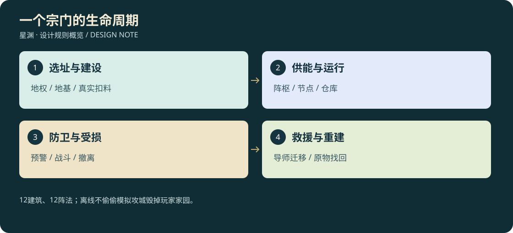

# 24 · 建宗、建筑、阵法与覆灭重建

<!-- illustrated-overview:start -->

*图解：12建筑、12阵法；离线不偷偷模拟攻城毁掉玩家家园。*
<!-- illustrated-overview:end -->

设计稿；与[23宗门](23_SECTS_NPCS_MISSIONS_AND_DUELS.md)、[08世界刷新](08_WORLD_DIRECTOR.md)、[11洞府](11_CAVES_AND_FORTUNES.md)同项目维护。无需新开项目：宗门是世界中的持久实体，阵法是战斗/建筑模块，刷新系统只提出事件，不直接改库存或算伤害。

## 1. 学习与创建路径

R1三级可在N27学习“识阵与布基”：完成三个可重复安全练习（识别阵眼、连接两个节点、切断危险供能），收费200碎灵石，无随机失败。随后可学AR01告警和AR03净息小阵，私人洞府也能使用，不必先建宗。储物扩容仍走第10的原有基础技能，不以阵法技能替代。

R2五级可申请立宗：完成一次救援、一项建设实习、识阵与布基；交立宗费用10,000碎灵石、同阶普通陨材20单位、普通木石结构料40单位。费用预览可达性与当前持有量，不要求稀有内丹。成为宗主前退出正式宗籍，可保留访学关系。单机每角色同时一处主宗址、后续最多两处不独立产贡献的分院。

创建流程：选择学派→勘探候选地→检查地权/道路/生态→预览地基与预算→命名及纹章→确认投入→分阶段建设。学派为武修、丹器、御灵、守望四选一，分别给训练/工坊/灵兽栏/防御建筑建造材料−10%，不直接给全身战力乘数。转换需拆换学派核心且冷却10有效游玩小时，已造建筑不返优惠差价。

首块宗址半径80米；避开固定NPC、安全救援点、主路、世界关键传送节点和受保护出生生态。世界提供按种子生成且可到达的3个候选，可自行勘探另一个合格地点；不是给玩家任意抢占安全区。显示高程/地基支撑/航路/危险范围，红色冲突处不能提交建设。

## 2. 十二类建筑

成本记作 `石/木石/陨材`：碎灵石、普通结构料单位、同阶普通陨材单位。表为一级地面建筑R2预算；建筑等级g=1—5，材料与耐久倍率为2^(g−1)，对应最低建造境界R(g+1)，母星最多g4(R5)。高阶g5需高级星球资源。空间类建筑还受专属前置，升级不自动创建新功能。

|ID 建筑|基础成本|占地/建造有效在线分钟|实际功能|前置与防滥用|
|---|---|---|---|---|
|SB01 山门与界碑|800/20/4|8×6/5|记录归属、访客规则、战争告警|建宗第一项，不能堵唯一道路|
|SB02 议事殿|1500/30/6|12×10/10|弟子岗位、事务、建设队列|SB01；不凭空生成NPC人口|
|SB03 演武场|1000/20/4|16×12/8|木人、武技验证、比武|SB02；训练不给真实怪掉落|
|SB04 静修室|1200/20/5|8×8/8|打坐环境+10%修为速率|沿用72小时离线封顶，不自动突破|
|SB05 炼丹房|1500/20/8|10×8/10|已学丹方制作，保存批次队列|需会炼制的NPC/玩家，真材扣料|
|SB06 铸器坊|1800/20/12|12×10/12|武器、鞍具、阵器维护|材料品级影响产物，不无限复制|
|SB07 藏经阁|1200/20/6|10×8/8|传承研究与已得图纸归档|没有书不能点空菜单学绝技|
|SB08 灵兽苑|1400/30/6|16×12/10|3只休息位、照护和训练|只收有契约宠物，不代打怪升级|
|SB09 药圃|600/12/2|12×12/5|4个种植格、真实种苗产普通草药|只结算当前一批，离线不自动补种|
|SB10 宗门仓库|1000/20/5|10×8/8|2000升/2000千克实体仓储|普通库不装活物；所有物品唯一ID|
|SB11 阵枢台|2000/20/15|8×8/12|管理供能与节点，上限4座同时工作阵|至少识阵技能精通；每阵独立损坏|
|SB12 远行台|3000/20/20|12×12/15|母星交通停靠，R6研究后可装跨星模块|前期不是跨星传送阵，不能跳过R6|

SB04最多一个有效环境加成，不能叠一百房间挂机。药圃普通种苗4个每批在线60分钟产8份同阶普通药材，种子来自真实库存、需水和照料；成熟可离线一次结算但不连续播种，珍稀野生草药仍需要探索。炼丹/铸造产率与第03统一，不另给独立“宗门品质×2”。建筑等级只增加相应容量/耐久，工作效率额外每级+5%最高20%，不能把成本倍率误用成出货倍率。

招募弟子由真实救援/访客/传闻事件产生。初始岗位3，SB02每级+2、最多11；每人有技能、食宿和报酬，分配后才工作。预算欠费暂停服务、不吞玩家库存；单机无离线战斗与扩张。宗门贡献是成员个人记录，宗门库的材料/灵石是组织资产，两账不能互换造钱。

## 3. 十二种阵法

AR是阵图ID，不是可堆无限伤害技能。学习R为最低要求；每阵初次制作需“对应阵图+同阶陨材+结构料”，表写 `陨材/结构料；布设秒；能量/秒`。初始供能晶每枚由10碎灵石充入100阵能，返还只退未使用整数阵能对应晶体余量，不生成新灵石；更高阶每阵能成本×6^(t−1)，t为阵阶、最低1。能量与灵石扣除采用整数账本，低阶阵t1。

|ID 阵法|学习门槛|制作/运作预算|边界与效果|反制/限制|
|---|---|---|---|---|
|AR01 听风警阵|R1/D1|2/4；8；1|半径15，进入者经感知规则触发告警|破坏2节点之一失效，不穿墙定位|
|AR02 四象壁阵|R2/D2|8/10；20；4|半径5几何罩，屏障强度40×6^t|击破核心/能量耗尽失效，不能全域无敌|
|AR03 净息小阵|R1/D1|3/4；10；2|半径3，脱战回气速率+10%|不与同名叠加、不攻击、不越离线72小时|
|AR04 荆棘困阵|R2/D2|5/8；15；3|半径4，入阵减速25%，最多3目标|可砍核心/离阵，减速走统一50%上限|
|AR05 雷火杀阵|R3/D3|10/10；25；6|半径5，每3秒预警0.8秒后术雷伤10×6^t|用19灵抗计算；最多3目标，不能埋在不可见地下|
|AR06 玄冰封阵|R3/D3|8/12；25；5|半径4，每6秒预警1秒冻0.6秒|共享控制递减，精英削韧替代|
|AR07 回春疗阵|R2/D2|6/8；18；4|半径4，每4秒回复6×6^t生命，最多2友方|同名择强，不与宠物重复算同一次治疗|
|AR08 藏影迷阵|R3/D3|8/10；20；4|半径5遮蔽声光，提高隐蔽但不隐身|近距观察/破妄/毁核心可破，不改玩家操作|
|AR09 镇空阵|R4/D4|14/16；30；8|半径8高20圆柱，飞行耗能+20%、减速20%|边界提前可见，不直接关飞行使人坠死|
|AR10 聚灵修阵|R3/D3|10/12；25；5|半径4修为速率+15%，需真实阵能|和静修室同属环境桶，环境总上限25%|
|AR11 小界护库阵|R4/D4|16/18；40；6|保护一仓库入口，屏障60×6^t，显示能量|不是无限空间，不增加仓储容量，不吞入侵者|
|AR12 星门定锚阵|R6/D5|30/30；60；12|校准已发现且授权的两端星门，传送另付门票|两端有效、星球权限和冷却都满足才传送|

阵能表为运行最低值，AR02/11受击额外每吸收10×6^t伤害消耗1阵能，护盾每次启动满值但必须预付10阵能，停开有60秒CD，避免无成本刷盾。攻击阵按每3秒周期扣完整3秒能量后结算，不足时不发半价攻击。其他阵按一秒定步扣能，不随FPS翻倍。

可携带便携阵盘，一人同时最多1座作战阵；宗址有阵枢最多4座，同名区域效果取最高，不乘算。便携预布设需要脱战，战斗中仅能启动已摆好的阵，不能随身搬杀阵追人；离开100米停止便携作战阵，不隔区自动杀怪刷材。阵阶t≤建造者境界且≤材料阶；供能品质只影响储能密度，不能暗中增加阵伤倍率。阵法掌握沿用五阶，伤害/治疗倍率同19，辅助比例不自动翻倍。

节点有明确地面支撑、连线、距离上限（普通20米、星门节点40米）及所属阵ID；完整拓扑才工作。阵法力场渲染用VF07、阵盾VF04、阵攻击VF03；五阶纹样沿22，不用屏幕滤镜冒充世界3D。阵外可观察能量流，敌我都能找阵眼；队友规则写入阵的阵营快照，易主后必须停机重新授权，不能同一帧双重归属。

## 4. 可破坏建筑、覆灭及救援

刷新修订见[27](27_CONSUMPTION_AND_UNIQUE_WORLD.md)：完整建筑不因计时替换；无主废墟需实际清理和地权检查才允许新事件建设。玩家和宗门建筑始终用授权、扣料、施工的建设事务恢复，不进普通随机补充池，内存卸载也不算拆除。

建筑一级基础耐久=600×6^建造境界，结构防御=20×6^建造境界，升级按上表；对建筑技能只有标记siegeEligible的重击、攻城器和预警阵攻击有效，普通打击也能造成低效伤害但乘0.1结构系数。使用19的物理/灵抗管线，目标境界取建造境界，不跟攻击者临时改变；建筑不吃暴击、生命偷取或宠物喂养收益。

100—60%完整，60—25%明显破损，25—0%危房暂停服务，0%倒塌成可回收残骸。只生成预制破片和导航变化，不模拟每块砖无限物理体。倒塌预警至少3秒，先疏散交互/解除工作状态；玩家可能受已预警坠物伤害，但主线NPC转入伤员救援，不静默永久删除。

议事殿与阵枢均失守且守军撤离才进入覆灭，不是一堵墙倒下立刻删宗门。玩家可以进攻敌对宗门，但首先获得敌意与救援后果预览；平民区/初始救援核心受剧情保护，不能摧毁唯一新手出口。R9毁星仅发生于明确允许的无人试炼星事件，不删除整个游戏存档与必需NPC。

私人储物在倒塌时变为锁定废墟清单，唯一原物仍在账上；救援NPC以已记录instanceId办理找回，不能现场拾取和找回各得一份。组织公共物资可按战役预告损失上限10%，任务唯一物/宠物/个人知识不损失。普通废墟回收未损坏建材30%，主动拆除完好建筑返50%，折扣学派按实际投入返，不按原价返。

重建先搭临时营地→救回导师→修仓库/山门→修议事殿→恢复服务；贡献、已做任务、历史阵图保留，不重领首建/入门奖。可选择另址复宗，sectId不变、siteId新建，旧废墟仍记录所属以供回收。主动解散需要清点私人与组织物品，显示具体处置再确认。

## 5. 模块、存档与未来联网

配置：SectDefinition、BuildingDefinition、FormationDefinition；实例：SectState、BuildingInstance、FormationInstance、EnergyLedger、SiegeEvent。持久键为worldId/sectId/siteId/buildingId/nodeId/ownerId；事件包含版本、时间、请求ID、已结算标记。建造先校验空间和材料→预占材料→建立施工实例→分阶段进度→竣工，取消只返未使用份额。加载后从施工实例恢复，不再扣一遍钱。

世界刷新提出袭击候选→宗门系统校验剧情与准备窗口→战斗系统运行→库存系统结算→世界系统记录生态结果。暂停不推进建造、阵能或攻城；正常离线仅按已定义挂机/当前生产一批规则结算，不运行防卫模拟。加载种子不重掷是否袭击，也不复制残骸。

联网以后由服务端拥有地权、阵能、战斗、宗门权限和物资事务；角色个人贡献与组织财库分权，宗主/长老/库管/成员/访客有明确权限。战争时间窗、下线保护、服务器区域分片必须另做联机设计与压力测试，不能把单机暂停保护原样带进共享世界。本地旧存档宗门与物品不直接导入正式联网经济。

验收闭环：学识阵→布警阵→真实敌人进入告警→坏节点停止→修复恢复；创建宗门→扣费施工→药圃一批→真库存入库→攻城受损→救援→重建。重复保存/读档、背包满、阵能恰好不足、节点跨地形、同名阵重叠、NPC迁移、主机下线等均须单独测试。
