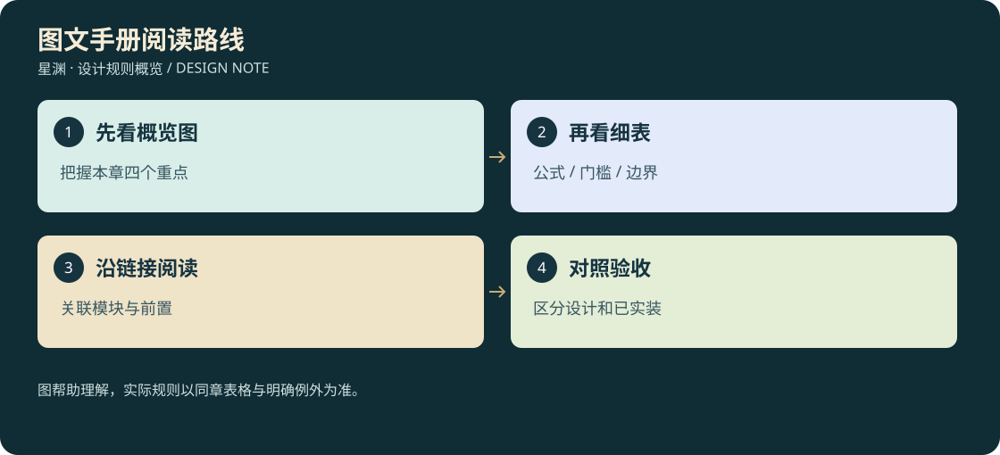

# 25 · 图文阅读路线

<!-- illustrated-overview:start -->

*图解：图帮助理解，实际规则以同章表格与明确例外为准。*
<!-- illustrated-overview:end -->

这是一份可逐章查看的设计手册。每章开头都有一张规则概览图，详细表格仍作为制作与计算依据；概念画帮助理解气质，流程图解释规则，两者不能当作已经实现的游戏画面。

**推荐直接打开[图文手册](illustrated-guide.html)**：左侧选章、搜索标题/正文，右侧看图、表与详细说明；支持离线打开，无需登录或连接游戏。手机窄屏会将目录折为上方列表，可打印当前章节。修改Markdown后执行 `node tools/build-cultivation-guide.cjs` 同步网页。

## 从一个角色的一天读起

|想先弄懂什么|推荐章节|看图时关注|
|---|---|---|
|怎么变强|01→03→19|境界基础、材料品质、同类先加再乘|
|为什么要探索|04→08→11→26|地区危险、持久线索、普通收获与极稀有传承分开|
|怎么打得舒服|02→13→20→22|动作、追逐、前摇、命中体积与真实3D一致|
|宠物怎样陪伴和战斗|15→16→17→18→21|收服、个体身份、两主动、飞行权限|
|宗门怎样成为家|05→23→24|NPC任务、有效兑换、建设、供能、防卫和重建|
|开发怎么逐步做|07→09→14|真实小闭环、可追溯数据、单机先行|

## 图例和读法

- **蓝色信息块**：玩家观察、准备和操作。
- **金色结果块**：获得收益或进入下一状态，不表示必定得到稀有物品。
- **箭头**：合法流程；图里省略的具体前置以同章表格为准。
- **概念插图**：表现方向；模型轮廓、动画、尺寸和碰撞需要后续3D验收。
- **数值示例**：固定输入下的运算，不是已经验证的全局战斗平衡。

## 本轮新增视觉内容

各规则章01—24配独立主题SVG概览，26配三清状态图、27配消耗换代图、28配游历夺宝图、29配十方组织图；总览与本阅读页配阅读路径图，并复用一张三联概念插画。共30张规则图。SVG是可维护的矢量规则图；插画由内置imagegen生成，源提示词、SHA-256及来源记录在[媒体清单v005](media/MEDIA_MANIFEST_v005.json)，v001—v004历史清单仍保留。全部文件已存入项目，独立异地备份仍未配置。

未来重点补画每种宠物与武器的正侧背面、关键动作分镜、宗门建筑俯视布局和阵眼节点。需先验证玩法样板再批量制作，避免拿大量气氛图代替可用3D资产。
