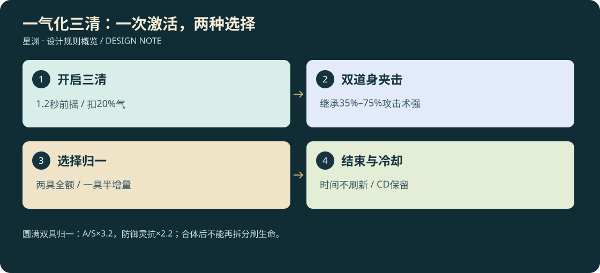
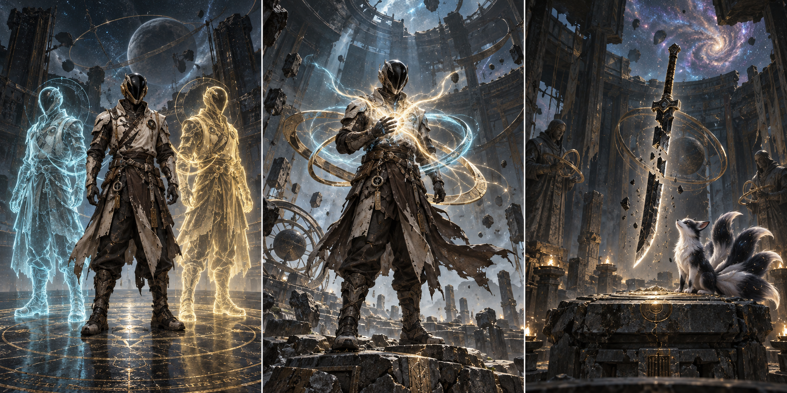

# 26 · 逆天传承、唯一遗兵与不可预料的机缘

<!-- illustrated-overview:start -->

*图解：圆满双具归一：A/S×3.2，防御灵抗×2.2；合体后不能再拆分刷生命。*
<!-- illustrated-overview:end -->

<!-- wandering-npc-update -->
游历者也能持有已有世界来源的逆天物，RN12人物模板不额外提高神物掉率。斩杀后只转移携行原物；吸收后的道统仅在原事件允许时以唯一残印继承，同一资格不会既掉原卷又掉残印。 详见[28地图与游历NPC](28_MAPS_AND_WANDERING_NPCS.md)。

2026-09-12；设计稿，尚未实装。用户新增方向：极难获得，获得后普通同级近乎无敌，优秀低境角色可以跨一个大境界取胜。这里是对普通成长上限的**显式例外**，不是把所有普通装备永久调强。角色仍为十境，每境十级。

图解：左侧本体与两具道身共同战斗；中间两道身归一强化本体；右侧是一条可能以残兵与幼灵开始的隐秘传承。此图为内置imagegen生成的概念插画，不能当作已有3D模型或游戏截图；正式角色结构仍按C2资产规范制作。

## 1. 稀有不等于只能多一个百分比

普通功法讲修炼效率，逆天功法改变能力结构；普通武技造成伤害，逆天武技改变一个受限战斗规则；遗兵有可觉醒的历史；神宠异格属于原33谱系的极稀有个体，不新增第34种；逆天机缘可以永久改变一条成长路线。

验收目标：同境同小级、同普通装备预算下，完成培养的逆天构筑对普通构筑在三类60秒遭遇中胜率目标≥90%；不是获得一个残片立刻满功率。面对同类逆天持有者、专克机制、多人围攻、资源耗尽仍可能失败。低境十级对高一境一至三级普通精英，在看懂攻击后有可验证胜算；低境一级随便秒杀高两境不作为目标。

能力可以提前偶得，承载逐步开放：R0后期就可能拿到残卷、封兵或幼灵，以设备/仪式代行基础功能；进阶形态要学习、修复和试炼。发现坐标、触发顺序和考验组合随角色种子变化，不靠固定时间地点点击领取。

## 2. 超常加成与普通公式怎样相接

保持[19](19_DAMAGE_ATTRIBUTES_AND_MASTERY.md)普通属性管线，在普通常驻属性算完后、施法快照前加入独立 `heavenOverride`。一个角色同时激活**一个天命核心**，来自逆天功法/遗兵/机缘之一；同核心包含一套完整规则，可持有其他宝物但只保留非核心招式/外观/材料功能，切换必须脱战并保留原冷却。新槽是本章明确新增，不悄悄占用或复制主辅功法槽。

同属性超常倍率取当前核心的一个最高生效值，不把“遗兵×分身合体×机缘灌顶”全部乘起来。临时攻击丹与核心加成采用 `max(丹药临时攻击倍率,核心攻击倍率)`；丹药代价仍真实存在。核心速度增益仍进13的移动上限，不倍增攻速、飞行高度或真空权限。

逆天技能的 `C/a/b`、掌握M、抗性、屏障、伤害事件顺序继续用19；专属规则例外必须逐条标记。主核心提供属性时，同一核心技能不能再把相同倍率作为额外“最终伤害”乘一次。稀有武技仍占原主动槽；天命核心动作默认长按技能轮盘选择，允许重绑，不能抢Q扫描/E闪避。

个人盾上限、控制递减、弱点与伤害桶仍有效；允许特定招式短窗口直伤、第二动作体或局部防御穿透。这些是强度来源，不以没有提示的永久无敌实现“逆天”。怪物不会读取玩家获得神物后立即同步变强。同次致命事件只触发一个保命源，优先自身星胎、其次宠物余烬；未触发者不扣储备，但15秒内不能再触发另一保命源，防止两者交替形成连续免死。

## 3. 一气化三清：双道身与三清归一（MYC01）

### 3.1 五阶具体能力

R0八级可通过已发现传承试验学入门，使用独立电容支撑；R1起内息承担。两道身从入门就都有，不把用户要的双分身拖到终局。分身方式与合体方式共用一次激活、资源和剩余时间。

|掌握|每道身攻击/术强继承|每道身生命/防御继承|合体A/S倍率|合体最大H倍率/防御灵抗倍率|最长持续/首次CD|
|---|---|---|---|---|---|
|入门|35%|30%/60%|1.80|1.10/1.30|12秒/180秒|
|小成|45%|35%/65%|2.10|1.20/1.50|15秒/180秒|
|精通|55%|40%/70%|2.40|1.30/1.70|18秒/180秒|
|大成|65%|45%/75%|2.80|1.40/1.90|21秒/180秒|
|圆满|75%|50%/80%|3.20|1.50/2.20|24秒/180秒|

CD在激活时起计，收回/死亡/换核心不重置；前摇1.2秒可被打断，成功开始扣基础池20%，每有效秒另扣2%。不允许战斗换装。表中继承取本体**不含天命核心和临时丹药**的常驻属性快照；不继承分身、召唤、宠物、阵法、核心激活、掉落和炼制技能。每道身使用本体已装备的一个可复制武技，轮流施放，共享“分身技能”CD：每6秒最多一具道身施放一次，两具不能同时复制大招。

普通攻击各按继承A结算；复制武技的固定C也乘继承比例，继承A/S已经缩放后不再整体乘第二遍。复制技按本体已掌握阶段计算一次；若原武技CD长于6秒，则取原CD。每次复制从本体额外扣原技能成本50%，耗尽则道身只能普攻直至总体断气。道身不独立吃丹回气，不共享本体被动吸血/反伤触发；本体只能因自己的实际伤害触发一次。

### 3.2 战斗与合体状态

本体可下达夹击/护卫/集火/归一，双道身采用青/金轮廓、脚下印和头顶图标，敌人能识别但仍需处理三个攻击方向。每道身要走真实路径，离本体30米开始回归、超过40米停攻返航；不能穿墙去打未加载敌人。指令可设两种不同武器动作，但没有两套可掉落装备。

至少一具存活时可合体，前摇0.8秒；两具存活取全倍率，一具取倍率增量的一半。例如圆满只剩一具：A/S=1+(3.2−1)/2=2.1。两具已灭不能合体，也不能在同一次激活重生道身。选择归一后剩余持续时间不刷新，不能再拆回分身循环刷盾/生命。

合体增H采用临时生命容量层：常驻H和当前H原样保留，增加 `(H倍率−1)×常驻最大H` 的临时容量与同额临时生命；先消耗临时层，不能治疗该层，结束移除剩余层，不按百分比抬高永久生命。伤害日志分别记临时层/本体，合体不能把残血洗满。个人盾上限按常驻最大H计算，不利用临时H扩盾；实际本体HP为0仍昏迷。

持续结束或主动提前结束后有15秒“分神疲劳”：不能再次激活核心，回气速率−30%；不掉境界、不清熟练。受伤道身消散有0.5秒清晰解体演出，禁止瞬间把被杀道身算成满额合体。

### 3.3 3D制作与五阶差异

骨架和武器来自同版本本体，衣物不另随机生成。入门道身局部透明且边缘不稳定，小成骨架/衣纹稳定，精通青金经脉连贯，大成三人脚下形成短连线，圆满头顶出现完整三清环；装饰不增加命中次数。合体时两道身沿可见弧线归胸，先解除实体碰撞再播放流光，0.8秒到点才更新属性。可在第一人称看见两侧影身，合体镜头不强制切第三人称。

道身计入可见战斗单位与寻路预算，单机默认同屏最多两组完整三清核心，超出先简化远处VFX而不是删掉敌方伤害体。未来多人需独立容量测试，不能复制客户端角色对象当服务端分身。

## 4. 六部逆天功法

每部均D5，沿用五阶熟练度，专属阶段数值覆盖普通核心；下表未写的属性无额外收益。圆满是长期培养结果。

|ID 名称|早期发现/最早使用|逆天规则（入门→圆满）|代价与独特获取考验|
|---|---|---|---|
|MYC01 一气化三清|R0后期/八级|双道身或归一，完整五阶见上|三处不同生态回声拼接，分别用本体完成攻/守/识试验，不要求先有分身|
|MYC02 不灭星胎经|R0残核/R1|核心H倍率1.2/1.4/1.6/1.8/2；致命前可消耗星胎储备拦一次使H留1，24小时有效游玩一次|星胎需三次不同远征修复，承伤成功后60秒伤害−30%，不抵剧情毁星/缺氧|
|MYC03 万法归炉诀|R1碎炉/R2|吸收已成功挡下的术伤能量，转自身下一术增伤桶+15/25/35/45/60%，最多存一次|必须实挡，不能吸友方/自己阵法；存量10秒失效，自己承担屏障成本|
|MYC04 太初无相经|R0无字页/R1|激活12秒选择已观测元素，来源该元素术强倍率1.5/1.8/2.1/2.4/2.7|CD150秒、20%基础气＋每秒2%；本次其他元素术强×0.6，切元素需再激活|
|MYC05 逆命燃灯录|R1残灯/R2|激活10秒A/S倍率1.8/2.1/2.4/2.7/3；伤害的20%延后为随后20秒生命债|CD180秒、25%气，债务可治疗但不可下线/昏迷清除，不免死；先完成有安全余量的债务教学|
|MYC06 周天无漏篇|R2星图/R3|激活20秒A/S倍率1.4/1.6/1.8/2/2.2，主动真气成本减少10/15/20/25/30%|CD150秒、启动30%基础气；飞行/阵能/维持核心不减耗，无限循环不成立|

MYC02的抗致命保命默认被动占用当前核心，储备不能与别的核心同时工作；其24小时是累计游玩时间，离线不能充值次数。MYC03的增伤走19的75%普通桶，不额外突破其上限。

## 5. 六式禁传武技

占人物主动槽、D5、五阶伤害仍×1/1.18/1.40/1.68/2；控制不随伤害翻倍。费用以基础池百分比表示；表中数值为入门，总多段预算。

|ID 名称|最低境界|伤害/范围/判定|前摇/后摇/CD/耗气|逆天之处与反制|
|---|---|---|---|---|
|MYA01 截天一线|R1|12/1.4/0.8；18米宽0.6线H2|1/0.8/35/30%|本次50%伤害物理、50%直伤，掩体和几何盾仍能挡；释放前线向冻结|
|MYA02 掌中山河|R3|20/0.5/2；15米半径5H3|1.5/1/45/35%|有界区域4秒地速−40%，共4段；能出圈、毁符柱，空中也显示上下边界|
|MYA03 大梦回身|R2|无伤害；自身H6|0.6/0.4/90/30%|留下锚点，5秒内可回返最多12米与同高度合法位置；不回滚生命、资源、道具和CD|
|MYA04 因果断章|R4|8/0/1.0；12米H5|1.4/0.8/45/30%|锁印后截断目标下一次可打断主动，持续2秒且只一次；锁定前破线、后解印/用普攻可反制|
|MYA05 万剑朝宗|R2|18/1.8/1.0；24米H4|1.2/1/40/35%|12剑视觉、六段总伤，转向60°/秒；墙体逐剑挡，不复制武器12份属性|
|MYA06 诛星七步|R5|20/1.5/1.2；七步共14米H1|1/1/50/40%|七步累计伤害权重10/10/10/10/15/20/25%，末击削韧80；可打断、地形会截停|

表现分别是极细断天白线、立体山河掌印、梦镜残身、断裂卷页锁印、可读剑群和逐步星痕。低特效也保留线/圈/锚/剑核/脚步预警。圆满补完整结构，不能把六段计算成十二次满额。

## 6. 六件唯一成长遗兵

未绑定完整遗兵可交易；激活后认主，可安全解除认主再交易，保留物品自身修复史、不会洗首次奖励。按[27世界唯一账](27_CONSUMPTION_AND_UNIQUE_WORLD.md)，每世界每件原器只有一个rootArtifactId，所有角色及来源共用；交易、丢弃、拆片、换角色不复位。收集残片只能补全同一把。普通装备属性仍按本境Q6上限，下面“神权”必须作为天命核心激活才生效。

|ID 名称/类别|最早使用|神权（入门→圆满）|成长材料与破局方式|
|---|---|---|---|
|MYW01 归墟断剑/剑|R0八级残刃|A倍率1.6/1.9/2.2/2.5/2.8；每12秒首重击30%转直伤|三块不同陨落遗片、真实剑碑验证；断口吞光，复原后仍留历史裂痕|
|MYW02 镇界长枪/长枪|R1|A倍率1.5/1.8/2.1/2.4/2.7；命中施放者削韧额外20|追踪会迁移的界缝锚材，枪尾撑地稳态，落空长收招|
|MYW03 天衡古锤/锤|R2|A倍率1.8/2.1/2.4/2.7/3；地速−15%，重击前摇+20%|反重力陨核需要先稳定设施而非强打，核心倾斜表示蓄力|
|MYW04 无弦星弓/弓|R1|A倍率1.4/1.7/2/2.3/2.6；可额外耗基础气5%替代一支箭|夜空不同方位观测，不能在背包生成箭出售；光弦和真实拉弓动作|
|MYW05 万象归环/环|R2|S倍率1.5/1.8/2.1/2.4/2.7；每10秒可挡正面一枚可挡弹|寻回失散环瓣、校准真实回收轨迹，不挡H5已成立锁印|
|MYW06 弑劫双爪/拳爪|R1|A倍率1.6/1.9/2.2/2.5/2.8；实际生命伤害吸取8%，每秒最多自身H的3%|击败有预警破绽的镜像猎手；反伤/召唤不触发吸血链|

遗兵激活持续20秒、CD150秒、启动20%基础气、每秒2%；被动段仅在激活窗口有效。封存/换武器立即结束神权但CD照走。进阶从入门到圆满需本境材料、三类不同实战记录与修复知识，不额外复制普通武器品质乘数。

## 7. 六种神宠异格：保留33谱系

以下为原宠物的稀有命格，不是新增可普遍购买的物种。宠物自身也只有一个异格核心，普通血脉和境界仍成长，不能孵化即满B6。普通主人的同级宠可以更强，仍沿用稀有护主破限最多高主人一个大境界。

|ID 异格/原谱系|额外专属能力|数值与代价|出其不意的获得线索/3D|
|---|---|---|---|
|MYP01 归夜九尾/PET09|影卫：短暂替主人分担伤害|8秒转移主人盾后伤害30%给自身，CD90秒、灵力30%；自身生命不足则停止|被当成普通失散幼狐，三个无奖励善意照料后显示残月纹；迷你形态双色尾尖|
|MYP02 不熄凰/PET05|余烬护生：抵一次主人致命伤至H=1|每24小时有效游玩一次，耗宠基础灵力80%；随后120秒无法出战，不复活已倒地者|熄灭炉灰中温度反常的卵，需救火不是添火；焦羽重生演出|
|MYP03 负星玄武/PET04|星壳承天：自身H与D临时×2|12秒、CD120秒、灵力35%，移动−40%，不为主人复制2倍生命|空壳漂浮的幼龟实际背负微星核，修壳需放弃一次快捷开采；星纹甲片|
|MYP04 逐日天马/PET17|日行：载飞巡航速度×1.6|10秒、CD120秒、灵力40%，仍守骑手高度/防护/载重，不改地面人物速度|护送受伤母兽后得到独特幼驹线索；蹄下短日轮，不瞬移|
|MYP05 食界鲲鹏/PET16|吞界息：破阵吐息总伤20/0.5/2|20米H2，1.2秒前摇、CD45秒、灵力35%；对几何盾额外+50%入专用破盾桶，不作用HP|潮汐倒流仅露一枚石状卵，先维护水系再显真形；鳍内星砂|
|MYP06 问道白泽/PET10|万象识破：给主人一次破防机会|H5锁定1.2秒，15米、CD45秒、灵力30%；下次本体命中忽略目标50%防御，5秒失效，不共享分身|救下被误判为机械异常的幼兽，通过声音回应而非杀怪；额目书纹|

异格能力占15的羁绊协同槽，原A/B/T保留但不另开第三常规主动键。异格五阶：数值效果保持表值，解锁稳定时长/耗能依次为表中耗能×1.2/1.15/1.1/1.05/1，持续时长为表值×0.6/0.7/0.8/0.9/1；一次免死型只改耗能，不增加次数。伤害型按19五阶伤害M，破盾系数不跟M翻倍。MYP06百分比穿透与其他穿透合计仍50%封顶。

## 8. 六种逆天机缘

|ID 机缘|惊喜入口|实际难题|永久获得与边界|
|---|---|---|---|
|MYF01 太初重铸池|枯井扫描读数是负温，而非金光宝箱|恢复三支流、保留退路、承载试验；最低R0八级|天命核心：H/A/S/D/灵抗×1.6；无激活耗能，但占唯一核心，不与三清倍率叠加|
|MYF02 无字天碑|普通石材拆解前出现与手势同步的影子|用已学三类动作解碑，失败仅记录，不销毁碑|任选一部尚未拥有MYC的入门完整传承，不赠圆满；内容生成时锁定候选|
|MYF03 残星问心|救援信号来自无人设备，回应形成坐标|修复观测站、完成三段不同取舍任务|自选已学武技累计熟练额外+50%学习效率，永久但仅一项，不直接×1.5伤害|
|MYF04 逆流一瞬|崩塌遗迹的碎片逆向漂浮|在两个安全锚之间保持路径，不能要求未学传送|获得MYA03残章与普通体质+5%一个槽，残章需修复才学；不真实回滚存档|
|MYF05 众生回响|多次不求回报的救助留下不同微小标记|至少3种独立生态事件，系统稀有种子先决定有无，善举不保证出货|一枚已锁定谱系/异格的MYP蛋或救援契约线索，仍须孵化/建立信任|
|MYF06 星骸授业|不起眼铁陨内部有节律敲击|非暴力拆解、隔离辐射、寻找失落炉心|获得一件封存MYW，修复后可用；材料失败不碎原器，可补普通辅料|

机缘成功意味着确定兑现已承诺内容，困难放在探索、承载、护送、解谜、稀有材料与真实战斗，**不在最后再掷一次低概率成功，把几十小时努力清零**。谜题可从记录推导，关键道具可追回；初次受挫保留线索，仍需补消耗品和解决难题。

## 9. 极稀有刷新与难度

延续11：每个首次完成的合格独立探索调查，极稀有永久机缘概率0.3%。其中固定互斥分支：5%为原护主破限线、2%为本章逆天线、93%为原普通永久机缘。逆天线基础无条件概率为0.003×0.02=0.00006，即**0.006%，约1/16667次合格调查**；这只是期望，不保证第16667次出现。不能每帧/每开箱/每256米重试，调度限定每有效游玩小时最多6个合格首次调查。

逆天线在未耗尽合法类别间等权选择（五类都可用时各20%），类内未占用条目等权；选择前按27查世界唯一键，预留时锁定来源、物项和固定候选序列。仅区域暂时无法兑现时保留封存线索，不把已属于别人的原器再许诺给玩家。MYF兑现与直接来源共用奖励唯一键，原器/道统/命格/核心机缘世界唯一，MYA首次学习按角色记录。已有活动线索时新资格保留待揭示；全部唯一池耗尽的明确选择见27。

100个合格调查至少触发一次逆天线概率约0.598%；600个约3.536%。这里算的是**遇到线索**，不等于完成高难度挑战并得到成熟神物。无普通保底，不进日常商店/签到；第20的20次研究保底只覆盖常规D5技能，不覆盖MY编号。开发可用显式测试种子验证所有线路，不能将测试种子当正式角色常规掉落。

后天能偶遇，但高阶难题可先封存后回来；“越境打赢”不要求先用尚未得到的神物杀掉守门者。路径至少提供战斗与机关/绕行两种进入方式，最终承载考验必须在当前能力或可取得设备范围内。

## 10. 越境可算的例子

取R0十级普通成长B=2.62，常规体质+40%、功法×1.35、装备×1.4，得到攻击83.19024、防御69.3252、生命831.9024。与R1一级普通精英比较：H1080、A90、D60，均无盾/额外减伤。

|状态|玩家A/D|玩家普攻每次实际HP伤害|敌人每次普攻对玩家HP伤害|说明|
|---|---|---|---|---|
|未激活|83.19024 / 69.3252|66|32|玩家需要17次命中，机动失误仍有风险|
|三清圆满归一|266.208768 / 152.51544|212|18|玩家需要6次命中，并有415.9512临时生命层；24秒窗口内有现实胜算|

目标防御K按其R1为240，玩家K按R0为40；用19公式分别算，不偷偷把玩家也视为R1。这里是裸普攻算例，未计攻击间隔、对方重击、位移与失误；测试应安排有两种可躲招式的同一精英对照，不能把纸面算例称为已实测胜率。

同小级跨一整境的基础差约6倍，三清归一3.2倍攻击本身不保证赢；通过临时生命、防御、武技与战术才可能胜。越境击败不直接解锁R5御空/R6传送/R8真空权限，成长与世界能力仍分别确认。

## 11. 资产、存档与验收

保存legendaryInstanceId、sourceOpportunityId、world/characterId、foundState、repairStages、mastery、activeCoreId、cooldownUntilSimulationTime、cloneGroupId、sharedEnergyLedger、temporaryLifeLayer、debt。分身无库存/掉落，不生成独立经验；所有击杀归本体同一任务事件，实际宠物仍只一只战宠。

新增媒体存入media/versioned文件与清单；本轮概念图是concept，后续Blender源、GLB、动画、五阶演出视频单独登记，保留此前130资产清单，不用新清单覆盖旧盘点。没有独立备份仍如实标注。

首片只验证三清：普通战斗→发现残卷→三类试验→学习双分身→真实夹击→受伤一具→合体只计一具→耗气结束→CD读档保留。补测试：克隆不得再克隆、材料/掉落不复制、临时生命不洗血、换装不重算快照、跨境公式、H5锁定、低帧率碰撞、第一人称镜头和30米回归。随后扩一件遗兵与一种异格；未体验过单核心前不同时开发30项。
