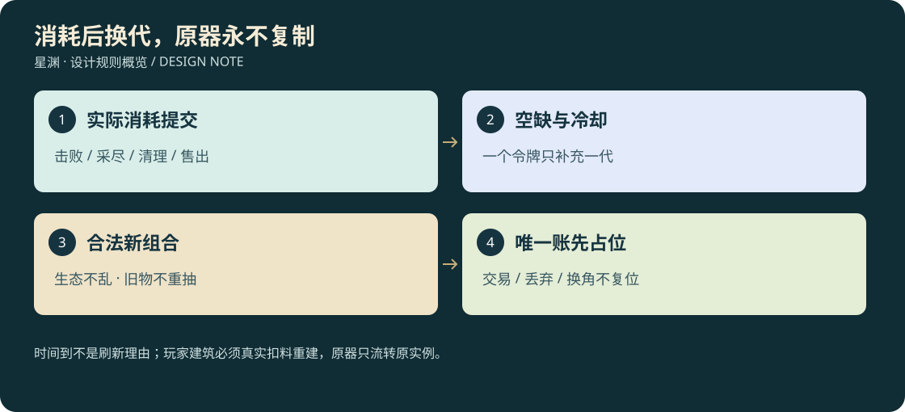

# 27 · 消耗后换代、世界唯一与刷新合理性复核

<!-- illustrated-overview:start -->

*图解：时间到不是刷新理由；玩家建筑必须真实扣料重建，原器只流转原实例。*
<!-- illustrated-overview:end -->

<!-- wandering-npc-update -->
动态人物也属于消耗驱动生态：死亡/永久迁出产生人口空缺，新人有新身份与货单；采集与抢夺使用真实库存转移。旧人唯一物持续流转，不随新人补位重生，具体规则见28。 详见[28地图与游历NPC](28_MAPS_AND_WANDERING_NPCS.md)。

2026-09-12；设计修订，未实装。用户明确：怪物、建筑、物资被实际击败、取得、采收或清理后才进入刷新；下一代应是新的东西，特定逆天物必须唯一。本章覆盖08/09的换代起点与26的“每角色一件”表述，冷却、安全距离和单机优先仍沿用。

## 1. 对旧设计的判断

原有区域生态、代数种子、任务材料可达、视线安全和事务保存值得保留。但“冷却到期”和“对象可替换”没有严格分开；动态陨落及商店定时补货可能挤掉未取资源；尸体过期可能使未领收益消失；每角色唯一无法保证同世界多角色的唯一性。修订后采用**消耗驱动的空缺补充**，不是到点把整个区域清空再随机摆一遍。

不建议所有东西被拿走后马上原点重刷：这样会鼓励守在采集点，也会把建筑和遗迹变成无限宝箱。消耗是必要前提，后面仍要经过冷却、生态、来源、空间、预算检查；没有合法候选就等待。

## 2. 首次布置与后续刷新分开

首次建世界/首次访问未生成区域允许按初始配置创建一代，不要求有人先采不存在的东西。此后同一槽位只有已提交的消耗事件才产生 `vacancyToken`；懒加载、卸载、倒地恢复、模型LOD、读档、天气变化、登录都不是消耗。

补充公式：`可换代 = 有未使用空缺令牌 AND 冷却到期 AND 生态/前置允许 AND 唯一资格允许 AND 有合法位置 AND 未超预算`。一次成功提交消耗一个令牌，只增加一代。令牌来源必须能追溯到旧实例、合法动作及库存/战斗/建设事务。

“被人”包括玩家、战宠协助击杀，以及真实参与且已记录的世界NPC；未来联网包括其他玩家。NPC采走资源必须使物品进入该NPC/运输队的有限库存，不允许为了刷新而凭空写一句“路人拿走了”。宠物打赢只记主人同一击杀，不能主人和宠物各发一个令牌。

## 3. 各类对象怎样腾出名额

|对象|产生空缺的真实事件|不产生空缺的情况|下一代是什么|
|---|---|---|---|
|普通怪/精英|击败已持久化，或合法收服并转移种群所有权|受伤、打晕后会恢复、脱战回血、暂时走远、卸载|新的个体/队伍、活动路线和外观，不复活原实例|
|怪物掉落包|所有物品已入库，或玩家明确放弃指定普通剩余物|背包满、关界面、尸体模型淡出、未捡|清理容器占用；掉落包本身不再产一份奖励|
|多次采集矿脉|最后一份储量扣除且材料成功入库|敲了一次但有剩余、采集取消、写档失败|同矿带另一个新矿芯/伴生组合，岩体不随机瞬移|
|草药/果实|该代产量全部采收并提交|成熟未采、采收中断、容器放不下|生态许可的新植株/新收成与新产量，未采植株不变质重抽|
|普通宝箱/补给点|原清单取尽，或明确放弃剩余普通物资并封箱|只看不拿、拿走一部分、交换相机/装备|有来源的下一批补给或新的可达探索内容|
|陨落资源|本次可采储量耗尽，或真实清理任务完成|陨石冷却降温、未采超过一小时、玩家离线|下一次有轨迹预告的新陨落；不是旧矿量复原|
|可重复野外遗址|核心奖励处理完＋一次探索完成＋需清理障碍已清|刚进门、击败守卫但核心未处理、暂时离开|保留历史遗址，可能迁入新住客/任务，不复原唯一宝库|
|无主临时建筑|被毁且残骸清理完成、地点重新通过地权检查|还完整、里面物资没处理、存在已接受任务|商旅/生态事件带来新营棚等，必须有建造过程|
|玩家/宗门建筑|玩家建设订单或有授权NPC的重建订单|时间到、离线、模型卸载、遭攻击但未毁|材料驱动的同址修复/新建筑，绝不从普通随机池自动替换|
|固定NPC/主线建筑|仅剧情迁移、救援和明确重建事务|普通冷却/其他资源被拿走|同一身份/任务继续，不能刷一个替代品销毁历史|
|商店货架|一份售出/授权调拨记录形成相应库存空缺|货还在架上、玩家卖给商人、仅过了补货时间|运输/生产到货填缺额；旧货保留，不刷新整页洗品质|
|唯一逆天物|不产生同类再生资格|交易、丢弃、损坏、拆成残片、主人死亡/删角色|原物继续流转或永久退役，同唯一键绝不再生|

怪物与其掉落包是两个生命周期：怪物被击败已腾出生物名额，不强迫玩家捡完每个低价材料才能恢复整个生态；旧掉落继续存在且不重算。新怪不能叠在旧尸体上，先等尸体完成演出，在另一个合法候选进入。每个锚点最多3个未结算普通战利品容器，达到上限仅暂停该锚点补怪，并给回收/明确放弃提示，不自动删掉落或全图停刷。

尸体模型可淡出；未领物品转为地图上的遗留物标记并保留清单，不再用15分钟过期删除未领取物。唯一、任务物与已预留机缘永不自动放弃。普通物可由玩家明确放弃，提交后永久注销该清单，不将其标记成“已经入包”。

## 4. 刷新后是不同的新东西

每个 `anchorId+generation` 生成新实例ID；上一代物品进入玩家库存后仍有原来源，不回到锚点。新一代的 `compositionFingerprint` 包含物种/材料家族、群体数量、生成布局、行动路线、外观变体；不把ID/生成时间变化冒充内容变化。

先在该生境的合法候选组合中排除上一代同指纹，再按原生态权重抽取一次并保存。候选至少两个才允许普通轮换；若规则或场地临时只剩上一种组合，显示 `noDistinctCandidate` 等待，不偷偷复制，也不不断重抽品质。Z0只做一种掠兽的样板，可以通过不同群体数量/路径/外观形成两套真实组合，无需假称已有第二种怪物模型。

轮换不等于“铁矿下一次必定变神剑”。草药仍在合法药区，普通矿仍在相应矿带，怪物不会随玩家升级；同种生物和同类材料允许再次出现，但本代组合不原样重复。品质、内丹率仍使用原掉落表，**品质不是强制不重复字段**，避免通过排除普通品逐轮逼出极品。

|场景|原一代|合理的新一代|不合理的变化|
|---|---|---|---|
|新手兽巢|两只掠兽，东侧巡游|三只新个体，北侧进场与不同巡线|把原死怪恢复满血再发一遍旧掉落|
|水林药区|3株基础草，靠浅滩|保留必要草药家族的4株新苗，支流边生长|普通突破材料被随机换成全是高阶不可采植物|
|陨铁矿带|矿芯A以铁陨为主，少量石料|矿芯B仍供基础铁陨，伴生组合变化|整个有碰撞的山体突然消失或移到玩家脚下|
|遗址营棚|旧补给营被清理|商旅建成新营棚、带来新普通清单|玩家洞府家具被随机改成怪物巢|

每个阶段必需材料的保底供给按“材料家族最低产量＋替代来源”检查，不能因追求不重复让基础炼丹断供；补货仍需要真实空缺和来源，保底不是凭空给背包加物资。

## 5. 哪些逆天东西真正唯一

新增独立于角色的 `WorldUniqueLedger`，保存在整个世界根存档。键为 `(worldId,uniqueDefinitionId)`；一个世界内所有角色共用，切角色不能获得第二份。不同独立单机世界是不同故事，可以各有一份，不宣称全体单机玩家共用全球唯一。未来共享服务器以 `(economyShardId,uniqueDefinitionId)` 约束，跨服迁移必须转移原账，不能双方各复制一份。

|内容|唯一范围|获得后能否再次刷新|
|---|---|---|
|MYW01—06六件原器|每世界每原器一件，残片也归同原器|永不；找回/重铸只能恢复原实例|
|MYC01—06原始传承|每世界每部一份“道统资格”；每角色学习记录单独保存|原资格不刷新；明确师承玩法未设计前不允许复印/教给无数角色|
|MYP01—06异格命格|每世界每命格一个载体|宠物可更换主人，不能复制命格；普通33物种不受此唯一限制|
|MYF01—06核心机缘|每世界每个核心事件一次|遗址可再被探索，核心奖励资格永不重置|
|MYA01—06禁传武技|每角色每式首次学习一次，传本可由不同合法事件流转|允许未来世界中其他角色获得独立传本；不是所有稀有物都世界唯一|
|普通Q6武器/高血脉普通宠|稀有但不唯一|按既定合法来源产出，不以颜色误称唯一|

界面区分“世界唯一原器”“本角色首次”“极稀有可重复”；不显示未发现唯一物的精确位置/主人，避免剧透。普通高血脉青龙不是世界只有一只青龙。

MYF02无字天碑选择MYC、MYF05产生MYP、MYF06产生MYW时，必须同时占用机缘键和对应奖励唯一键。直接掉落、NPC转交、机缘、修复、迁移全部调用同一账本，不能每条来源各有一个“首次”就分别发原器。

## 6. 唯一物从生成前就占位

`unissued → reserved → manifested → claimed → transferred/recoverable/retired`。

- 在提示线索/出现物体前原子预留；背包满或暂时不做挑战仍占位，不等玩家拿到后才查重。
- reservation绑定来源事件与奖励实例。重复请求返回原预留，不能产生第二个ID。
- manifested之后绝不因超时释放；玩家交易/丢在地上/存飞船都只改持有位置。学习传承后变为已吸收资格，原键永久已使用。
- 原器损坏/拆成残片时保留rootArtifactId。找回、拼合、重铸消耗这些原片并恢复同一物品，不发第二把。明确彻底销毁才进入retired，仍不能再刷新。
- 删除角色不能删世界唯一账；删角色时先预览处置，原器留在该世界遗留物/继承保管处，或者玩家明确永久退役。宠物进入托管，不悄悄回池生第二只。
- 仅“事务从未提交、线索未显示”的技术性预留可回滚；已显示的机缘属于世界历史，不靠关游戏释放。

候选选择前先排除已占唯一键，再固定本次候选序列和稀有门结果；提交时用版本检查锁唯一键。未来两玩家同帧撞同资格，只有一个提交成功；另一个按预存候选序列检查其余未占用内容，不重掷稀有概率。如果全部占用，保留资格并明确记录 `uniquePoolExhausted`，提供玩家确认的尚未学MYA传承或现有原器的一次专属修复研究；没有可用选项就暂停此类新尝试并显示已探尽，不让玩家无限等一个不会复位的原器。不暗改成普通石头，不再次提高原稀有门成功率。

唯一原器没有“刷完所有后重新开一轮”。未来若要赛季重置，必须是独立新世界/新经济域，不能在旧世界同账里复位。

## 7. 概率、离线与经济联动

原普通洞府8%与普通线索第7次保底保留；永久机缘0.3%及其5%护主破限/2%逆天/93%其余分支不变。它们只在首次合格调查发生，不在每次采草/刷怪新一代时重掷；物资轮换不生成无限新的 `discoveryOpportunityId`。同遗迹的普通住客换了，不等于重新拥有唯一核心首次调查。

新增内容首次资格与补充空缺分别记账：一次新探索可以揭示尚未布置的机缘，已经在该机缘槽里的内容则不能被后来的事件挤掉。场上未采陨石、未完成机缘仍占事件名额，天气散去只收起提示，不清奖励数据。

离线仍最多给已消耗普通槽位30分钟冷却抵扣、最多一代；**没消耗就抵扣0**。离线不代替NPC采集、不清掉落、不拆建筑、不释放唯一预留。商店仅对已售形成的缺额获得一次补货资格，旧品不变；回购商品单独库存，不因补货抹掉刚卖的东西。

不把整个区域绑成一个条件：矿还有剩余只影响该矿芯；一个掉落包未拿不会让全部森林停止生长。按锚点和对象家族局部限额，有助于保留探索自由，也控制存档增长。

## 8. 配置、存档与复核清单

配置新增consumePolicy、replacementPolicy、distinctFingerprintFields、uniqueScope、uniqueDefinitionId、minSupplyFamilies。实例新增consumptionTxnId、vacancyTokenId、generation、previousFingerprint、reservationRevision、rootArtifactId；世界保存usedVacancyTokens、uniqueLedger与未结算物资容器。

冷却从消耗事务提交时起算；成功入库与储量扣除不能分开。生成计划持久化必须同次写“令牌已用＋新代实例＋唯一预留”；存储失败保持旧态，不显示可攻击的新怪。版本迁移先备份，对已有唯一重复冲突暂停相关发放并列清单，不静默删玩家拥有的物品。

|验收ID|场景|应有结果|
|---|---|---|
|RF01|未采草等两小时|仍是同代同品质，空缺为0|
|RF02|矿只采一半后离线|保留原剩余量，不换代|
|RF03|满包导致采收提交失败|不扣储量、不开始再生|
|RF04|采尽且事务成功|恰好一个空缺令牌，冷却开始|
|RF05|同一采收请求重发|返回原结果，不多给令牌或材料|
|RF06|令牌已有、时间已到但视线不安全|等待，不强行出现|
|RF07|一次合法新代提交|新ID、不同组合、只消费一个令牌|
|RF08|只有上一种合法组合|noDistinctCandidate，不重抽品质|
|RF09|怪物击败但未捡掉落|死亡空缺与原掉落分别保留，原掉落不重算|
|RF10|尸体演出结束|遗留物标记继续存在，非奖励过期|
|RF11|原器被捡后卖出/丢弃|世界仍只有原实例，唯一账不复位|
|RF12|原器拆成残片再重铸|恢复相同rootArtifactId，不能一片拼两把|
|RF13|MYF06与直接遗兵来源并发|只能提交一份对应MYW|
|RF14|换角色或删除原主人|世界唯一资格仍占用，走托管/退役|
|RF15|一只异格宠释放再收服|还是同实例同命格，不刷新第二只|
|RF16|建筑完整但计时到|不替换；损毁后须清理与真实重建|
|RF17|补货时间到但库存未售|不增加、不洗旧货品质|
|RF18|区域换代后重复调查遗迹|不重抽逆天门、不重领核心|
|RF19|离线96小时且无消耗|不发令牌、不堆多代、不动唯一账|
|RF20|迁移发现两把同唯一键原器|报告冲突、停止相关发放，保留备份与实物待处理|

以上为待实现验收合同。本轮只完成规则复核、文档同步和图文检查，不宣称这些情况已经在运行游戏中修好。
