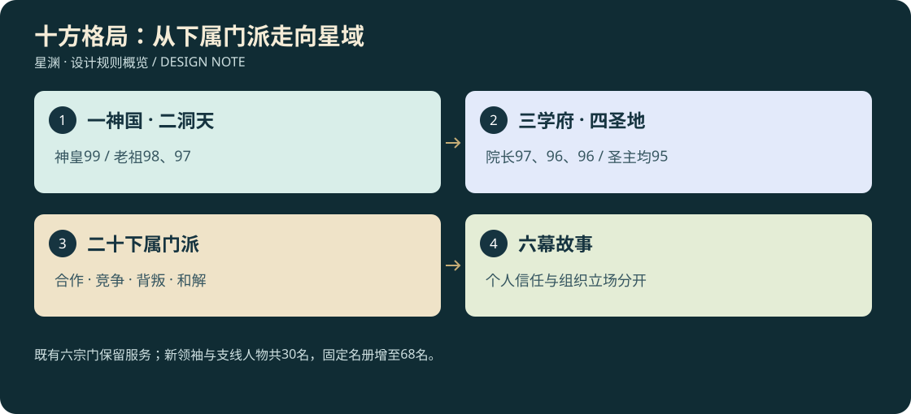

# 29 · 一神国、二洞天、三学府、四圣地

<!-- illustrated-overview:start -->

*图解：既有六宗门保留服务；新领袖与支线人物共30名，固定名册增至68名。*
<!-- illustrated-overview:end -->

2026-09-12；世界观与任务设计增补，未实装。本章保留用户指定的十位最高领袖战力，连接既有六宗门、动态游历者和跨星路线。阵营不是善恶标签，个人关系、宗门身份与实际行为分别记录。

## 1. 等级与称谓对齐

沿用十境各十级：`总等级=10×境界编号r+本境小级l`。后天R0是1—10级，道源R9是91—100级。因此99级=道源九级，98级=道源八级，97级=道源七级，96级=道源六级，95级=道源五级。

道源内部叙事称谓：91—93初阶、94—96中阶（96为中阶顶峰）、97—99大成、100圆满。本章的“道源大成”是角色境界段位，与技能的入门/小成/精通/大成/圆满分属两个字段，不能混用。领袖数字是常态参考战力等级，装备/阵法/伤势影响实战，仍通过19的属性管线结算；不额外再乘一次“神皇倍率”。

神皇是当前已知NPC中单体最强者，99级；不新增一个隐藏100级NPC压过用户设定，也不阻止玩家将来达到100级。最高领袖不会按主角等级自动缩放或被低阶教学习惯动作击杀。

## 2. 十大顶级组织与最高人物

|组织ID|类别/组织|最高人物（固定NPC）|总等级|道源阶段|根本主张与矛盾|
|---|---|---|---|---|---|
|TF01|神国·昊宸神国|N39 姬天衡·神皇|99|大成（九级）|统一星门、抵御星潮；中央秩序也形成通行垄断与边星重税|
|TF02|洞天·太初玄都洞天|N40 玄微子·太初老祖|98|大成（八级）|保存道统、维护封印；封存知识与公开求道长期冲突|
|TF03|洞天·归墟洞天|N41 顾长渊·归墟老祖|97|大成（七级）|边星自治、归还被征用的灵脉；激进派可能不顾后果拆星门|
|TF04|学府·太一学府|N42 闻道衡·院长|97|大成（七级）|传承应向通过验证的人开放；坚持论证而非血统定资格|
|TF05|学府·万象学府|N43 叶知微·院长|96|中阶顶峰（六级）|实地观测、档案与星图共享；争议在于危险知识如何公开|
|TF06|学府·天工学府|N44 墨天机·院长|96|中阶顶峰（六级）|科技与炼器并进、用工程减少灵脉消耗；实验失败可能伤人|
|TF07|圣地·赤霄圣地|N45 陆焚霄·圣主|95|中阶（五级）|尚武、炼兵与守护航道；军备需求侵蚀矿脉和边地权益|
|TF08|圣地·瑶光圣地|N46 苏映寒·圣主|95|中阶（五级）|疗愈、生态与中立救援；必须面对战争双方都需要药的困局|
|TF09|圣地·无相圣地|N47 闻无相·圣主|95|中阶（五级）|认为道统垄断必须打破，擅长隐匿与情报；部分门人以此为夺宝借口|
|TF10|圣地·御灵圣地|N48 牧天青·圣主|95|中阶（五级）|人兽契约与共同生存；与强制奴役灵兽、掠夺兽巢的组织冲突|

根基分别为：神国天都“曜京”、太初“玄都内天”、归墟“沉星内海”、太一“问道洲”、万象“万象星观测环”、天工“铸星环”、赤霄“炎冠星”、瑶光“澄明星”、无相“无名渡”、御灵“万灵洲”。它们通过现有空衡/万象/寂曜航路逐步接触，不是开局同时建十张大地图。高阶未开放时以文书、代表和封锁航路体现组织存在。

## 3. 对立、合作与互相牵制

|双方|现状|冲突焦点|合作窗口/可变化结果|
|---|---|---|---|
|昊宸—归墟|核心对立，局部停战|星门控制、征用灵脉与自治权|星潮来袭时共守边界；主角证据可促成限期共管|
|昊宸—赤霄|军备同盟|神国要服从，赤霄要矿权与军事自主|供应受阻会裂盟，但不随机一夜互相灭门|
|昊宸—太一|合作培养，制度冲突|神国欲按出身授法，学府主张公开试炼|共同调查边军贪腐，改革路线可改善关系|
|太初—无相|长期敌对|封存禁法是否正当、旧道统失窃案|证明部分封印确有危险后可交换档案，激进者仍不接受|
|太初—太一|同源异见|守成秘传与开放研习|共同主持不依赖血统的承载试验|
|归墟—无相|机会性合作，互不信任|前者要自治，后者有人想趁乱夺原器|主角可识破假旗袭击，切断激进派合作|
|天工—赤霄|资源竞争|陨脉用作公共设施还是战争炼兵|一起修复防御设施；矿区污染证据决定后续契约|
|天工—御灵|技术伦理争议|灵兽能芯实验、鞍具与自主契约|完成无伤害替代试验可形成长期合作|
|瑶光—赤霄|救援中立下的摩擦|战地采药、占领药谷和伤员撤离|允许医疗走廊换取限量补给，任何一方违约都留后果|
|御灵—无相|针对具体掠夺团的敌意|盗卵与伪造契约，不把所有无相弟子都定罪|无相内部告密者可帮助救兽并获得庇护|
|万象—各方|有限中立，掌握证据|星图、战争档案与消息封锁|只公开有依据的信息；拒绝伪造记录，即使主角请求|

没有单一“好人联盟/坏人联盟”。神国也有保护平民的军官，归墟也有伤害商旅的极端派；瑶光中也可能有人倒卖救命丹。阵营立场由利益与历史决定，个人能违抗上级并承担职位/追捕后果。

## 4. 既有六宗门接在哪一层

|既有宗门|上层关系|保持的独立性|
|---|---|---|
|S01 玄衡武院|太一学府的边星合作武院，受天工教学资助|保留N27/N28和科技营地教学，不因外交恶化关闭基础教程|
|S02 青岚剑宗|太初玄都的外传支系|剑宗内部也有开放派，可推荐主角访学太一|
|S03 赤炉门|天工学府认证工坊，同时承接赤霄订单|矿脉任务让玩家实际面对两方利益，非自动归军队所有|
|S04 回春谷|瑶光圣地的医道支脉|沿用N33/N34和既有丹方，不强迫玩家加入才能救命|
|S05 御灵山|御灵圣地的边星契约道场|保留同一宠物双模式和N35/N36服务|
|S06 太虚星宫|万象学府参与、神国许可的空衡星门研究机构|既受许可限制又保留档案责任；不是十强之外另一个顶级统治组织|

顶层人物的等级不意味着旗下所有门人都是道源。下层弟子依所在地区自然分布R0—R5，高阶星区才常见R6以上；使者投影只传话，不具备远程秒杀战斗能力。

## 5. 二十个下属门派与关系NPC

下表新增20名可建立个人关系的具名NPC，加上10位最高人物，固定设计名册由38增至68。现有38人的编号与任务不重写。下属门派SS01—SS20是支线组织，当前不新增20套玩家入门职业；六宗门仍是首轮完整加入/兑换系统。

“初遇”给定本体阶段，任务重逢若有成长要记录修炼经历，不随主角自动补级。高级本体出现在低阶剧情时只通过投影/信使，不作为免费高阶战斗队友。友善/敌对倾向是作者配置，玩家看到行为后才形成判断。

|门派ID/名字|直属顶层|具名NPC/初遇本体|与主角合作的具体任务|可能结怨、攻击的具体原因|
|---|---|---|---|---|
|SS01 镇辰府|昊宸|N49 裴照野·巡边使，R2三级|护送灾民，和主角并肩守撤离口|主角确实劫掠平民或伪造军令后追捕；不会仅因拒绝入伍攻击|
|SS02 天衡司|昊宸|N50 姬玄策·监察使，R4二级|合作查星门走私，交换通行证据|受密令没收未认主禁器，遭拒后可进入有预告争夺；可用证据说服其违令|
|SS03 守一门|太初|N51 宁守真·守印弟子，R1七级|修复裂缝，教正确封印顺序|主角破坏有证实危险的封印会阻止，不因学其他宗功法敌视|
|SS04 藏虚观|太初|N52 沈藏岳·藏卷执事，R3三级|查找失窃残卷、共同过镜阵|本人私吞传承，发现主角持关键残图时可能伏击夺图|
|SS05 归潮盟|归墟|N53 顾听潮·渡舟队长，R2一级|救助被重税拖垮的商队，提供绕行图|玩家出卖安全路线致难民受害后绝交/交战|
|SS06 沉星剑门|归墟|N54 陆沉锋·先锋，R3一级|袭击掠夺灵脉的非法采场|将无辜补给船也列目标，主角阻止其爆破后可能决斗|
|SS07 明心书院|太一|N55 温知行·游学弟子，R1四级|一起做遗迹辨伪、保全证据|主角杀伤其同伴且拒绝解释，关系下降并依法追责|
|SS08 问道剑院|太一|N56 卫争鸣·试剑弟子，R2五级|先比武再共闯剑阵，互相救援可成挚友|争排名先走规则内比武；只有私人仇怨升级才野外攻击|
|SS09 星图院|万象|N57 叶听澜·勘图师，R2二级|共同测绘地宫、出售经核实地图|主角泄露避难点给劫修后拒绝合作，不无证据全图通缉|
|SS10 千鉴阁|万象|N58 许照尘·鉴图执事，R3四级|鉴定残图，追索赃物流转|为偿债伪造一条安全路线，暴露后可能逃走或雇劫修灭证|
|SS11 星炉宗|天工|N59 墨承砚·炉师，R2三级|修炉、击退矿区怪群，共建节能阵器|主角掠走救援用核心导致停炉后讨还，可赔偿和解|
|SS12 百机门|天工|N60 韩断机·试验执事，R3五级|合作测试无伤害兽用鞍具|偷偷使用强制抽灵装置，被揭发后带机关武器攻击|
|SS13 烽岳宗|赤霄|N61 岳扶危·护航统领，R3三级|保卫航路，救两方伤员，重视守约|会因上级征用令与主角对峙，可通过替代物资避免冲突|
|SS14 血铸门|赤霄|N62 炎夺岳·夺矿执事，R4一级|迫于兽潮可暂时与主角合作|觊觎主角陨核/原器，主动布设夺宝伏击，是可斩杀的长期对手|
|SS15 济世山|瑶光|N63 苏晚照·行医弟子，R1五级|采药、救援、护送伤员，可同行治疗|目击主角滥杀后离队，必要时保护受害者对抗主角|
|SS16 寒灯谷|瑶光|N64 柳寒灯·药库执事，R3二级|采购短缺药材，提供可靠疗伤线索|倒卖赈灾丹药，主角掌握货单后可能找人抢夺证据|
|SS17 渡影楼|无相|N65 阮渡影·潜行弟子，R2四级|救回被盗兽卵、揭穿假旗袭击，可能背叛本门保护主角|主角出卖其真实身份后失去信任，生死追捕由实际证据触发|
|SS18 无面阁|无相|N66 莫无声·猎宝人，R4三级|可买情报或达成一次停战交易|按已观察的宝物设局，使用伪名；身份揭露后仍是同一实例|
|SS19 青梧苑|御灵|N67 牧青禾·护兽弟子，R1六级|共同孵蛋、安抚暴走灵兽、救援契约宠|若主角抢卵贩卖或伤害受保护兽群，会护兽反击|
|SS20 镇兽谷|御灵|N68 赫连驭·镇兽执事，R3六级|兽潮时帮助筑防线，早期看似可靠|推行强制契约，企图夺主角封存异格蛋；活契约宠不变成可抢背包物|

不是每个组织都固定配“一个好人一个坏人”：卫争鸣是可化解的竞争者，裴照野可能因主角行为变敌，阮渡影来自可疑组织却可成为可靠伙伴。关系好的NPC也有底线；关系差不必一见面就战斗。

## 6. 关系、组队与敌意怎么算

每个具名人物分别记录信任T∈[-100,100]、个人仇怨G∈[0,100]、组织声望F∈[-100,100]和证据事件。T与F不能相互覆盖：玩家得罪神国，不会自动让曾被救过的裴照野忘记恩情；他可能拒绝执行不当追捕，也可能只能暗中提供消息。

首次实际救援T+15、履行一次高风险约定+10、普通交易不刷信任；同事件只计一次。毁约T−15，抢夺已确认属于该人的财物T−40且G+40；恶意杀害其亲友需证据才触发G+70。T≥30且满足个人任务可邀同行，T≥60可解锁互救支线；T≤−30仅表示拒绝合作，主动攻击还需G≥60或明确的通缉/夺宝行为动机。罪行可由目击、真实物证和供述传播，不全宇宙瞬时同步。

早期玩家最多1名临时人类同伴，与**同一只当前宠物**并存，均计总AI预算。同行前明确任务、分配、期限、撤离条件。队友会真实行走、攻击、耗药、负重、受伤；超过主角两境的本体不作为常规可招募战斗队友，特殊救援演出不产生可刷经验/材料。分成以实际物品清单分配，唯一物提前约定归属，不给每人复制一份。

同伴倒地先进入可救援状态，危险任务明确告知可能永久死亡；非战斗过场不突然秒杀队友。可斩杀的支线人物死亡后不会改名复活；职位可由新人物接任，原恩怨、任务记录和唯一物账保留。原38名基础服务NPC的保护边界保持，新30名中领袖只在相应终局事件开放实战，支线人物是否可杀在事件定义声明。

背叛、抢夺、搜身、销赃、赎回全部复用28，不能为剧情把“已学一气化三清”从主角脑中掏出。来自最高组织的劫修也受真实视线、负重、追击、CD与安全区限制。误会有交证据/赔偿/第三方作证路线，蓄意反复掠夺不能靠买一瓶药立即洗白。

## 7. 六幕故事线：从小委托接触大组织

|幕/主角阶段|触发与同行人物|冲突和关键选择|持久后果与奖励|
|---|---|---|---|
|ACT01 雾林初约/R0—R1|可靠基础地图→苏晚照、牧青禾的救援线|救伤员还是先抢稀有草；存在分批完成办法，不强制二选一害人|得到可信地图、基础配方与人情；初次听到瑶光/御灵，不送神物|
|ACT02 一矿两契/R2|墨承砚修炉、岳扶危护航，陆沉锋在矿外出现|同一陨脉有军备和民用两份契约；查清违法加采后选公开证据/重谈分配/武力争夺|矿区产出归属、运输路与NPC关系变化；真实工坊服务和进阶阵图|
|ACT03 无字假图/R3—R4|叶听澜测绘、阮渡影密告，许照尘/莫无声可能设局|辨别被篡改图纸，公共遗迹先取资格；是否救曾骗过自己的引路者|图谱真伪档案、背叛/和解支线；唯一机缘只按原概率/唯一账产生|
|ACT04 星门税火/R5—R6|姬玄策监察与顾听潮救船，同时可访问S06|神国担忧星潮，归墟反征用；主角发现部分税银流向私人炼兵|选择共管证据线、自治护航线或强行夺门线；航路许可不同，但保留基础返程|
|ACT05 封印之争/R7—R8|宁守真和温知行带来相互矛盾的古卷|太初要求续封，无相要公开，天工发现旧星门耗能失衡；证据表明禁制既有保护也被滥用|可形成局部技术改造联盟，或引发有限势力战争；不是一句话说服十位领袖|
|ACT06 十方问鼎/R9|前五幕证据与幸存关系决定谁愿出面|神皇主张集中调度，归墟要求星域自治；无相激进派欲抢控制核心，赤霄军队内部出现分歧|集中秩序/诸域共治/公开道统等结局分支；可比武或战争解决部分节点，无需屠尽十强|

最终大战的目标是星门控制核心与星潮应对，不要求把有居民星球打爆。道源威能用受限场景、阵眼和天体事件表达；毁星仍遵守既有无人试炼星范围。神皇99级的强度通过能力、范围与可读破绽体现，不靠删除玩家输入制造不可战胜。

## 8. 可选私人故事与重玩差异

- **《一纸军令》裴照野**：早期护民结缘，后期奉命追捕主角；带齐证据可使其拒令失职，缺证据则真刀真枪交战。击败可留命、押送或斩杀，各有不同后续联系人。
- **《断图留名》叶听澜与许照尘**：玩家可提前发现篡改，也可能被伏击后循失物记录追赃。许照尘死亡后不能再生成他卖过的地图原件，接任鉴图师有独立身份。
- **《影下归人》阮渡影**：来自无相却持续帮助主角；揭穿其身份会改变其行动安全，不等于她立即变坏。保密、公开作证或出卖分别通向同行、庇护或仇敌线。
- **《契不为枷》牧青禾与赫连驭**：救兽和强制契约两条路线在兽潮时交汇；可用真实替代防线证明无需奴役，也可挑战赫连驭。奖励是契约知识与合法材料，不强夺玩家活宠。

相同组织框架下，任务地点、真实运输货单、游历者介入和机缘候选可按世界种子变化。具名人物的基本信念不每次见面重抽，玩家行为改变关系；支线顺序可变，已死亡者不会回来主持下一幕，后续用不同幸存者/档案提供关键线索。

## 9. 3D、界面与实现边界

顶层势力以建筑轮廓、纹章、服饰材质和动作礼仪区分：昊宸金黑日轮、太初白玉闭环、归墟深蓝断环、太一青墨简牍、万象靛紫星格、天工铜灰齿纹、赤霄赤金炎冠、瑶光月白药枝、无相银灰折面、御灵青绿契纹。不得仅用衣服颜色判断NPC是否会背叛。

关系页分“此人与我的关系”“所属组织态度”“已知证据”，不显示未揭露的阴谋脚本。邀请组队、任务分账、拒绝征用和决斗均有明确选项；菜单结束先恢复镜头与输入，随后才允许敌对前摇。同行需配行走、地图查看、协同攻击、救援、分歧、离队、投降和倒地动作，不用聊天头像冒充组队。

新增FactionDefinition(TF)、BranchSectDefinition(SS)、LeaderDefinition、PersonalRelation、EvidenceEvent、CompanionContract、StoryAct和SuccessionRecord。组织敌对关系独立于个人仇怨；继任者得到职位而非死者物品/技能副本。首轮只接ACT01两位低阶代表及一条协作任务，顶层组织先以档案/信物体现，不要求当前前期模块一次实现道源战争。

验收：十强分组1/2/3/4及等级99/98/97/97/96/96/95/95/95/95完全一致；30个新固定ID不重复；20支门派有唯一直属组织；六宗门关联不变更原服务；亲善与阵营敌意可并存；同伴不免费刷战利品；背叛不在菜单中击杀；死者不复活、原器不复制；任务分支失败仍有关键知识和返程路线。
