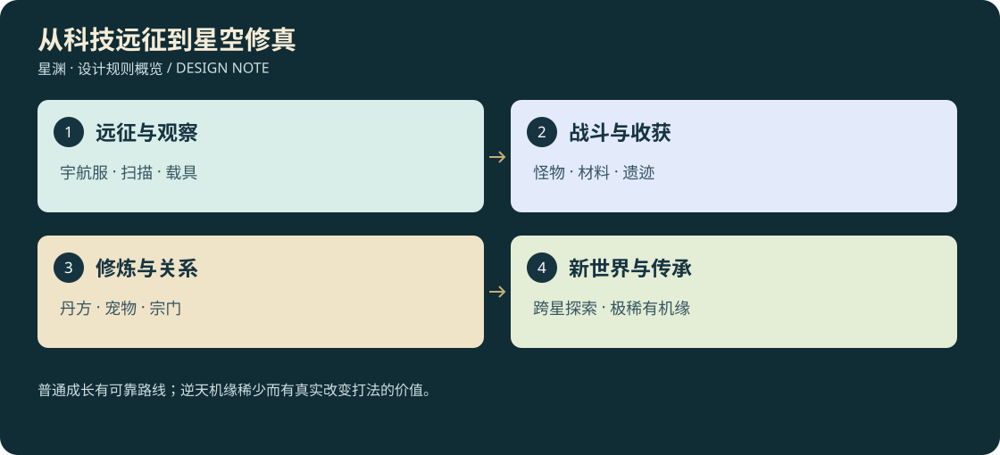

# 星渊：从科技远征到星空修真 · D3

<!-- illustrated-overview:start -->

*图解：普通成长有可靠路线；逆天机缘稀少而有真实改变打法的价值。*
<!-- illustrated-overview:end -->

2026-09-12。性质：后续开发基准草案；本文档包不代表玩法已经实装。当前版本仍是探索原型，实际完成项查阅 [验收台账](../HTML5_VERIFICATION.md)。

## 1. 核心体验

**图文阅读：打开[离线图文手册](illustrated-guide.html)**，可搜索正文、切换章节和打印。各章的规则图配合详细表格阅读；新增[26逆天传承](26_HEAVEN_DEFYING_LEGACIES.md)包含双分身/归一、六部功法、六式禁传武技、六件遗兵、六种神宠异格和六种机缘。

人类远征队在裂环星发现可改变生命结构的物质，最初将其制成“进化液”。随着探索深入，幸存者与遗民揭示：科技测量到的能量回路，正是古老文明修行所称的经脉与真气。宇航服、实验舱、轨道器不是突然失效，而逐步成为修炼、炼丹与星际远征的工具。

游戏是单人、实时第三/第一人称动作冒险。主要循环：整备功法与武器 → 选择区域 → 观察、战斗、采集、发现遗迹 → 带材料返回或继续冒险 → NPC 炼丹/锻造 → 提升修为与属性 → 突破境界 → 发现新生态、新人物和新规则。打坐提供稳定修为，探索决定突破资格、材料品质和稀有成长；两者缺一不可。

任务不是唯一入口。遗迹声响、异色植物、怪物迁徙、陨落轨迹、NPC 传闻都能开启发现。主线提供一条有保障的成长路线，支线与机缘扩展解法。路线不固定，但材料产地、怪物生态和突破前置有可解释规律。

## 2. 编号与明确取舍

- 采用最新“共十境界”：后天是第 **0** 境，之后第 **1—9** 境；每境 **1—10** 级，共 100 个角色等级位置。这里的第几境不是“后天一级”的小等级。
- 0—3 境空中移动可依靠飞行器或合格飞宠；4 境解锁借物御器；5 境才可肉身御空；6 境可跨星传送；8 境可星空飞行；9 境具备有条件毁星能力。骑宠不自动绕过本人防护/真空权限。
- 小等级靠修为；跨大境界靠满级修为、突破法和明确确认。进化液是突破制剂的统称，高阶 NPC 可称其为丹；不要求每升一级都重复买药。
- 离线只结算前 72 小时修炼，达到当前大境界上限即停止，不替玩家突破、不自动战斗采集。
- 自由跨区，不用空气墙要求玩家“等级不足”。低境玩家面对真实强敌，可绕行、逃跑、侦察；被击败会昏迷并被救回安全区。
- 单人 NPC 市场为本轮范围；玩家间联网交易、拍卖行和联机经济另立项目，不以本地买卖界面冒充已实现。
- 保留当前探索剧情、载具、扫描和角色资产，后续按迁移文档接入新成长系统，不在文档任务里改动运行数值或用户存档。

## 3. 按模块开发的阅读顺序

|文件|负责回答|
|---|---|
|[01 境界、数值与修炼](01_REALMS_AND_CULTIVATION.md)|十境界名字、每境能力、属性差异、挂机、突破|
|[02 战斗、武器与功法](02_COMBAT_WEAPONS_SKILLS.md)|怎么打、十类武器、技能与真气、陨石锻造|
|[03 丹方、材料与经济](03_ALCHEMY_MATERIALS_ECONOMY.md)|三十种突破配方、品级、血液/内丹掉率、灵石和交易|
|[04 世界、区域与探索](04_WORLD_REGIONS_EXPLORATION.md)|足够大的星球、0—5 境地区、高阶星球、飞行和机缘|
|[05 NPC、交互与任务](05_NPCS_DIALOGUE_TASKS.md)|68名固定NPC、功能、对话框、交易/炼丹/宠物/宗门服务|
|[06 怪物与 3D 资产](06_MONSTERS_AND_3D.md)|30 类怪物、战斗行为、掉落、原型与高阶 3D 制作规格|
|[07 实施与验收](07_IMPLEMENTATION_AND_ACCEPTANCE.md)|从第一场战斗到完整远征的切片、数据合同、迁移和测试|
|[08 世界刷新系统](08_WORLD_DIRECTOR.md)|野怪/材料再生、随机事件、离线资格、空间安全、种子与存档|
|[09 配置与开发面板](09_WORLD_DIRECTOR_CONFIG_AND_TOOLS.md)|刷新配置、可达性校验、概率模拟、调试面板与分阶段接入|
|[10 储物与负重](10_STORAGE_AND_ENCUMBRANCE.md)|背包、飞行器货舱、袋戒、扩容材料/技能、容量与携重|
|[11 随机洞府与机缘](11_CAVES_AND_FORTUNES.md)|角色差异、洞府布局、奖励、定居与私人仓储|
|[12 丹药与后遗症](12_MEDICINES_AND_AFTEREFFECTS.md)|疗伤/回气/续力/爆发丹、共享冷却、治疗与离线疗养|
|[13 移动与追逐](13_MOVEMENT_AND_PURSUIT.md)|十境速度、奔袭、负重影响、怪物感知/追击/脱战|
|[14 单机与联网边界](14_OFFLINE_AND_ONLINE_BOUNDARY.md)|世界/角色/实例归属、在线资产、组队洞府与未来迁移|
|[15 宠物成长与羁绊](15_PET_PROGRESSION_AND_BOND.md)|孵化、喂养收服、七档血脉、十境成长、兽诀、迷你陪伴|
|[16 神兽33种](16_PET_BESTIARY_33.md)|每种定位、食物、天赋、飞行类型、迷你形态与服装|
|[17 骑宠空战与资产](17_PET_3D_FLIGHT_AND_ASSETS.md)|高度/载重/灵力、双视角、3D动作、图片视频版本与备份|
|[18 名字、装扮与身份](18_NAMES_PET_STYLE_AND_IDENTITY.md)|玩家/宠物起名、个体花纹、私人纹章、同名与多人归属|
|[19 属性与五阶掌握](19_DAMAGE_ATTRIBUTES_AND_MASTERY.md)|先加后乘、术强/灵抗、伤害/盾/治疗、锁定反制和手算示例|
|[20 人物武技60式](20_PLAYER_MARTIAL_ARTS_60.md)|20武器技、26属性术、14战术身法的系数/门槛/耗能/判定|
|[21 宠物专属技能](21_PET_SKILLS_33.md)|33种各2主动1天赋、独立宠物属性、空战与AI|
|[22 战斗3D与动画](22_COMBAT_3D_AND_ANIMATION.md)|每招专属形状与五阶VFX、骨骼/命中/双视角、资产版本验收|
|[23 宗门与比武](23_SECTS_NPCS_MISSIONS_AND_DUELS.md)|6宗门、12新增NPC、12委托模板、20兑换项与擂台|
|[24 建宗与阵法](24_SECT_BUILDINGS_AND_FORMATIONS.md)|立宗条件、12建筑、12阵法、真实供能、覆灭与重建|
|[25 图文阅读路线](25_ILLUSTRATED_READING_GUIDE.md)|按玩法选阅读顺序、图例、媒体来源与离线阅读器|
|[26 逆天传承与机缘](26_HEAVEN_DEFYING_LEGACIES.md)|一气化三清、超常核心、30项极稀有设计、跨境算例|
|[27 消耗换代与世界唯一](27_CONSUMPTION_AND_UNIQUE_WORLD.md)|实际消耗才补充、不同新组合、原器流转不复制、20项刷新验收|
|[28 地图与游历NPC](28_MAPS_AND_WANDERING_NPCS.md)|8类地图、12人物模板、材料竞争、伏击夺宝、销赃追索与新人补位|
|[29 十大顶层势力](29_SUPREME_FACTIONS_AND_STORY.md)|一神国二洞天三学府四圣地、领袖等级、20下属门派、关系与六幕故事|

刷新系统留在本游戏项目内，以独立模块和开发入口维护，不另外新建仓库或服务。宗门、建筑、阵法与战斗、库存、境界、任务共用稳定ID和事务存档；未来共享世界需求出现时再拆后端。当前文档包共三十份（本入口＋01—29），配30张规则图与1张三联概念插画。新增27优先覆盖旧的到期换货、掉落自动过期和每角色原器唯一假设。

## 4. 对旧设计的覆盖

本包覆盖 D2 对应条款：取消“不增加人物经验条”、仅两种材料、暂不引入品级、无交易/炼丹的范围限制；新增角色十境界及材料经济。技能的“入门/小成/精通/大成/圆满”保留为**技能熟练阶**，不得再称角色境界。旧身体/装备续航作为科技适应记录保留，转换方案独立迁移，不能与新境界重复乘算。

D2 的事件去重、事务扣料、存档备份、真实 3D 与表现/判定一致原则继续适用。旧文档与 D3 冲突时，以本包对应模块为准；用户新指令优先于本包。第 07 文件的阶段替代旧 M0—M6 排期，但不撤销历史验收证据。

2026-09-12 补充：第 10—14 文件覆盖旧文档尚未定义的容量/钱包、第 01 文件相同基础地速、第 03 文件功能丹即时恢复及固定放置机缘假设。机缘实例按角色随机并保存；共享联网玩法在后续阶段实现，当前仍单机。

宠物当前规则：同时只有一只随行个体，在日常迷你跟随与完整战斗模式之间切换；不是战宠加陪伴宠两只同时出现。宠物补充以第15—18为准：新增33种神话谱系与两名NPC，允许低境载宠飞行；生活宠物只能在灵兽栏/灵栖契内休息，普通储物袋不收活物。资产版本归档与独立备份不能混称，未生成模型仍标 planned。

## 5. 初期可感知的目标

本次19—24覆盖旧伤害公式与宗门未定义部分：五阶名称保留，伤害倍率为1/1.18/1.40/1.68/2，防御常数由20改40，弱点默认25%进入统一增伤桶；宠物数值独立计算。本章当时新增12名宗门NPC至38名；第29再增30名，现共68名。玩法和数值均待实机验证，文档审计不代表60武技、66宠物主动或3D资产已完成。

第一轮可玩目标是一趟 20—30 分钟的远征：与医师领取基础方案，击退掠兽取得血液，避开高阶巢母采药，拾取铁陨，返回炼制一次进化液、锻造一把武器，再用实际增强后的能力挑战营地外精英。全过程可失败、可救援、可保存，收益不依赖低概率内丹。

这不是要求先完成 100 级再验证乐趣。先验证一只敌人是否好打、一种技能是否有用、一次炼丹是否值得，再扩大种类与地图。所有概率、时长、伤害和价格均为首轮可调配置，不能当作已验证的平衡结论。
